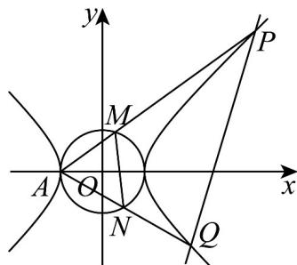

> [!faq]- 《高二数学下学期第三次月考卷（人教A版必修一-选修三全册，高效培优）》官方解析
>
> > [!success]- **【答案】** (1) $x^{2}-y^{2}=1$ (2)(i)证明见解析；(ii) $[8,+\infty)$
>
> > [!note]- **【解析】**
> > （1）由题意得， $\left\{\begin{aligned}&2c=2\sqrt{2},\\ &\frac{3}{a^{2}}-\frac{2}{b^{2}}=1\\ &a^{2}+b^{2}=2,\end{aligned}\right.$ ，解得 $\left\{\begin{aligned}&a=1,\\ &b=1,\\ &c=\sqrt{2},\end{aligned}\right.$
> >
> > 所以 C 的方程为 $x^{2}-y^{2}=1$
> >
> > (2) (i) 证明：由 (1) 知， $A(-1,0)$
> >
> > 
> >
> > 由题意可知直线 l 的斜率不为 0，设直线 $l: x = ty + 3, P(x_{1}, y_{1}), Q(x_{2}, y_{2})$
> >
> > 联立 $\left\{\begin{aligned}x&=ty+3,\\ x^{2}-y^{2}&=1,\end{aligned}\right.$ 得 $\left(t^{2}-1\right)y^{2}+6ty+8=0$
> >
> > 因为直线 l 与 C 的右支交于两点.
> >
> > 所以 $\left\{ \begin{array}{l} t^2 - 1 \neq 0 \\ \Delta = (6t)^2 - 4 \times 8 \times (t^2 - 1) > 0 \\ y_1y_2 = \frac{8}{t^2 - 1} < 0 \end{array} \right.$ ，解得 $-1 < t < 1$
> >
> > 又 $y_{1} + y_{2} = \frac{-6t}{t^{2} - 1},y_{1}y_{2} = \frac{8}{t^{2} - 1}$
> >
> > $$
> > k _ {A P} \cdot k _ {A Q} = \frac {y _ {1}}{x _ {1} + 1} \cdot \frac {y _ {2}}{x _ {2} + 1} = \frac {y _ {1} y _ {2}}{(t y _ {1} + 4) (t y _ {2} + 4)} = \frac {y _ {1} y _ {2}}{t ^ {2} y _ {1} y _ {2} + 4 t (y _ {1} + y _ {2}) + 1 6}
> > $$
> >
> > $$
> > = \frac {\frac {8}{t ^ {2} - 1}}{t ^ {2} \cdot \frac {8}{t ^ {2} - 1} + 4 t \cdot \frac {- 6 t}{t ^ {2} - 1} + 1 6} = \frac {8}{8 t ^ {2} - 2 4 t ^ {2} + 1 6 t ^ {2} - 1 6} = - \frac {1}{2}.
> > $$
> >
> > (ii) 设 $AP: x = m_{1}y - 1, AQ: x = m_{2}y - 1$ ，且 $\left|m_{1}\right| > 1, \left|m_{2}\right| > 1$
> >
> > $$
> > \left\{ \begin{array}{l} x = m _ {1} y - 1 \\ x ^ {2} - y ^ {2} = 1 \end{array} \right.
> > $$
> >
> > $$
> > \left(m _ {1} ^ {2} - 1\right) y ^ {2} - 2 m _ {1} y = 0
> > $$
> >
> > 所以 $y_{P}=\frac{2m_{1}}{m_{1}^{2}-1}$ ，同理可得 $y_{Q}=\frac{2m_{2}}{m_{2}^{2}-1}$
> >
> > 联立 $\left\{ \begin{array}{l} x = m_{1}y - 1 \\ x^{2} + y^{2} = 1 \end{array} \right.$ ，得 $\left(m_{1}^{2} + 1\right)y^{2} - 2m_{1}y = 0$
> >
> > 所以 $y_{M}=\frac{2m_{1}}{m_{1}^{2}+1}$ ，同理可得 $y_{N}=\frac{2m_{2}}{m_{2}^{2}+1}$
> >
> > $$
> > \text {所以} \frac {S _ {\triangle A P Q}}{S _ {\triangle A M N}} = \frac {\frac {1}{2} | A P | \cdot | A Q | \sin \angle P A Q}{\frac {1}{2} | A M | \cdot | A N | \sin \angle M A N} = \frac {| A P |}{| A M |} \cdot \frac {| A Q |}{| A N |} = \frac {y _ {P}}{y _ {M}} \cdot \frac {y _ {Q}}{y _ {N}}
> > $$
> >
> > $$
> > = \frac {\frac {2 m _ {1}}{m _ {1} ^ {2} - 1}}{\frac {2 m _ {1}}{m _ {1} ^ {2} + 1}} \cdot \frac {\frac {2 m _ {2}}{m _ {2} ^ {2} - 1}}{\frac {2 m _ {2}}{m _ {2} ^ {2} + 1}} = \frac {(m _ {1} ^ {2} + 1) (m _ {2} ^ {2} + 1)}{(m _ {1} ^ {2} - 1) (m _ {2} ^ {2} - 1)} = \frac {m _ {1} ^ {2} m _ {2} ^ {2} + m _ {1} ^ {2} + m _ {2} ^ {2} + 1}{m _ {1} ^ {2} m _ {2} ^ {2} - m _ {1} ^ {2} - m _ {2} ^ {2} + 1}.
> > $$
> >
> > 因为 $\frac{1}{m_1} \cdot \frac{1}{m_2} = -\frac{1}{2}$ ，所以 $m_1 \cdot m_2 = -2$ ，所以 $|m_1| \cdot |m_2| = 2$
> >
> > 所以 $\frac{S_{\triangle APQ}}{S_{\triangle AMN}} = \frac{5 + (m_1^2 + m_2^2)}{5 - (m_1^2 + m_2^2)}$
> >
> > 又因为 $\left|m_{2}\right|=\frac{2}{\left|m_{1}\right|}>1$ ，所以 $1<\left|m_{1}\right|<2$
> >
> > 令 $n = m_1^2 + m_2^2$ ，由 $\left|m_1\right| \cdot \left|m_2\right| = 2, 1 < \left|m_1\right| < 2$ ，得 $n = m_1^2 + \frac{4}{m_1^2} \in [4,5)$
> >
> > 所以 $\frac{S_{\triangle APQ}}{S_{\triangle AMN}}=\frac{5+n}{5-n}=\frac{10}{5-n}-1,n\in[4,5)$
> >
> > $$
> > \text {令} f (n) = \frac {1 0}{5 - n} - 1, n \in [ 4, 5)
> > $$
> >
> > 因为 $f(n)$ 在区间 $[4,5)$ 上为增函数，所以 $f(n)$ 的取值范围为 $[9, +\infty)$
> >
> > 又因为 $\frac{S_{1}}{S_{2}}=\frac{S_{\triangle APQ}-S_{\triangle AMN}}{S_{\triangle AMN}}=\frac{S_{\triangle APQ}}{S_{\triangle AMN}}-1$
> >
> > 所以 $\frac{S_1}{S_2}$ 的取值范围为 $[8, +\infty)$
