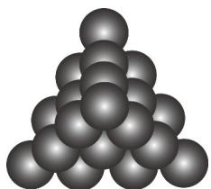

<!-- question-source:start -->
34. 如图的形状出现在南宋数学家扬辉所著的《详解九章算法商功》中后人称为“三角垛”，“三角垛”最上层有 $^{1}$ 个球，第二层有 $^{3}$ 个球，第三层有 $^{6}$ 个球，…，设第n层有 $a_{n}$ 个球，从上往下n层球的总数为 $S_{n}$ ，则（）

A. $a_5 = 35$ B. $S_{5} = 35$ C. $a_{n + 1} - a_n = n + 1$ D.不存在正整数 $m > 2$ ，使得 $a_{m}$ 为质数
<!-- question-source:end -->

![[高中/课堂同步/题库/人教A版高中数学同步讲义(2026)/05_选择性必修第三册/期中专项训练+期中模拟卷/专项训练/专题01_数列的概念_高效培优期中专项训练_数学人教A版高二选择性必修/_compact/answers/Q00060080A1.md]]
