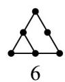
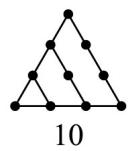
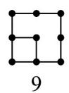
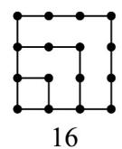
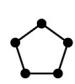
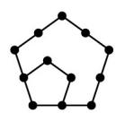
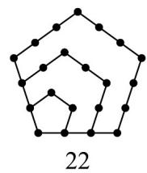

> [!faq]- 《专题01_数列的概念_高效培优期中专项训练_数学人教A版高二选择性必修》官方解析
>
> > [!success]- **【答案】** ACD
>
> > [!note]- **【解析】**
> > 由题意可得 $a_{1}=3$ ， $a_{n+1}=1-\frac{1}{a_{n}}$ 所以 $a_{2}=1-\frac{1}{3}=\frac{2}{3}$ ， $a_{3}=1-\frac{3}{2}=-\frac{1}{2}$ ， $a_{4}=1-\frac{1}{- \frac{1}{2}}=3,\cdots$ 故A正确；
> > 易得数列 $\left\{a_{n}\right\}$ 是以 $^{3}$ 为周期的周期数列，无单调性，故 $^{B}$ 错误； $a_{2025}=a_{3:675}=a_{3}=-\frac{1}{2}$ ，故C正确；
> >
> > $S_{34}=a_{1}+a_{2}+a_{3}+\cdots+a_{34}=11(a_{1}+a_{2}+a_{3})+a_{1}=11\left(3+\frac{2}{3}-\frac{1}{2}\right)+3=\frac{227}{6}$ ，故D正确.
> >
> > 故选：ACD.
> >
> > ## 考点07求递推关系式
> >
> > 31. 传说古希腊毕达哥拉斯学派的数学家用沙粒和小石子来研究数，他们根据沙粒或小石子所排列的形状把数分成许多类，如图中第一行的 $^{1,3,6,10}$ 称为三角形数，第二行的 $^{1,4,9,16}$ 称为正方形数，第三行的 $^{1,5,12,22}$ 称为五边形数，则正方形数所构成的数列的第 $^{5}$ 项是\_\_\_\_，五边形数所构成的数列 $\left\{a_{n}\right\}$ 的通项公式为\_\_\_\_。
> >
> > 
> >
> > 
> >
> > 
> >
> > 
> >
> > 
> >
> > 
> >
> > 
> >
> > 【答案】
> >
> > $$
> > a _ {n} = \frac {3 n ^ {2} - n}{2}
> > $$
> >
> > 【详解】正方形数所构成数列的第 $^{5}$ 项是 $16+9=25$ ，
> >
> > 五边形数所构成数列满足 $a_1 = 1$ ， $a_2 - a_1 = 4$ ， $a_3 - a_2 = 7$ ， $a_4 - a_3 = 10$ ， $a_n = a_{n-1} + (3n - 2)$
> >
> > 所以 $a_{n} = a_{1} + (a_{2} - a_{1}) + (a_{3} - a_{2}) + (a_{4} - a_{3}) + \dots +(a_{n} - a_{n - 1}) = 1 + 4 + 7 + \dots +(3n - 2)$ ， $n$ 2，
> >
> > 累加可得 $a_{n} = \frac{n(1 + 3n - 2)}{2} = \frac{3n^{2} - n}{2}$ ，当 $n = 1$ 时 $a_1 = 1$ 成立，
> >
> > 所以 $a_{n}=\frac{3n^{2}-n}{2}$ .
> >
> > 故答案为： $25$ ； $\frac{3n^2 - n}{2}$
