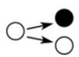
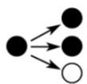
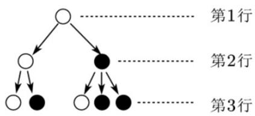

> [!faq]- 《专题01_数列的概念_高效培优期中专项训练_数学人教A版高二选择性必修》官方解析
>
> > [!success]- **【答案】** BCD
>
> > [!note]- **【解析】**
> > 依题意因为 $a_{1}=1, a_{2}-a_{1}=2, a_{3}-a_{2}=3, \cdots, a_{n}-a_{n-1}=n$
> >
> > 以上 n 个式子累加可得： $a_{n}=1+2+3+\cdots+n=\frac{n(n+1)}{2},(n-2)$ ,
> >
> > 又 $a_1 = 1$ 满足上式，所以 $a_n = \frac{n(n + 1)}{2}$ ，故 $a_5 = \frac{5 \times 6}{2} = 15$ ，故A错误；
> >
> > 因 $a_1 = 1, a_2 = 3, a_3 = 6, a_4 = 10, a_5 = 15$
> >
> > 所以 $S_{5}=a_{1}+a_{2}+a_{3}+a_{4}+a_{5}=1+3+6+10+15=35$ ，故 B 正确；
> >
> > 因为 $a_{n} - a_{n - 1} = n$ ，所以 $a_{n + 1} - a_n = n + 1$ ，故C正确；
> >
> > 因为 $a_{n} = \frac{n(n + 1)}{2}$ ，故当 $m > 2$ 且为整数时， $a_{m} = \frac{m(m + 1)}{2}$
> >
> > 此时 $m(m + 1)$ 必为偶数，则 $\frac{m(m + 1)}{2}$ 为整数，且为合数，
> >
> > 则不存在正整数 m > 2 ，使得 $a_{m}$ 为质数，D 正确，
> >
> > 故选：BCD
> >
> > 35. 分形几何学是数学家伯努瓦·曼德尔布罗特在 $^{20}$ 世纪 $^{70}$ 年代创立的一门新的数学学科，它的创立为解决众多传统科学领域的难题提供了全新的思路。按照如图 $^{1}$ 所示的分形规律可得如图 $^{2}$ 所示的一个树形图
> >
> > 若记图 2 中第 n 行黑圈的个数为 $a_{n}$ ，则 $a_{5} = (\quad)$
> >
> > 
> >
> > 
> >
> > 
> > 图1
> > 图2
> >
> > A.21 B.25 C.27 D.30
> >
> > 【答案】A
> >
> > 【详解】已知 $a_{n}$ 是第 $n$ 行中黑圈的个数，设 $b_{n}$ 表示第 $n$ 行中白圈的个数，
> >
> > ## 由于每个白圈产生下一行的一白一黑两个圈，一个黑圈产生下一行的一白两黑三个圈，
> >
> > 由题意可得 $a_{n + 1} = 2a_{n} + b_{n}$ ， $b_{n + 1} = a_n + b_n$ 且 $a_1 = 0$ ， $b_{1} = 1$
> >
> > 所以， $a_2 = 2a_1 + b_1 = 1$ ， $b_{2} = a_{1} + b_{1} = 1$ ； $a_3 = 2a_2 + b_2 = 3$ ， $b_{3} = a_{2} + b_{2} = 2$ ； $a_4 = 2a_3 + b_3 = 8$ ， $b_{4} = a_{3} + b_{3} = 5$ ； $a_5 = 2a_4 + b_4 = 21$ ， $b_{5} = a_{4} + b_{4} = 13$ ：
> >
> > 故选：A.
> >
> > ## 考点08根据数列的单调性求参数
