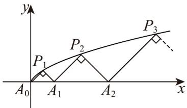

<!-- question-source:start -->
6. 如图所示， $P_{1}(x_{1},y_{1})$ ， $P_{2}(x_{2},y_{2})$ ，…， $P_{n}(x_{n},y_{n})$ ，…是曲线 $C: y^{2} = \frac{1}{2} x(y - 0)$ 上的点， $A_{1}(a_{1},0)$ ， $A_{2}(a_{2},0)$ ，…， $A_{n}(a_{n},0)$ ，…是 $x$ 轴正半轴上的点，且 $\triangle A_{0}A_{1}P_{1}$ ， $\triangle A_{1}A_{2}P_{2}$ ，…， $\triangle A_{n-1}A_{n}P_{n}$ ，…均为等腰直角三角形（ $A_{0}$ 为坐标原点）.

(1) 计算 $a_{1}$ , $a_{2}$ , $a_{3}$ , 猜想 $\{a_{n}\}$ 的通项公式；

(2)用数学归纳法证明你的猜想；

(3)求数列 $\left\{\frac{1}{a_n}\right\}$ 的前 $n$ 项和 $S_{n}$
<!-- question-source:end -->

![[高中/课堂同步/题库/人教A版高中数学同步讲义(2026)/05_选择性必修第三册/期中专项训练+期中模拟卷/专项训练/专题04_数学归纳法_高效培优期中专项训练_数学人教A版高二选择性必修/_compact/answers/Q00060144A1.md]]
