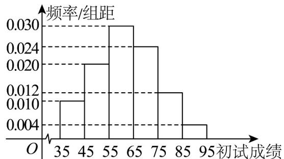

<!-- question-source:start -->
13．某校组织本校 $^{2000}$ 名学生进行针对性检测（检测分为初试和复试），并随机抽取了 $^{100}$ 名学生的初试成绩，绘制了频率分布直方图，如图所示．

(1)根据频率分布直方图，求样本平均数的估计值；（同一组数据用该区间的中点值作代表）

(2)若所有学生的初试成绩 X 近似服从正态分布 $N(\mu, \sigma^{2})$ ，其中 $\mu$ 为样本平均数的估计值， $\sigma \approx 14$ ，初试成绩不低于 90 分的学生才能参加复试，试估计能参加复试的人数、（四舍五入精确到整数）。

附：若随机变量 $X$ 服从正态分布 $N\left(\mu, \sigma^2\right)$ ，则 $P(\mu - \sigma \leq X \leq \mu + \sigma) \approx 0.6827$ ，

$$
P (\mu - 2 \sigma \leq X \leq \mu + 2 \sigma) \approx 0. 9 5 4 5 P (\mu - 3 \sigma \leq X \leq \mu + 3 \sigma) \approx 0. 9 9 7 3
$$
<!-- question-source:end -->

![[高中/课堂同步/题库/人教A版高中数学同步讲义(2026)/05_选择性必修第三册/期中专项训练+期中模拟卷/专项训练/专题12_正态分布_高效培优期中专项训练_数学人教A版高二选择性必修第/_compact/answers/Q00060240A1.md]]
