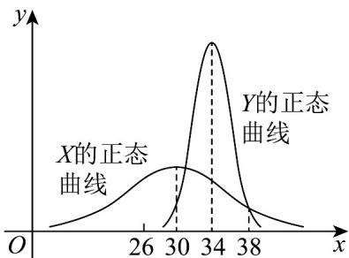

<!-- question-source:start -->
22. 李明上学有时坐公交车，有时骑自行车，他分别记录了 $^{50}$ 次坐公交车和 $^{50}$ 次骑自行车所花的时间，经数据分析得到，假设坐公交车用时 X 和骑自行车用时 Y 都服从正态分布， $X \sim N\left(\mu_{1}, 6^{2}\right)$ ， $Y \sim N\left(\mu_{2}, 2^{2}\right)$ X 和 Y 的正态曲线如图所示．则下列结果正确的是（）

A. $D(X) = 6$ $\mathsf{B}_{\cdot}\mu_{1} <   \mu_{2}$ C. $P(X\leq 38) > P(Y\leq 38)$ D. $P(X\leq 34) <   P(Y\leq 34)$
<!-- question-source:end -->

![[高中/课堂同步/题库/人教A版高中数学同步讲义(2026)/05_选择性必修第三册/期中专项训练+期中模拟卷/专项训练/专题12_正态分布_高效培优期中专项训练_数学人教A版高二选择性必修第/_compact/answers/Q00060246A1.md]]
