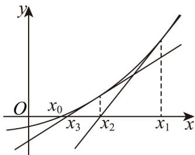

<!-- question-source:start -->
2．如图，在求解一些函数零点的近似值时，常用牛顿切线法进行求解．牛顿切线法的计算过程如下：设

函数 $f(x)$ 的一个零点 $x_0$ ，先取定一个初值 $x_1$ ，曲线 $y = f(x)$ 在 $x = x_1$ 处的切线为 $l_1$ ，记 $l_1$ 与 $x$ 轴的交点横

坐标为 $x_{2}$ ，曲线 $y = f(x)$ 在 $x = x_{2}$ 处的切线为 $l_{2}$ ，记 $l_{2}$ 与 $x$ 轴的交点横坐标为 $x_{3}$ ，以此类推，每进行一次

切线求解，我们就称之为进行了一次迭代，若进行足够多的迭代次数，就可以得到 $x_0$ 的近似值 $x_{n}\left(n\in \mathbf{N}^{*}\right)$

设函数 $f(x) = x^2 - 3$ ，令 $x_1 = 3$ 。进行三次迭代得到的 $x_4 =$ \_\_\_\_.

97
<!-- question-source:end -->

![[高中/课堂同步/题库/人教A版高中数学同步讲义(2026)/05_选择性必修第三册/期中专项训练+期中模拟卷/专项训练/专题14_导数精选压轴60题12类考点专练_高效培优期中专项训练_数学/_compact/answers/Q00060324A1.md]]
