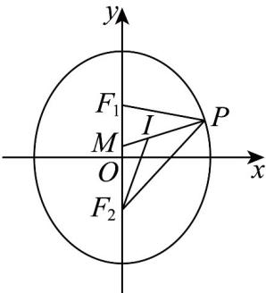

> [!faq]- 《专题14_导数精选压轴60题12类考点专练_高效培优期中专项训练_数学》官方解析
>
> > [!success]- **【答案】** C
>
> > [!note]- **【分析】**
> > 先根据分段函数的定义求出 $f(3)$ ，再求出x=3时对应的表达式，然后求导由点斜式可得.
>
> > [!note]- **【解析】**
> > 由题意可得 $f(3)=2f(3-2)=2f(1)=2(1-1)=0$
> >
> > 当 $x \in x - 2 \in [24]$ 时， $x - 2 \in [0, 2]$ ，此时 $f(x - 2) = (x - 2)^2 - (x - 2)$ ，
> >
> > 所以 $f(x) = 2f(x - 2) = 2\left[(x - 2)^2 - (x - 2)\right] = 2x^2 - 10x + 12$
> >
> > 求导可得 $f^{\prime}(x) = 4x - 10$
> >
> > 所以 $f'(3)=2$
> >
> > 所以切线方程为 $y-0=2(x-3)$ ，即 2x-y-6=0。
> >
> > 故选：C.
> >
> > 5．抛物线 $x^{2} = 2py(p > 0)$ 与椭圆 $\frac{x^2}{m} +\frac{y^2}{4} = 1(m > 0)$ 有相同的焦点， $F_{1}$ ， $F_{2}$ 分别是椭圆的上、下焦点， $P$
> >
> > 是椭圆上的任一点， $I$ 是 $\triangle PF_{1}F_{2}$ 的内心， $PI$ 交 $y$ 轴于 $M$ ，且 $\stackrel {\square}{PI} = 2\stackrel {\square}{IM}$ ，点 $(x_{n},y_{n})(n\in \mathbb{N}^{*})$ 是抛物线上在
> >
> > 第一象限的点，且在该点处的切线与 $x$ 轴的交点为 $\left(x_{n + 1},0\right)$ ，若 $x_{2} = 8$ ，则 $x_{2025} = \_$ .
> >
> > 【答案】 $\left(\frac{1}{2}\right)^{2020}$
> >
> > 【分析】利用抛物线性质，可得焦点在 $y$ 轴上，即椭圆的 $2a = 4$ ，再利用角平分线的性质，结合正弦定理
> >
> > 可证明 $\frac{|PI|}{|MI|} = \frac{|PF_2|}{|MF_2|}$ ， $\frac{|PI|}{|IM|} = \frac{|PF_1|}{|F_1M|}$ ，然后利用已知条件可求得 $c = 1$ ，再利用导数来求切线方程，构造递
> >
> > 推关系，可判断等比数列，问题即可求解.
> >
> > 【详解】因为 $x^{2}=2py(p>0)$ 焦点在 y 轴上，
> >
> > 所以椭圆 $\frac{x^{2}}{m}+\frac{y^{2}}{4}=1(m>0)$ 的焦点在 y 轴上，故 4>m ，且 2a=4 ，
> >
> > 
> >
> > 由 $I$ 是 $\triangle PF_{1}F_{2}$ 的内心， $PI$ 交 $y$ 轴于 $M$ ，连接 $F_{2}I$ ，则 $F_{2}I$ 平分 $\angle F_{1}F_{2}P$
> >
> > 在 $\triangle PF_{2}I$ 中，由正弦定理得 $\frac{|PI|}{\sin\angle PF_2I} = \frac{|PF_2|}{\sin\angle PIF_2}$ ①，
> >
> > 在 $\triangle MF_{2}I$ 中，由正弦定理得 $\frac{|MI|}{\sin\angle MF_{2}I} = \frac{|MF_{2}|}{\sin\angle MIF_{2}}$ ②，
> >
> > 其中 $\angle MIF_{2} + \angle PIF_{2} = \pi$ ，故 $\sin \angle MIF_{2} = \sin \angle PIF_{2}$ ，又 $\sin \angle PF_{2}I = \sin \angle MF_{2}I$
> >
> > 所以式子①与②相除得： $\frac{|PI|}{|MI|} = \frac{|PF_2|}{|MF_2|}$
> >
> > 根据已知条件： $\overline{PI}=2\overline{IM}$ ，故 $\frac{\left|PF_{2}\right|}{\left|MF_{2}\right|}=2$
> >
> > 同理可得 $\frac{|PI|}{|IM|} = \frac{|PF_{1}|}{|F_{1}M|} = 2$ ，∴ $\left|PF_{1}\right| + \left|PF_{2}\right| = 2\left|F_{1}M\right| + 2\left|F_{2}M\right|$
> >
> > 由椭圆定义可知 $\left|PF_1\right| + \left|PF_2\right| = 2a = 4$ ， $\left|F_1M\right| + \left|F_2M\right| = 2c$
> >
> > $\therefore 4c = 2a = 4$ ，解得 $c = 1$ ，即焦点坐标为 $(0, \pm 1)$ ，所以抛物线方程为 $x^{2} = 4y$
> >
> > 由 $y' = \frac{1}{2} x$ ，故抛物线 $y = \frac{x^2}{4}$ 在 $\left(x_{n},y_{n}\right)$ 处的切线方程为 $y - y_{n} = \frac{1}{2} x_{n}\left(x - x_{n}\right)$
> >
> > 即 $y - y_{n} = \frac{1}{2} x_{n}x - \frac{1}{2} x_{n}^{2}$ ，又 $y_{n} = \frac{1}{4} x_{n}^{2}$ ，故 $y = \frac{1}{2} x_n x - \frac{1}{4} x_n^2$
> >
> > 令 $y = 0$ 得， $x_{n + 1} = \frac{x_n^2}{4} \times \frac{2}{x_n} = \frac{x_n}{2}$ ，因为 $x_2 = 8$ ，所以 $x_1 = 2x_2 = 16$
> >
> > 所以 $\{x_{n}\}$ 是首项16，公比 $\frac{1}{2}$ 的等比数列，
> >
> > 即 $x_{2025} = 16 \times \left(\frac{1}{2}\right)^{2024} = \left(\frac{1}{2}\right)^{2020}$
> >
> > 故答案为： $\left(\frac{1}{2}\right)^{2020}$
