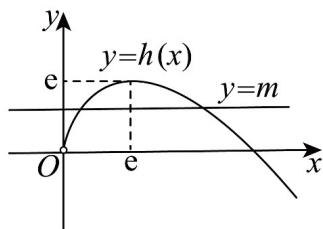

> [!faq]- 《专题14_导数精选压轴60题12类考点专练_高效培优期中专项训练_数学》官方解析
>
> > [!success]- **【答案】** ACD
>
> > [!note]- **【分析】**
> > 由奇偶性的概念可判断 A，通过求导确定单调性，再结合函数对称性可判断 BCD.
>
> > [!note]- **【解析】**
> > A选项： $f(x) = \mathrm{e}^{|x|}\sin x$ 定义域为R
> >
> > $f(-x)=\mathrm{e}^{|-x|}\sin(-x)=-\mathrm{e}^{|x|}\sin x=-f(x)$ ，是奇函数，选项正确；
> >
> > B 选项： $x \in \left(-\frac{\pi}{4}, 0\right)$ ， $f(x) = \mathrm{e}^{-x} \sin x = \frac{\sin x}{\mathrm{e}^{x}}$ ， $f'(x) = \frac{\cos x - \sin x}{\mathrm{e}^{x}} > 0$
> >
> > 故 $f(x)$ 在 $\left(-\frac{\pi}{4},0\right)$ 上单调递增，选项错误；
> >
> > C 选项：当 $x \in \left[0, \frac{\pi}{4}\right]$ ， $f(x) = \mathrm{e}^x \sin x$ ， $f'(x) = \mathrm{e}^x (\cos x + \sin x) > 0$
> >
> > 故 $f(x)$ 在 $x \in \left[0, \frac{\pi}{4}\right]$ 单调递增，所以 $f(x)$ 的最小值是 $f(0) = 0$ ，选项正确；
> >
> > D选项： $x\in \left(-\frac{5\pi}{2},0\right)$ ， $f^{\prime}(x) = \frac{\cos x - \sin x}{\mathrm{e}^{x}} = 0$ ，解得： $x = -\frac{3}{4}\pi$ 或 $-\frac{7}{4}\pi$
> >
> > 当 $x \in \left(-\frac{5\pi}{2}, -\frac{7\pi}{4}\right)$ 时， $f'(x) > 0$ ，当 $x \in \left(-\frac{7\pi}{4}, -\frac{3\pi}{4}\right)$ ， $f'(x) < 0$
> >
> > 当 $x \in \left(-\frac{3\pi}{4}, 0\right)$ 时， $f'(x) > 0$
> >
> > 即 $f(x)$ 在 $\left(-\frac{5\pi}{2}, -\frac{7\pi}{4}\right)$ ， $\left(-\frac{3\pi}{4}, 0\right)$ 单调递增，在 $\left(-\frac{7\pi}{4}, -\frac{3\pi}{4}\right)$ 单调递减，
> >
> > $\therefore f(x)$ 在 $\left(-\frac{5\pi}{2},0\right)$ 内有且只有2个极值点，
> >
> > 结合奇函数的对称性， $f(x)$ 在 $\left(-\frac{5\pi}{2}, \frac{5\pi}{2}\right)$ 内有且只有 4 个极值点，选项正确.
> >
> > 17. 过点 $(m,1)$ 有两条直线与 $f(x)=\ln x$ 的图象相切，则 m 的取值范围是（）
> > A. $(-∞,e)$ B. $(0,+∞)$ C. $(0,e^{2})$ D. $(0,e)$
> >
> > 【答案】D
> >
> > 【详解】设切点为 $\left(x_{0},\ln x_{0}\right),x_{0}>0,\quad f^{\prime}(x)=\frac{1}{x}$ ，切线斜率 $k=\frac{1}{x_{0}}$
> >
> > 切线方程： $y - \ln x_{0} = \frac{1}{x_{0}} (x - x_{0})$ ， $y = \frac{1}{x_{0}} x + \ln x_{0} - 1$
> >
> > 切线过 $(m,1)$ ，代入得： $1 = \frac{m}{x_0} +\ln x_0 - 1$ 整理得： $\ln x_0 + \frac{m}{x_0} -2 = 0$
> >
> > 由 $\ln x_{0}+\frac{m}{x_{0}}-2=0$ 分离参数，得 $m=x_{0}(2-\ln x_{0})$
> >
> > 令 $h(x)=x(2-\ln x)(x>0)$ ，原题等价于 y=m 与 $h(x)$ 的图象有两个交点.
> >
> > 求导： $h^{\prime}(x)=2-\ln x+x\cdot\left(-\frac{1}{x}\right)=1-\ln x$ ，令 $h^{\prime}(x)=0$ ，得x=e.
> >
> > 当 0 < x < e 时， $h'(x) > 0$ ， $h(x)$ 单调递增；
> >
> > 当 $x > \mathrm{e}$ 时， $h'(x) < 0$ ， $h(x)$ 单调递减.
> >
> > 故 $h(x)_{\max}=h(\mathrm{e})=\mathrm{e}(2-\ln\mathrm{e})=\mathrm{e}$
> >
> > 当 $x \to 0$ 时， $h(x) \to 0$ ，当 $x \to +\infty$ 时， $h(x) \to -\infty$ ，
> >
> > 作出 $h(x)$ 的大致图象：
> >
> > 
> >
> > 由此可知要使得 y = m 与 $h(x)$ 的图象有两个交点，需满足 0 < m < e
> >
> > 综上所述 $0 < m < \mathrm{e}$ 时，原方程有两个零点.
