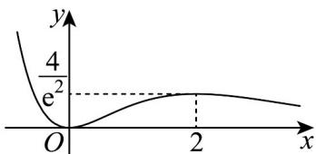

> [!faq]- 《专题14_导数精选压轴60题12类考点专练_高效培优期中专项训练_数学》官方解析
>
> > [!success]- **【答案】** A
>
> > [!note]- **【分析】**
> > 因为函数有三个极值点，所以其导函数有三个不同的变号零点，先对原函数求导，转化为方程
> >
> > $a = \frac{x^2}{\mathrm{e}^x}$ 有三个不同实根的问题，构造函数 $g(x) = \frac{x^2}{\mathrm{e}^x}$ ，对 $g(x)$ 求导，分析其单调性与极值，确定 $a$ 范围
>
> > [!note]- **【解析】**
> > 对 $f(x) = ae^{x} - \frac{1}{3} x^{3}$ 求导得 $f^{\prime}(x) = ae^{x} - x^{2}$
> >
> > $f(x)$ 有三个极值点 $\Rightarrow f'(x) = 0$ 有三个不同实根，整理得 $a = \frac{x^2}{\mathrm{e}^x}$
> >
> > 设 $g(x)=\frac{x^{2}}{\mathrm{e}^{x}}$ ， $g'(x)=\frac{2x\cdot\mathrm{e}^{x}-x^{2}\cdot\mathrm{e}^{x}}{(\mathrm{e}^{x})^{2}}=\frac{x(2-x)}{\mathrm{e}^{x}}$
> >
> > $x < 0$ 时， $g'(x) < 0$ ， $g(x)$ 单调递减； $0 < x < 2$ 时， $g'(x) > 0$ ， $g(x)$ 单调递增； $x > 2$ 时， $g'(x) < 0$ ， $g(x)$
> >
> > 单调递减
> >
> > 因此 $g(x)$ 的极小值为 $g(0) = 0$ ，极大值为 $g(2) = \frac{4}{\mathrm{e}^2}$ ；且当 $x \to -\infty$ 时 $g(x) \to +\infty$ ， $x \to +\infty$ 时 $g(x) \to 0$ ， $g(x)$ 恒大于0
> >
> > 
> >
> > 要使 $a=\frac{x^{2}}{e^{x}}$ 有三个不同实根，则 $0<a<\frac{4}{e^{2}}$
