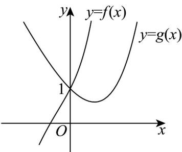

> [!faq]- 《专题14_导数精选压轴60题12类考点专练_高效培优期中专项训练_数学》官方解析
>
> > [!success]- **【答案】** BC $$ f (x) = \mathrm{e} ^ {2 x} - x ^ {2}, g (x) = \mathrm{e} ^ {x} - 2 x $$ $$ f (x) _ {\text {与}} g (x) $$ $$ h (x) = f (x) - g (x) $$ $$ f (x) = g (y) = m $$ 关系.
>
> > [!note]- **【解析】**
> > 令 $f(x) = \mathrm{e}^{2x} - x^2, g(x) = \mathrm{e}^x - 2x$ ， $f(0) = \mathrm{e}^0 - 0^2 = 1, g(0) = \mathrm{e}^0 - 2 \times 0 = 1$ ，
> >
> > $$
> > f ^ {\prime} (x) = 2 \mathrm{e} ^ {2 x} - 2 x
> > $$
> >
> > 当 $x \leq 0$ 时， $f'(x) = 2\mathrm{e}^{2x} - 2x > 0$
> >
> > 当 x > 0 时，由 $e^{x}$ $x + 1$ ，则 $e^{2x}$ $2x + 1$ ， $f'(x) = 2e^{2x} - 2x$ $2(2x + 1) - 2x = 2x + 2 > 0$ ，
> >
> > 综上可知， $f(x)$ 在 R 上单调递增，
> >
> > $g'(x)=\mathrm{e}^{x}-2$ ，令 $g'(x)=0$ ，即 $e^{x}-2=0$ ，解得 $x=\ln2$
> >
> > $$
> > \text {当} x \in (- \infty , \ln 2) _ {\text {时}}, g ^ {\prime} (x) = \mathrm{e} ^ {x} - 2 <   0, g (x) _ {\text {单调递减}},
> > $$
> >
> > $$
> > \text {当} x \in (\ln 2, + \infty) _ {\text {时}}, g ^ {\prime} (x) = \mathrm{e} ^ {x} - 2 > 0, g (x) _ {\text {单调递增}},
> > $$
> >
> > 最小值为 $g(\ln 2) = e^{\ln 2} - 2 \ln 2 = 2 - 2 \ln 2$
> >
> > 当 $x < 0$ 时， $f(x) < f(0) = 1$ ， $g(x) > g(0) = 1$ ，即 $f(x) < 1 < g(x)$ ，
> >
> > 当 x > 0 时，令 $h(x) = f(x) - g(x) = e^{2x} - x^{2} - e^{x} + 2x$
> >
> > $$
> > h ^ {\prime} (x) = 2 \mathrm{e} ^ {2 x} - \mathrm{e} ^ {x} - 2 x + 2 = \mathrm{e} ^ {2 x} - \mathrm{e} ^ {x} + \mathrm{e} ^ {2 x} - 2 x + 2
> > $$
> >
> > 因为 $\mathrm{e}^{2x} > \mathrm{e}^{x}, (x > 0)$ ， $\mathrm{e}^{2x} > 2x + 1, (x > 0)$ ，所以 $h'(x) > 0$
> >
> > $h(x)$ 单调递增，且 $h(0)=0$ ，所以 $h(x)>h(0)=0$ ，即 $f(x)>g(x)$
> >
> > 故二者图象如图所示，令 $f(x)=g(y)=m$
> >
> > 当 $2 - 2 \ln 2 \leq m < 1$ 时，x < 0 < y
> >
> > 当 $m > 1$ 时， $y < 0 < x$ 或 $0 < x < y$
> >
> > 当 m=1 时，x=y=0 或 x=0<y.
> >
> > 故选：BC
> >
> > 
