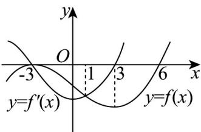

> [!faq]- 《专题14_导数精选压轴60题12类考点专练_高效培优期中专项训练_数学》官方解析
>
> > [!success]- **【答案】** BC
>
> > [!note]- **【分析】**
> > 由 $g(x)=\frac{f(x)}{\mathrm{e}^{x}}$ 有 $g'(x)=\frac{f'(x)-f(x)}{\mathrm{e}^{x}}$ ，结合图象逐项去分析即可判断.
>
> > [!note]- **【解析】**
> > 由 $g(x)=\frac{f(x)}{\mathrm{e}^{x}}$ ，得 $g'(x)=\frac{f'(x)-f(x)}{\mathrm{e}^{x}}$
> >
> > 若过 $(6,0)$ 的曲线为 $f'(x)$ 的图象，
> >
> > 则当 -3 < x < 6 时， $f'(x) < 0$ ，函数 $f(x)$ 在 $(-3, 6)$ 上单调递减，矛盾，
> >
> > 故 $f(x)$ 的图象过点 $(6,0)$ ， $f'(x)$ 的图象过点 $(3,0)$
> >
> > 即 $f(x), f'(x)$ 的图象关系如下：
> >
> > 
> >
> > 对于 A，当 3 < x < 6 时， $f'(x) > 0$ ， $f(x) < 0$ ，则 $f'(x) - f(x) > 0$ ，
> >
> > 所以 $g'(x) > 0$ ，即 $g(x)$ 在 $(3,6)$ 上单调递增，故 A 错误；
> >
> > 对于 B，当 -3 < x < 1 时， $f'(x) < f(x) < 0$ ，所以 $f'(x) - f(x) < 0$ ，即 $g'(x) < 0$
> >
> > 所以 $g(x)$ 在 $(-3,1)$ 上单调递减，故 B 正确；
> >
> > 对于 C，由图可得当 -3 < x < 1 时， $g'(x) < 0$ ，当 1 < x < 3 时， $g'(x) > 0$
> >
> > 所以 $g(x)$ 在 $(-3,1)$ 上单调递减，在 $(1,3)$ 上单调递增， $g'(1) = \frac{f'(1) - f(1)}{\mathrm{e}} = 0$
> >
> > 故当 $x = 1$ 时，函数 $g(x)$ 有极小值，故C正确；
> >
> > 对于 D，当 x < -3 时， $f'(x) > 0 > f(x)$ ，所以 $f'(x) - f(x) > 0$ ，即 $g'(x) > 0$
> >
> > 所以 $g(x)$ 在 $(-∞,-3)$ 上单调递增，又 $g(x)$ 在 $(-3,1)$ 上单调递减， $g'(-3)=0$ ，
> > 所以当 x=-3 时，函数 $g(x)$ 有极大值，故 D 错误.
