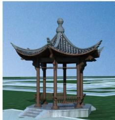
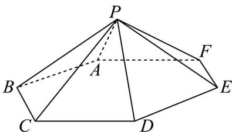

> [!faq]- 《专题15_计数原理及随机变量及其分布精选压轴70题14类考点专练_期中》官方解析
>
> > [!success]- **【答案】** C
>
> > [!note]- **【分析】**
> > 根据题意可知限时秒杀类选品不需要考虑；因为新鲜助农水果、核心助农产品要相邻，所以将其捆绑考虑；先求出不限制非遗手工艺品上架顺序的排列种数，最后从总排列方式中减去非遗手工艺品
> >
> > 作为最后一个链接上架的排列方式，即可得到符合条件的排列种数.
>
> > [!note]- **【解析】**
> > 因为要让限时秒杀类选品作为第一个链接上架，所以只要考虑余下的5类选品即可；
> >
> > 因为新鲜助农水果和核心助农产品要作为相邻链接上架，所以将它们视为一个整体，其内部排列方式有
> >
> > $A_{2}^{2}=2$ （种）；
> >
> > 所以此整体与剩下的地域特色干货、五谷杂粮礼包、非遗手工艺品 $^{3}$ 类选品的排列方式有 $A_{4}^{4}=24$ （种）；
> >
> > 因此不考虑其他限制的排列方式有 $A_{2}^{2}A_{4}^{4}=2\times24=48$ （种）；
> >
> > 当非遗手工艺品作为最后一个链接上架的排列方式有 $A_{2}^{2}A_{3}^{3}=2\times6=12$ （种）；
> >
> > 所以新鲜助农水果、核心助农产品作为相邻链接上架，且非遗手工艺品不能作为最后一个链接上架的上
> >
> > 架顺序有 48 - 12 = 36 （种）.
> >
> > 故选：C.
> >
> > 7. 中国古建筑闻名于世，源远流长·如图1，某公园的六角亭是中国常见的一种供休闲的古建筑，六角亭
> >
> > 屋顶的结构示意图可近似地看作如图2所示的六棱锥 $P - ABCDEF$ .该公园管理处准备用风铃装饰六角亭
> >
> > 屋顶 $P - ABCDEF$ 的六个顶点 $A, B, C, D, E, F$ ，现有四种不同形状的风铃可供选用，则在相邻的两
> >
> > 个顶点挂不同形状的风铃的条件下，顶点 $A$ 与 $C$ 处挂同一种形状的风铃的概率为（）
> >
> > 
> > 图1
> >
> > 
> > 图2
> >
> > A. $\frac{9}{61}$ B. $\frac{12}{61}$ C. $\frac{21}{61}$ D. $\frac{7}{12}$
> >
> > 【答案】C
> >
> > 【分析】记事件 G：相邻的两个顶点挂不同形状的风铃，事件 H：A 与 C 处挂同一种形状的风铃·分三类
> >
> > 讨论求出事件 G 的挂法总数，分两类讨论求出对于事件 H 的挂法总数，结合条件概率的计算公式计算即
> >
> > 可求解.
> >
> > 【详解】记事件 G：相邻的两个顶点挂不同形状的风铃，事件 H：A 与 C 处挂同一种形状的风铃.
> >
> > 对于事件 $G$ ，包含的情况可分以下三类：
> >
> > (1) 当 A, C, E 挂同一种形状的风铃时，有 4 种挂法，
> >
> > 此时 B, D, F 各有 3 种挂法，故不同的挂法共有 $4 \times 3 \times 3 \times 3 = 108$ 种；
> >
> > (2) 当 $A, C, E$ 挂两种不同形状的风铃时，有 $\mathrm{C}_3^2\mathrm{A}_4^2$ 种挂法，
> >
> > 此时 B，D，F 有 $3 \times 2 \times 2$ 种挂法，故不同的挂法共有 $C_{3}^{2}A_{4}^{2} \times 3 \times 2 \times 2 = 432$ 种；
> >
> > (3) 当 A, C, E 挂三种不同形状的风铃时，有 $A_{4}^{3}$ 种挂法，
> >
> > 此时 B, D, F 各有 2 种挂法，故不同的挂法共有 $A_{4}^{3} \times 2 \times 2 \times 2 = 192$ 种.
> >
> > 综上，总计有 $108+432+192=732$ 种挂法，即 $n(G)=732$
> >
> > 当顶点 $A$ 与 $C$ 挂同一种形状的风铃，且相邻两顶点挂不同形状的风铃时，分以下两类：
> >
> > (1) $A, C, E$ 挂同一种形状的风铃，由前面解析可知，此时不同的挂法有108种；
> >
> > (2) 当 A, C 挂同一种形状的风铃，E 挂其他形状的风铃时，有 $A_{4}^{2}$ 种挂法，
> >
> > 此时 B, D, F 有 $3 \times 2 \times 2$ 种挂法，故不同的挂法共有 $A_{4}^{2} \times 3 \times 2 \times 2 = 144$ 种.
> >
> > 综上，总计有 $108 + 144 = 252$ 种挂法，即 $n(GH) = 252$
> >
> > 故 $P(H|G)=\frac{n(GH)}{n(G)}=\frac{252}{732}=\frac{21}{61}$
> >
> > 故选 **C**.
