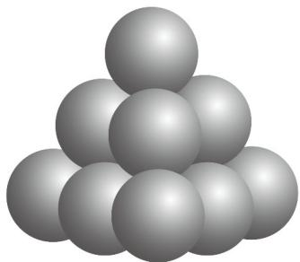

<!-- question-source:start -->
5. 如图的形状出现在南宋数学家杨辉所著的《详解九章算法·商功》中，后人称为“三角垛”“三角垛”的最上层有1个球，第二层有3个球，第三层有6个球，…，设各层球数构成一个数列 $\{a_n\}$ ，则 $a_{21} = (\quad)$

A.58 B.225 C.210 D.231
<!-- question-source:end -->

![[高中/课堂同步/题库/人教A版高中数学同步讲义(2026)/05_选择性必修第三册/期中专项训练+期中模拟卷/专题01 数列的概念（高效培优期中专项训练）数学人教A版高二选择性必修第二册_57272349/专题01_数列的概念/questions/answers/Q00082655A1.md]]
