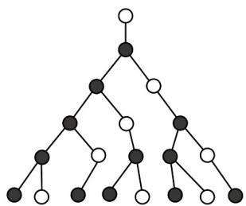

> [!faq]- 《专题01 数列的概念（高效培优期中专项训练）数学人教A版高二选择性必修第二册_57272349》官方解析
>
> > [!success]- **【答案】**  A. 55 B. 34 C. 21 D. 13
>
> > [!note]- **【解析】**
> > 设第 n 行圆点的个数为 $a_{n}$ ， $n \in N^{*}$ .
> >
> > 则由已知可得， $a_1 = 1$ ， $a_2 = 0$ ， $a_3 = 1 = a_1 + a_2$ ， $a_4 = 1 = a_2 + a_3$ ， $a_5 = 2 = a_3 + a_4$ ， $a_6 = 3 = a_4 + a_5$
> >
> > 所以 $a_{7} = a_{5} + a_{6} = 5$ ， $a_{8} = a_{6} + a_{7} = 8$ ， $a_{9} = a_{7} + a_{8} = 13$ ， $a_{10} = a_{8} + a_{9} = 21$
> >
> > 故选 **C**.
