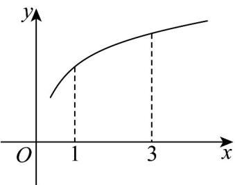

> [!faq]- 《专题05 导数的概念及运算（高效培优期中专项训练）数学人教A版高二选择性必修第二册_57272353》官方解析
>
> > [!success]- **【答案】**  A. $\frac{f(3) - f(1)}{2} < f'(1) < f'(3)$ B. $f'(3) < \frac{f(3) - f(1)}{2} < f'(1)$ C. $f'(3) < f'(1) < \frac{f(3) - f(1)}{2}$ D. $f'(1) < \frac{f(3) - f(1)}{2} < f'(3)$
>
> > [!note]- **【解析】**
> > 设 $(1,f(1))$ 为点A， $(3,f(3))$ 为点B，
> >
> > 由题图可知函数 $f(x)$ 的图象在 $x = 1$ 处的切线的斜率比在 $x = 3$ 处的切线的斜率大，且均为正数，
> >
> > 所以 $0 < f'(3) < f'(1)$ ，而直线 $AB$ 的斜率为 $\frac{f(3) - f(1)}{3 - 1} = \frac{f(3) - f(1)}{2}$ ，其比在 $x = 1$ 处的切线的斜率小，但比在 $x = 3$ 处的切线的斜率大，所以 $0 < f'(3) < \frac{f(3) - f(1)}{2} < f'(1)$ .
