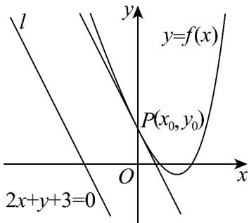

> [!faq]- 《专题05 导数的概念及运算（高效培优期中专项训练）数学人教A版高二选择性必修第二册_57272353》官方解析
>
> > [!success]- **【答案】** $\frac{4\sqrt{5}}{5} / \frac{4}{5}\sqrt{5}$
>
> > [!note]- **【解析】**
> > $f'(x)=\mathrm{e}^{x}-3=0$ ，得 $x=\ln3$ ，
> >
> > 当 $x < \ln 3$ 时， $f'(x) < 0$ ， $f(x)$ 单调递减，
> >
> > 当 $x > \ln 3$ 时， $f'(x) > 0$ ， $f(x)$ 单调递增，
> >
> > 所以当 $x = \ln 3$ 时，函数 $f(x)$ 取值最小值 $\mathrm{e}^{\ln 3} - 3\ln 3 = 3 - 3\ln 3 < 0$
> >
> > 如图画出函数 $f(x)$ 和直线 $l$ 的图象，
> >
> > 
> >
> > 如图，平移直线 l 至与 $y = f(x)$ 的图象相切时，此时切点 P 到直线 l 的距离为 $\left|AB\right|$ 的最小值，
> > 此时 $f'(x_{0})=\mathrm{e}^{x_{0}}-3=-2$ ，得 $x_{0}=0$ ， $f(x_{0})=f(0)=1$ ，即 $P(0,1)$
> >
> > 所以点 $P$ 到直线 $l$ 的距离 $d = \frac{|0 + 1 + 3|}{\sqrt{2^2 + 1^2}} = \frac{4\sqrt{5}}{5}$ .
> >
> > 故答案为： $\frac{4\sqrt{5}}{5}$
