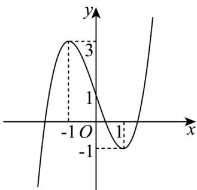

> [!faq]- 《专题14 导数精选压轴60题12类考点专练（高效培优期中专项训练）数学人教A版高二选择性必修第二册[57394124]》官方解析
>
> > [!success]- **【答案】** A
>
> > [!note]- **【分析】**
> > 根据导数作出函数 $f(x)$ 图象，数形结合依次判断即可.
>
> > [!note]- **【解析】**
> > 对函数 $f(x)$ 求导可得 $f'(x)=3x^{2}-3$
> >
> > 当 $x \in (-\infty, -1) \cup (1, +\infty)$ 时， $f^{\Phi}(x) > 0$ ，当 $x \in (-1, 1)$ 时， $f^{\Phi}(x) < 0$
> >
> > 所以函数 $f(x)$ 在区间 $(- \infty, -1), (1, +\infty)$ 上单调递增，在区间 $(-1, 1)$ 上单调递减，
> >
> > 当 $x \to -\infty$ 时， $f(x) \to -\infty$ ，当 $x \to +\infty$ 时， $f(x) \to +\infty$ ， $f(-1) = 3$ ， $f(1) = -1$
> >
> > 所以函数 $f(x)$ 大致图象如下：
> >
> > 
> >
> > 由图象可知，函数 $f(x)$ 有3个零点，2个极值点，
> >
> > 图象关于 $(0,1)$ 成中心对称，没有对称轴，故A正确，BCD错误.
