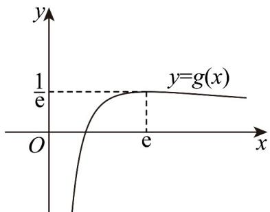

> [!faq]- 《专题14 导数精选压轴60题12类考点专练（高效培优期中专项训练）数学人教A版高二选择性必修第二册[57394124]》官方解析
>
> > [!success]- **【答案】** C
>
> > [!note]- **【分析】**
> > 由 $f(f(x)) = x$ 可得 $a^x = \log_a x$ ，由互为反函数函数图象关系可得 $a^x = x$ 有两解，
> >
> > 即 $\ln a = \frac{\ln x}{x}$ 有两个根，最后由函数 $y = \frac{\ln x}{x}$ 图象与直线 y = a 有两个交点可得答案.
>
> > [!note]- **【解析】**
> > 由题意得 $f(f(x)) = x \Leftrightarrow a^{a^x} = x$ ，即方程 $a^x = \log_a x$ 有两个不等根，
> >
> > 函数 $y = a^{x}$ 与 $y = \log_{a} x$ 图象有两个不同交点，
> >
> > $\because y=a^{x}$ $y=\log_{a}x$ 与互为反函数，则两函数图象关于 y=x 对称，
> >
> > 则 $y = a^{x}$ 与 $y = \log_a x$ 图象的交点都分布在直线 $y = x$ 上， $\therefore$ 问题等价于 $y = a^{x}$ 与 $y = x$ 有两个不同交点，即 $a^{x} = x \Rightarrow x \ln a = \ln x \Rightarrow \ln a = \frac{\ln x}{x}$ 有两根，
> >
> > 即函数 $y = \frac{\ln x}{x}$ 图象与直线 $y = \ln a$ 有两个交点.
> >
> > 设 $g(x) = \frac{\ln x}{x}$ ，则 $g'(x) = \frac{1 - \ln x}{x^2}$ ，令 $g'(x) > 0 \Rightarrow 0 < x < e$ ； $g'(x) \langle 0 \Rightarrow x \rangle e$ ，
> >
> > 则 $g(x)$ 在 $(0, \mathrm{e})$ 上单调递增，在 $(\mathrm{e}, +\infty)$ 上单调递减， $g(x)_{\max} = g(\mathrm{e}) = \frac{1}{\mathrm{e}}$ .
> >
> > $$
> > \text {又} g (1) = 0, x \to 0, g (x) \to - \infty , x \to + \infty , g (x) \to 0
> > $$
> >
> > 可得 $g(x)$ 大致图象如下，则要使 $y = \frac{\ln x}{x}$ 图象与直线 $y = \ln a$ 有两个交点，
> >
> > 需满足 $0 < \ln a < \frac{1}{e} \Rightarrow a \in \left(1, e^{\frac{1}{e}}\right)$ .
> >
> > 故选：C
> >
> > 
