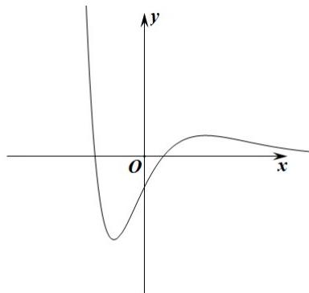

> [!faq]- 《专题14 导数精选压轴60题12类考点专练（高效培优期中专项训练）数学人教A版高二选择性必修第二册[57394124]》官方解析
>
> > [!success]- **【答案】** A. $f(x)$ 的极大值点为 2 B. 若关于 $x$ 的方程 $f(x) = k$ 恰有两实根，则 $k \in (-\mathrm{e}, 0)$ C. $f(f(x)) = -1$ 有 4 个实根 D. 关于 $x$ 的不等式 $f(x) \leq ax$ 的整数解至少有两个
>
> > [!note]- **【分析】**
> > 通过求导分析极值点，结合方程根的个数、复合函数零点即可验证ABC选项，对于D，在 $a = 0$
> >
> > 的情况下就存在两个整数解，所以关于 $x$ 的不等式 $f(x) \leq ax$ 的整数解至少有两个，故D正确.
>
> > [!note]- **【解析】**
> > 对于 A，由题意得 $f'(x) = -\frac{(x-2)(x+1)}{\mathrm{e}^{x}}$ ，令 $f'(x) = 0$ ，x = -1 或 x = 2，
> >
> > 则当 $x \in (-\infty, -1)$ 时， $f'(x) < 0$ ， $f(x)$ 单调递减，
> >
> > 当 $x \in (-1,2)$ 时， $f'(x) > 0$ ， $f(x)$ 单调递增，
> >
> > 当 $x \in (2, +\infty)$ 时， $f'(x) < 0$ ， $f(x)$ 单调递减，
> >
> > 所以 x = 2 是极大值点，故 A 正确；
> >
> > 对于 B，当 x = -1 时 $f(x)$ 取极小值 $f(-1) = -\mathrm{e}$ ，
> >
> > 当 $x = 2$ 时 $f(x)$ 取极大值 $f(2) = \frac{5}{\mathrm{e}^2}$
> >
> > 当 $x \to +\infty$ 时， $f(x) \to 0^{+}$ ，如图，
> >
> > 
> >
> > 则当 $k \in (-\mathrm{e}, 0]$ 时， $f(x) = k$ 恰有两实根，故B错误；
> >
> > 对于 C，令 $f(x)=0$ ，解得 $x=\frac{-1\pm\sqrt{5}}{2}$
> >
> > 设 $f(x)=t$ ，则 $f(t)=-1$ ，
> >
> > 易得 $f(0) = -1$ ，且 $f(t_{1}) = -1$ ， $\frac{-1 - \sqrt{5}}{2} < t_1 < 0$
> >
> > 当 $f(x) = 0$ 时，由 $f(x)$ 的图象可得 $x$ 有两个解，
> >
> > 当 $f(x) = t_1$ 时，因为 $-\mathrm{e} < \frac{-1 - \sqrt{5}}{2} \leq 0$ ，由 $f(x)$ 的图象可得 $x$ 有两个解，
> >
> > 故 $f(f(x)) = -1$ 有4个实根，故C正确；
> >
> > 对于D，当 $a = 0$ 时， $f(x) \leq 0$ ，存在整数解 $x = 0$ 使 $f(0) = -1 < 0$ 满足题意，
> >
> > 存在整数解 x = -1 使 $f(-1) = -\mathrm{e} < 0$ 满足题意，
> >
> > 故关于 x 的不等式 $f(x) \leq ax$ 的整数解至少有两个，D 正确.
