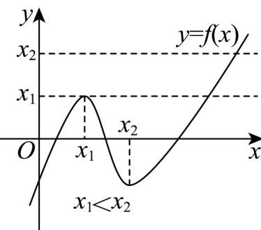

> [!faq]- 《专题14 导数精选压轴60题12类考点专练（高效培优期中专项训练）数学人教A版高二选择性必修第二册[57394124]》官方解析
>
> > [!success]- **【答案】** 3
>
> > [!note]- **【分析】**
> > 求导数 $f'(x)$ ，由题意知 $x_{1}$ ， $x_{2}$ 是方程 $3x^{2} + 2ax + b = 0$ 的两根，从而关于 $f(x)$ 的方程 $3(f(x))^{2}+2af(x)+b=0$ 有两个根，作出草图，由图象可得答案.
>
> > [!note]- **【解析】**
> > $f'(x)=3x^{2}+2ax+b$ ，则由题 $x_{1}$ 、 $x_{2}$ 是方程 $3x^{2}+2ax+b=0$ 的两根，
> >
> > 所以 $3(f(x))^2 + 2af(x) + b = 0$ 可得 $f(x) = x_1$ 或 $f(x) = x_2$
> >
> > 函数 $f(x)$ 定义域为 R，因为 $x_{1} < x_{2}$ ，所以 $x \in (-\infty, x_{1}) \cup (x_{2}, +\infty)$ 时 $f'(x) > 0$ ， $x \in (x_{1}, x_{2})$ 时 $f'(x) < 0$ ，
> > 所以函数在 $(-∞, x₁), (x₂, +∞)$ 上单调递增，在 $(x₁, x₂)$ 上单调递减，
> > 作出函数草图如图所示：
> >
> > 
> >
> > 由图象可知 $f(x)=x_{1}$ 有2个解， $f(x)=x_{2}$ 有1个解，
> >
> > 因此 $3(f(x))^{2} + 2af(x) + b = 0$ 的不同实根个数为 3.
> >
> > 故答案为：3.
