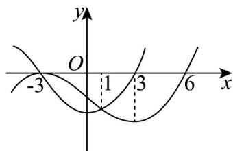

<!-- question-source:start -->
4．已知函数 $f(x)$ 与其导函数 $f'(x)$ 的部分图象如图所示，若函数 $g(x)=\frac{f(x)}{\mathrm{e}^{x}}$ ，则下列关于函数 $g(x)$ 的结

论正确的是（）

A. 在区间 $(3,6)$ 上单调递减 B. 在区间 $(-3,1)$ 上单调递减

C．当 x=1 时，函数 $g(x)$ 有极小值 D．当 x=-3 时，函数 $g(x)$ 有极小值
<!-- question-source:end -->

![[高中/课堂同步/题库/人教A版高中数学同步讲义(2026)/05_选择性必修第三册/期中专项训练+期中模拟卷/专题14 导数精选压轴60题12类考点专练（高效培优期中专项训练）数学人教A版高二选择性必修第二册[57394124]/题型十二_导数的综合性的考点/questions/answers/Q00082984A1.md]]
