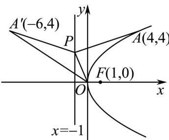

> [!faq]- 《专题15 计数原理及随机变量及其分布精选压轴70题14类考点专练（期中复习专项训练）数学人教A版高二选择性必修第三册_57394125》官方解析
>
> > [!success]- **【答案】** A
>
> > [!note]- **【分析】**
> > 依题意可得 $E(X) = 0.2\sum_{k=1}^{n-1} k \cdot 0.8^{k-1} + n \cdot 0.8^{n-1}$ ，设 $M = \sum_{k=1}^{n-1} k \cdot 0.8^{k-1}$ ，利用错位相减法求出 $0.2M$ ，即
> >
> > 可得到 $E(X) = 5(1 - 0.8^n)$ ，从而得到 $0.8^n$ 、 $0.4$ ，再根据指数函数的性质及所给数据判断即可。
>
> > [!note]- **【解析】**
> > 因为蓝莓果重量 $Z$ 服从正态分布 $N(15,9)$ ，其中 $\mu = 15, \sigma = 3$
> >
> > $$
> > p = P \left( \begin{array}{c c} Z & 1 8 \end{array} \right) = P \left( \begin{array}{c c} Z & \mu + \sigma \end{array} \right) = \frac {1 - P (\mu - \sigma <   Z \leq \mu + \sigma)}{2} = \frac {1 - 0 . 6 8 2 7}{2} \approx 0. 2
> > $$
> >
> > 设第 k 次抽到优等果的概率 $P(X=k)=0.8^{k-1}\cdot0.2$ ( $k=1,2,3,\cdots,n-1$ )
> >
> > 恰好抽取 n 次的概率 $P(X = n) = 0.8^{n-1}$ ，所以 $E(X) = 0.2 \sum_{k=1}^{n-1} k \cdot 0.8^{k-1} + n \cdot 0.8^{n-1}$
> >
> > 设 $M = \sum_{k=1}^{n-1} k \cdot 0.8^{k-1}$ ，则 $0.8M = \sum_{k=1}^{n-1} k \cdot 0.8^{k}$
> >
> > $0.2M = \sum_{k=1}^{n-1} 0.8^{k-1} - (n-1) \cdot 0.8^{n-1} = \frac{1 - 0.8^{n-1}}{1 - 0.8} - (n-1) \cdot 0.8^{n-1} = 5(1 - 0.8^{n-1}) - (n-1) \cdot 0.8^{n-1}$ 两式相减得：
> >
> > 所以 $E(X) = 0.2M + n \cdot 0.8^{n-1} = 5(1 - 0.8^{n-1}) - (n - 1) \cdot 0.8^{n-1} + n \cdot 0.8^{n-1} = 5(1 - 0.8^n)$
> >
> > 由 $5(1 - 0.8^n)\leq 3$ ，即 $0.8^{n}$ 0.4
> >
> > 又 $0.8^{4} = 0.4096 > 0.4, 0.8^{5} = 0.32768 < 0.4$
> >
> > 所以 $n$ 的最大值为4.
> >
> > 故选：A.
> >
> > $$
> > \xi \sim N (3, 2 0 1 9 ^ {2})
> > $$
> >
> > $$
> > P (\xi \leq 1) = P (\xi a)
> > $$
> >
> > $$
> > F
> > $$
> >
> > $$
> > y ^ {2} = 4 x
> > $$
> >
> > $$
> > o
> > $$
> >
> > $$
> > P
> > $$
> >
> > 是抛物线准线上一动点，若点 $A$ 在抛物线上，且 $\vert AF\vert = a$ ，则 $\vert PA\vert +\vert PO\vert$ 的最小值为（ ）A. $\sqrt{5}$ B. $\sqrt{13}$ C. $2\sqrt{5}$ D. $2\sqrt{13}$
> >
> > 【答案】D
> >
> > 【分析】根据已知条件先得到 $a$ 的值即得到了 $\left|AF\right|$ 的值，再利用抛物线的定义由 $\left|AF\right|$ 的值可得到 $A$ 点的坐
> >
> > 标为 $A(4,4)$ ，要求 $|PA| + |PO|$ 的最小值即要在准线上找一点到两个定点的距离之和最小，最后利用平面
> >
> > 几何的方法即可求出距离之和的最小值.
> >
> > 【详解】∵随机变量 $\xi\sim N(3,2019^{2})$ ，且 $P(\xi\leq1)=P(\xi\quad a)$ ，
> >
> > ∴ 1 和 a 关于 x = 3 对称，
> >
> > ∴ a = 5 即 | AF | = 5
> >
> > 设 A 为第一象限中的点， $A(x,y)$
> >
> > $\because$ 抛物线方程为： $y^{2} = 4x$ ， $F(1,0)$
> >
> > ∴ $\left|AF\right|=x+1=5$ 解得 x=4 即 $A(4,4)$
> >
> > $\therefore A(4,4)$ 关于准线 $x = -1$ 的对称点为 $A^{\prime}(-6,4)$
> >
> > $\because$ 根据对称性可得： $\left|PA\right| = \left|PA'\right|$
> >
> > $$
> > \therefore | P A | + | P O | = \left| P A ^ {\prime} \right| + | P O | \quad \left| A ^ {\prime} O \right| = \sqrt {(- 6) ^ {2} + 4 ^ {2}} = \sqrt {5 2} = 2 \sqrt {1 3}
> > $$
> >
> > 当且仅当 $A', P, O$ 三点共线时等号成立. 如图
> >
> > 
> >
> > 故选 **D**
