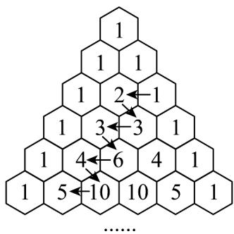

> [!faq]- 《专题15 计数原理及随机变量及其分布精选压轴70题14类考点专练（期中复习专项训练）数学人教A版高二选择性必修第三册_57394125》官方解析
>
> > [!success]- **【答案】** (1) $\frac{7}{15}$ (2) $\frac{1}{8}$ (3)随机变量 $Y$ 的分布列如下表所示： <table><tr><td>Y</td><td>30</td><td>55</td><td>80</td></tr><tr><td>P</td><td>7/15</td><td>7/15</td><td>1/15</td></tr></table> 数学期望为 45.
>
> > [!note]- **【分析】**
> > （1）根据题意得出这10个零件中不合格零件数，利用随机变量 $X$ 服从超几何分布即可求解；
> >
> > (2) 通过条件概率公式即可求解；
> >
> > (3) 根据题意得出随机变量 $X$ 与随机变量 $Y$ 的关系，从而得到随机变量 $Y$ 的取值范围和对应概率，即可
> >
> > 求出分布列，再根据期望公式计算即可.
>
> > [!note]- **【解析】**
> > （1）小明的解答不正确，正确的解答过程如下：
> >
> > 根据题意，这10个零件中是有2个不合格零件，8个合格零件，
> >
> > 则从这10个零件中抽到1个不合格零件，2个合格零件的组合数是 $C_2^1 \times C_8^2 = \frac{2}{1} \times \frac{8 \times 7}{1 \times 2} = 56$ 种，
> >
> > 因此 $P(X=1)=\frac{C_{2}^{1}\times C_{8}^{2}}{C_{10}^{3}}=\frac{2\times\frac{8\times7}{1\times2}}{\frac{10\times9\times8}{1\times2\times3}}=\frac{56}{120}=\frac{7}{15}$
> >
> > (2) 设事件 $A$ 为“抽到的 3 个零件中至少有 1 个为不合格零件”，事件 $B$ 为“抽到的 3 个零件中恰好有 2 个为
> >
> > 不合格零件”，
> >
> > 由于事件 $B$ 是事件 $A$ 的子事件，所以 $P(AB) = P(B)$
> >
> > $$
> > P (B) = \frac {C _ {2} ^ {2} \times C _ {8} ^ {1}}{C _ {1 0} ^ {3}} = \frac {8}{1 2 0} = \frac {1}{1 5}, P (A) = \frac {C _ {1 0} ^ {3} - C _ {8} ^ {3}}{C _ {1 0} ^ {3}} = \frac {1 2 0 - 5 6}{1 2 0} = \frac {8}{1 5},
> > $$
> >
> > 根据条件概率公式 $P(B \mid A) = \frac{P(AB)}{P(A)} = \frac{P(B)}{P(A)} = \frac{\frac{1}{15}}{\frac{8}{15}} = \frac{1}{8}$ ，即恰好有一个为不合格零件的概率为 $\frac{1}{8}$ .
> >
> > (3) 由于随机变量 $X$ 表示抽到的不合格的零件数，可能取值为 $0,1,2$ ，而对于每个 $X$ 的值，总费用 $Y = 3\times 10 + 25X = 30 + 25X$
> >
> > 因此随机变量 $Y$ 的可能取值为 $Y = 30 + 25 \times 0 = 30$ ， $Y = 30 + 25 \times 1 = 55$ ， $Y = 30 + 25 \times 2 = 80$
> >
> > $$
> > = P (X = 0) = \frac {C _ {8} ^ {3}}{C _ {1 0} ^ {3}} = \frac {5 6}{1 2 0} = \frac {7}{1 5}, P (X = 1) = \frac {C _ {2} ^ {1} \times C _ {8} ^ {2}}{C _ {1 0} ^ {3}} = \frac {5 6}{1 2 0} = \frac {7}{1 5}, P (X = 2) = \frac {C _ {2} ^ {2} \times C _ {8} ^ {1}}{C _ {1 0} ^ {3}} = \frac {8}{1 2 0} = \frac {1}{1 5}
> > $$
> >
> > $$
> > P (Y = 3 0) = P (X = 0) = \frac {7}{1 5}, P (Y = 5 5) = P (X = 1) = \frac {7}{1 5}, P (Y = 8 0) = P (X = 2) = \frac {1}{1 5}
> > $$
> >
> > 所以随机变量 $Y$ 的分布列为：
> >
> > <table><tr><td>Y</td><td>30</td><td>55</td><td>80</td></tr><tr><td>P</td><td>7/15</td><td>7/15</td><td>1/15</td></tr></table>
> >
> > 数学期望为 $E(Y)=30\times\frac{7}{15}+55\times\frac{7}{15}+80\times\frac{1}{15}=45$ ，即随机变量 Y 的数学期望为 45.
> >
> > ## 考题猜想·高分必刷
> >
> > 1. 我国南宋数学家杨辉 1261 年所著的《详解九章算法》一书里出现了杨辉三角，杨辉三角是中国数学
> >
> > 史上一项重要研究成果·从不同的角度观察杨辉三角，能得到很多优美的规律，如图是一个7阶的杨辉三
> >
> > 角，则下列说法正确的是（）
> >
> > <table><tr><td>第0行</td><td></td><td></td><td></td><td>1</td><td>......</td><td>第1斜列</td></tr><tr><td>第1行</td><td></td><td></td><td></td><td>1</td><td>1</td><td>......第2斜列</td></tr><tr><td>第2行</td><td></td><td></td><td></td><td>1</td><td>2</td><td>1 ......第3斜列</td></tr><tr><td>第3行</td><td></td><td></td><td></td><td>1</td><td>3</td><td>3 1 ......第4斜列</td></tr><tr><td>第4行</td><td></td><td></td><td></td><td>1</td><td>4</td><td>6 4 1 ......第5斜列</td></tr><tr><td>第5行</td><td></td><td></td><td></td><td>1</td><td>5</td><td>10 10 5 1 ......第6斜列</td></tr><tr><td>第6行</td><td></td><td></td><td></td><td>1</td><td>6</td><td>15 20 15 6 1 ......第7斜列</td></tr><tr><td>第7行</td><td></td><td></td><td></td><td>1</td><td>7</td><td>21 35 35 21 7 1 ...第8斜列</td></tr></table>
> >
> > A. 第2025行共有2025个数
> > B. 第3斜列为： $1,3,6,10,15,L$ ，则该数列的前n项和为 $T_{n}=C_{n+2}^{3}(n\in\mathbf{N}^{*})$ C. 70 在杨辉三角中共出现了 3 次
> > D. 记第 n 行的第 i 个数为 $a_{i}$ ，则 $\sum_{i=1}^{n+1}3^{i-1}a_{i}=4^{n}$
> >
> > 【答案】BCD
> >
> > 【分析】由行数比每行的个数少1可判断A，由公式 $C_{n}^{m}+C_{n}^{m+1}=C_{n+1}^{m+1}$ 可判断B，由组合数计算可判断C，
> >
> > 结合二项式定理可判断 D.
> >
> > 【详解】对于 A：行数比每行的个数少 1，所以第 2025 行共有 2026 个数，所以 A 错误；
> >
> > <!-- source-part:3 pages:101-109 -->
> >
> > 对于 B：由公式 $C_{n}^{m} + C_{n}^{m+1} = C_{n+1}^{m+1}$ 得：
> >
> > $$
> > \mathrm{C} _ {2} ^ {2} + \mathrm{C} _ {3} ^ {2} + \mathrm{C} _ {4} ^ {2} + \dots + \mathrm{C} _ {n + 1} ^ {2} = \mathrm{C} _ {3} ^ {3} + \mathrm{C} _ {3} ^ {2} + \mathrm{C} _ {4} ^ {2} + \dots + \mathrm{C} _ {n + 1} ^ {2}
> > $$
> >
> > $= \mathrm{C}_{4}^{3} + \mathrm{C}_{4}^{2} + \dots \mathrm{C}_{n + 1}^{2} = \mathrm{C}_{n + 2}^{3}\left(n\in \mathbf{N}^{*}\right)$ ，所以B正确.
> >
> > 对于 C：由组合数可知只有 $C_{8}^{4}=70, C_{70}^{1}=70, C_{70}^{69}=70$ ，所以 C 正确，
> >
> > 对于 D，记第 n 行的第 i 个数为 $a_{i}$ ，则 $a_{i} = C_{n}^{i-1}$ ，
> >
> > 则 $\sum_{i=1}^{n+1}3^{i-1}C_{n}^{i-1}=3^{0}C_{n}^{0}+3^{1}C_{n}^{1}+3^{2}C_{n}^{2}+\cdots+3^{n}C_{n}^{n}=(1+3)^{n}=4^{n}$ ，D 正确；
> >
> > 故选：BCD
> >
> > 2．学校举办“校园歌手大赛”，某参赛同学的参赛曲库中有5首歌，分别是：抒情歌1首，流行歌2首，摇
> >
> > 滚歌2首.若他演唱这三类歌曲能晋级下一轮的概率分别为 $\frac{2}{3}$ ， $\frac{3}{4}$ ， $\frac{4}{5}$ ，他比赛时，随机从这5首歌里选
> >
> > 择一首演唱，则他能晋级的概率为\_\_\_\_；若他晋级了，则这名学生是演唱流行歌晋级的概率为\_\_\_\_。
> >
> > 【答案】
> >
> > $$
> > \begin{array}{c c} \frac {1 1 3}{1 5 0} & \frac {4 5}{1 1 3} \end{array}
> > $$
> >
> > 【分析】首先根据题意写出各事件的概率，再根据全概率公式求解；第二个小题根据贝叶斯概率公式求
> >
> > 解.
> >
> > 【详解】设某参赛选手演唱抒情歌，流行歌，摇滚歌分别为事件 A, B, C
> >
> > 该选手晋级为事件 E ，
> >
> > 由条件可知， $P(E|A)=\frac{2}{3}$ ， $P(E|B)=\frac{3}{4}$ ， $P(E|C)=\frac{4}{5}$ ， $P(A)=\frac{1}{5}$ ， $P(B)=\frac{2}{5}$ ， $P(C)=\frac{2}{5}$ ，
> >
> > $$
> > P (E) = P (E | A) P (A) + P (E | B) P (B) + P (E | C) P (C) = \frac {1}{5} \times \frac {2}{3} + \frac {2}{5} \times \frac {3}{4} + \frac {2}{5} \times \frac {4}{5} = \frac {1 1 3}{1 5 0}
> > $$
> >
> > 所以他能晋级的概率为 $\frac{113}{150}$ ；
> >
> > $$
> > P (B \mid E) = \frac {P (B E)}{P (E)} = \frac {P (E \mid B) P (B)}{P (E)} = \frac {\frac {3}{4} \times \frac {2}{5}}{\frac {1 1 3}{1 5 0}} = \frac {4 5}{1 1 3},
> > $$
> >
> > 所以这名学生是演唱流行歌晋级的概率为 $\frac{45}{113}$ .
> >
> > 3. 一位飞镖运动员向一个目标投掷三次，记事件 $A_{i} =$ “第 $i$ 次命中目标” ( $i = 1, 2, 3$ )
> >
> > $P(A_{1}) = \frac{1}{6}, P(A_{i+1} | A_{i}) = 2P(A_{i}), P(A_{i+1} | \overline{A_{i}}) = \frac{1}{3} (i = 1, 2)$ ，则 $P(A_{3}) =$ \_\_\_\_.
> >
> > 【答案】 $\frac{4}{9}$
> >
> > 【分析】根据题意两次利用全概率公式依次求出 $P(A_{2})$ 、 $P(A_{3})$
> >
> > 【详解】由题意知 $P\left(A_{1}, A_{1}\right) = 2P\left(A_{1}\right) = \frac{1}{3}$ ， $P\left(A_{1} \overline{A_{1}}\right) = \frac{1}{3}$ ，
> >
> > 所以 $P(A_{2})=P(A_{1})P(A_{2}\mid A_{1})+P(\overline{A_{1}})P(A_{2}\mid\overline{A_{1}})=\frac{1}{6}\times\frac{1}{3}+\frac{5}{6}\times\frac{1}{3}=\frac{1}{3}$
> >
> > 因为 $P(A_3 \mid A_2) = 2P(A_2) = 2 \times \frac{1}{3} = \frac{2}{3}$ ， $P(A_3 \mid \overline{A_2}) = \frac{1}{3}$
> >
> > $$
> > P \left(A _ {3}\right) = P \left(A _ {2}\right) P \left(A _ {3} \mid A _ {2}\right) + P \left(\overline {{{A _ {2}}}}\right) P \left(A _ {3} \mid \overline {{{A _ {2}}}}\right) = \frac {1}{3} \times \frac {2}{3} + \frac {2}{3} \times \frac {1}{3} = \frac {4}{9}.
> > $$
> >
> > 故答案为： $\frac{4}{9}$
> >
> > 4．盒中有6个小球，分别标有数字1，2，3，4，5，6，从中无放回地随机取5次，每次取1个球，设a
> >
> > 为前2次取出的球上数字的平均值， $b$ 为后3次取出的球上数字的平均值，记 $X = a + b$ ， $E(X) =$
> >
> > 附：若 $\xi$ ， $\eta$ 是随机变量，则 $E(\xi +\eta) = E(\xi) + E(\eta)$
> >
> > 【答案】7
> >
> > 【分析】设第 n 次取出的数字为 $X_{n}$ ，根据题意分析可知对任意的 $i \in \{1, 2, 3, 4, 5\}$ ， $E(X_{i}) = \frac{7}{2}$ ，结合题中
> >
> > 期望的性质运算求解.
> >
> > 【详解】设第 n 次取出的数字为 $X_{n}$ ，则 $a=\frac{X_{1}+X_{2}}{2}$ ， $b=\frac{X_{3}+X_{4}+X_{5}}{3}$ ，
> >
> > 所以， $X = \frac{X_1 + X_2}{2} +\frac{X_3 + X_4 + X_5}{3}$ ， $E(X_{1}) = \frac{1 + 2 + 3 + 4 + 5 + 6}{6} = \frac{7}{2}$
> >
> > 设第 1 次取出的数字是 k，则第 2 次只能从剩下的 5 个数字中取，
> >
> > 此时第2次取出的数字的期望为 $\frac{(1 + 2 + 3 + 4 + 5 + 6) - k}{5} = \frac{21 - k}{5}$
> >
> > 对所有可能的 $k$ 求期望，可得 $E\left(X_{2}\right) = \frac{1}{6}\sum_{k = 1}^{6}\frac{21 - k}{5} = \frac{7}{2}$
> >
> > 同理，对任意的 $i\in \{1,2,3,4,5\}$ ， $E(X_{i}) = \frac{7}{2}$
> >
> > 所以， $E(X)=E(a)+E(b)=E\left(\frac{X_{1}+X_{2}}{2}\right)$
> >
> > $$
> > + E \left(\frac {X _ {3} + X _ {4} + X _ {5}}{3}\right) = E \left(\frac {X _ {1}}{2}\right) + E \left(\frac {X _ {2}}{2}\right) + E \left(\frac {X _ {3}}{3}\right) + E \left(\frac {X _ {4}}{3}\right) + E \left(\frac {X _ {5}}{3}\right) = 7
> > $$
> >
> > 5. 杨辉三角形，又称贾宪三角形，是二项式系数 $\mathrm{C}_n^{r-1}$ ( $n \in \mathbb{N}^*$ , $r \in \mathbb{N}^*$ 且 $r \leq n+1$ ) ，在三角形中的一种几
> >
> > 何排列，南宋数学家杨辉1261年所著的《详解九章算法》一书中就有出现．如图所示，在“杨辉三角”中，
> >
> > 从1开始箭头所指的数组成一个锯齿形数列：1，2，3，3，6，4，10，5，…，则在该数列中，第37项是
> >
> > 
> >
> > 【答案】190
> >
> > 【分析】依题意将锯齿形数列分组找出规律可知第37项是第19组的第一个数 $C_{20}^{2}$ ，计算可得结果.
> >
> > 【详解】根据题意，将锯齿形数列两个一组进行分组，可知其成如下规律：
> >
> > 第一组： $C_{2}^{2},C_{2}^{1}$ ；
> >
> > 第二组： $C_{3}^{2},C_{3}^{1}$ ；
> >
> > 第三组： $C_{4}^{2},C_{4}^{1}$ ；
> >
> > 第四组： $C_{5}^{2},C_{5}^{1},\cdots$ ；
> >
> > 因此第 37 项是第 19 组的第一个数，易知第 19 组的两个数为 $C_{20}^{2}, C_{20}^{1}$ ;
> >
> > $C_{20}^{2}=\frac{20\times19}{2\times1}=190$ 可得第 37 项是
> >
> > 故答案为：190
