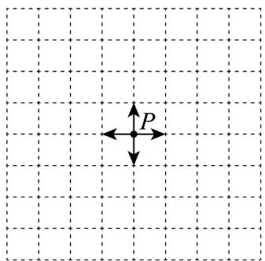

<!-- question-source:start -->
6．如图，某机器狗位于点 P 处，它可以向上、下、左、右四个方向自由移动，每次移动一个单位现机器
狗从点 P 出发移动 4 次，则在机器狗仍回到点 P 的条件下，它向右移动了 2 次的概率为（）

A. $\frac{1}{6}$ B. $\frac{1}{3}$ C. $\frac{1}{2}$ D. $\frac{2}{3}$
<!-- question-source:end -->

![[高中/课堂同步/题库/人教A版高中数学同步讲义(2026)/05_选择性必修第三册/期中专项训练+期中模拟卷/高二数学下学期期中模拟卷（人教A版选择性必修第二册全部+选择性必修三第六、七章，高效培优·提升卷）_57272348/一_选择题/questions/answers/Q00083062A1.md]]
