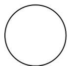
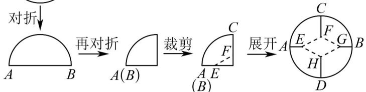

> [!faq]- 《高二数学下学期期中模拟卷（人教A版选择性必修第二册全部+选择性必修三第六、七章，高效培优·提升卷）_57272348》官方解析
>
> > [!success]- **【答案】** D
>
> > [!note]- **【解析】**
> > 由题意知讲座 $A$ 只能安排在第一或最后一场，安排 $A$ 有 $A_{2}^{1} = 2$ 种排法，
> >
> > 因为讲座 B 和 C 必须相邻，所以安排 BC 及其余三场讲座共有 $A_{4}^{4}A_{2}^{2}=48$ 种排法，
> >
> > 根据分步计数原理知共有 $2 \times 48 = 96$ 种排法.
> >
> > 故选：D.
> >
> > 
> >
> > 8．剪纸是一种镂空艺术，是中国汉族最古老的民间艺术之一．如图，一圆形纸片，直径 $AB = 12\mathrm{cm}$ ，需要剪去菱形EFGH，可以经过两次对折、沿EF裁剪、展开后得到．若 $\left|CF\right| = \left|EF\right|$ ，若要使镂空的菱形
> >
> > $EFGH$ 面积最大，则菱形的边 $EF$ 的长度为（）
> >
> > 
> >
> > A. $2\mathrm{cm}$ B. $2\sqrt{3}\mathrm{cm}$ C. $4\mathrm{cm}$ D. $3\sqrt{3}\mathrm{cm}$
> >
> > 【答案】C
> >
> > 【详解】设圆心为 $O$ ，由圆的性质可知， $A$ ， $E$ ， $O$ ， $G$ ， $B$ 共线， $C$ ， $F$ ， $O$ ， $H$ ， $D$ 共线，由菱形性质可知， $EG \perp FH$ ，
> >
> > 不妨令 OF = m ， OE = n ，且半径为 6 ，
> >
> > 则 $EF=\sqrt{m^{2}+n^{2}}=CF=6-m$ ，即 $2m=6-\frac{1}{6}n^{2}$ ，0<n<6，
> > 故 $S_{EFGH}=4S_{VOEF}=2OE\cdot OF=2mn=-\frac{1}{6}n^{3}+6n$ 不妨令 $f(x) = -\frac{1}{6}x^{3} + 6x$ ，0 < x < 6，
> > 则 $f'(x) = -\frac{1}{2}x^{2} + 6$ 从而 $f'(x) > 0 \Rightarrow 0 < x < 2\sqrt{3}$ ; $f'(x) < 0 \Rightarrow 2\sqrt{3} < x < 6$ 故 $f(x)$ 在 $(0,2\sqrt{3})$ 上单调递增，在 $(2\sqrt{3},6)$ 上单调递减，
> >
> > 所以当 $x = 2\sqrt{3}$ 时， $f(x)$ 在 $(0,6)$ 上取最大值，
> >
> > 从而要使镂空的菱形 EFGH 面积最大，则 $n = 2\sqrt{3}$ ，
> >
> > 由 $2m = 6 - \frac{1}{6}n^{2}$ 可知，m = 2，
> >
> > 则此时 EF = 6 - 2 = 4.
> >
> > 故选：C.
> >
> > ## 二、选择题：本题共3小题，每小题6分，共18分．在每小题给出的选项中，有多项符合题目要求．全部选对的得6分，部分选对的得部分分，有选错的得0分.
