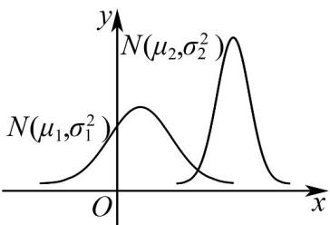

<!-- question-source:start -->
21. 设两个正态分布 $N\left(\mu_1, \sigma_1^2\right)\left(\sigma_1 > 0\right)$ 和 $N\left(\mu_2, \sigma_2^2\right)\left(\sigma_2 > 0\right)$ 曲线如图所示，则有（）

A. $\mu_{1} < \mu_{2}, \sigma_{1} > \sigma_{2}$ B. $\mu_{1} < \mu_{2}, \sigma_{1} < \sigma_{2}$ C. $\mu_{1} > \mu_{2}, \sigma_{1} > \sigma_{2}$ D. $\mu_{1} > \mu_{2}, \sigma_{1} < \sigma_{2}$
<!-- question-source:end -->

![[高中/课堂同步/题库/人教A版高中数学同步讲义(2026)/05_选择性必修第三册/第七章 随机变量及其分布/专项训练/专题04_二项分布与正态分布四大常考题型_高效培优专项训练_数学人教A/题型三_sec_04/questions/answers/Q00059647A1.md]]
