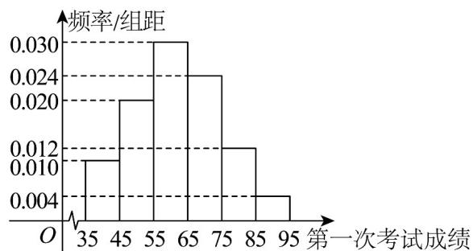

<!-- question-source:start -->
27. 某区举行模拟考试，共有 $5000$ 名学生参加，考试分两次，对第一次考试成绩不满意的学生可参加第二次考试。为了解考生情况，随机抽取了 $100$ 名学生第一次考试中某科目的成绩（满分： $100$ 分），并绘制样本频率分布直方图，如图所示。

(1)若学生第一次考试中某科目的成绩 X 近似服从正态分布 $N(\mu,144)$ ，其中 $\mu$ 为样本平均数的估计值，请
估计第一次考试中某科目的成绩高于86分的人数。(同一组数据用该区间的中点值作代表)

(2)设第一次考试中某科目成绩在区间 $[85,95],[65,85),[45,65),[35,45)$ 内对应的等级分别为优秀、良好、合格与不合格，若该科目第一次考试等级为良好，合格与不合格的学生都参加了第二次考试，假设第二次考试后，原等级为良好、合格与不合格的学生分别有 $\frac{1}{2},\frac{2}{3},\frac{4}{5}$ 的概率提升一个等级，不晋级则保留原等级，每位学生的考试成绩相互独立.将频率视为概率，从全体学生中任取一人，求在已知该生是第二次考试后晋级的条件下，第一次考试评级为合格的概率.

附:若随机变量 $X \sim N\left(\mu, \sigma^{2}\right)$ ，则 $P\left(\left|X - \mu\right| \leq \sigma\right) \approx 0.6827, P\left(\left|X - \mu\right| \leq 2\sigma\right) \approx 0.9545$ .
<!-- question-source:end -->

![[高中/课堂同步/题库/人教A版高中数学同步讲义(2026)/05_选择性必修第三册/第七章 随机变量及其分布/专项训练/专题04_二项分布与正态分布四大常考题型_高效培优专项训练_数学人教A/题型三_sec_04/questions/answers/Q00059651A1.md]]
