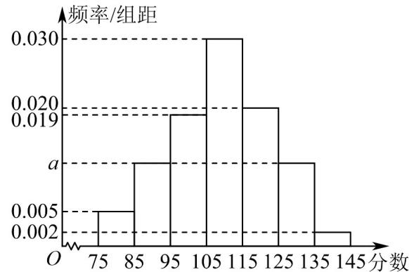

> [!faq]- 《专题04_二项分布与正态分布四大常考题型_高效培优专项训练_数学人教A》官方解析
>
> > [!success]- **【答案】** 1
>
> > [!note]- **【分析】**
> > 根据题意以及正态曲线的特征可知， $(596-3\sigma,596+3\sigma)\subseteq(593,599)$ ，然后列不等式组可解。
>
> > [!note]- **【解析】**
> > 依题意可知， $\mu=596$ ，又 $P\left(\left|X-\mu\right|<3\sigma\right)\approx0.9974$
> >
> > 所以，要使合格率达到 $99.74\%$ ，则 $(596 - 3\sigma, 596 + 3\sigma) \subseteq (593, 599)$
> >
> > 所以 $\left\{ \begin{array}{ll}596 - 3\sigma & 593\\ 596 + 3\sigma \leq 599 \end{array} \right.$ ，解得： $\sigma \leq 1$ ，故 $\sigma$ 至多为 $^1$
> >
> > 故答案为：1.
> >
> > 23. 毒品是人类的公敌，禁毒是社会的责任，当前宁德市正在创建全国禁毒示范城市，我市组织学生参加禁毒知识竞赛，为了解学生对禁毒有关知识的掌握情况，采用随机抽样的方法抽取了 $^{500}$ 名学生进行调查，成绩全部分布在 $^{75}$ 到 $^{145}$ 分之间，根据调查结果绘制的学生成绩的频率分布直方图如图所示。
> >
> > 
> >
> > (1)求频率分布直方图中 a 的值；
> >
> > (2)由频率分布直方图可认为这次全市学生的竞赛成绩 X 近似服从正态分布 $N(\mu, \sigma^{2})$ ，其中 $\mu$ 为样本平均数（同一组数据用该组数据的区间中点值作代表）， $\sigma = 13$ ，现从全市所有参赛的学生中随机抽取 10 人进行座谈，设其中竞赛成绩超过 135.2 分的人数为 Y，求随机变量 Y 的期望。（结果精确到 0.01，
> >
> > $$
> > P (\mu - \sigma \leq X \leq \mu + \sigma) \approx 0. 6 8 2 7, P (\mu - 2 \sigma \leq X \leq \mu + 2 \sigma) \approx 0. 9 5 4 5, P (\mu - 3 \sigma \leq X \leq \mu + 3 \sigma) \approx 0. 9 9 7 3
> > $$
> >
> > 【答案】(1) $\alpha=0.012$
> >
> > (2)0.23
> >
> > 【分析】（ $^{1}$ ）根据题意，由频率分布直方图的性质，代入计算，即可得到结果：
> >
> > (2) 根据题意，由正态分布的概率公式可得 $P(X > 135.2)$ ，再由二项分布的期望公式，代入计算，即可得到结果：
> >
> > 【详解】（1）由频率分布直方图，得 $10 \times (0.005 + a + 0.019 + 0.03 + 0.02 + a + 0.002) = 1$ ，解得 $a = 0.012$
> >
> > (2) 由题意得
> >
> > $$
> > \mu = 8 0 \times 0. 0 5 + 9 0 \times 0. 1 2 + 1 0 0 \times 0. 1 9 + 1 1 0 \times 0. 3 + 1 2 0 \times 0. 2 + 1 3 0 \times 0. 1 2 + 1 4 0 \times 0. 0 2 = 1 0 9. 2
> > $$
> >
> > 则 $X \sim N(109.2, 13^2)$ ， $P(X > 135.2) = P(X > \mu + 2\sigma) = \frac{1 - P(\mu - 2\sigma < X \leq \mu + 2\sigma)}{2} \approx \frac{1 - 0.9545}{2} = 0.02275$ ， $Y \sim B(10, 0.02275)$ ， $E(Y) = 10 \times 0.02275 = 0.2275 \approx 0.23$
> >
> > 即随机变量 $Y$ 的期望约为0.23.
