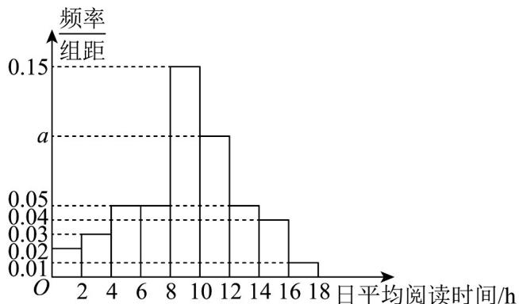

## 题型二：二项分布概率最大问题

11. 罚球是篮球运动员在篮球比赛时得分的方式之一．已知某篮球运动员经过长期的训练和比赛，将罚球命中率稳定在 $70\%$ ，若该运动员在某场比赛中获得了5次罚球的机会，且每罚中一球可得到1分，则该名运动员通过罚球最有可能得\_\_\_\_分．

【答案】4

【分析】设最有可能得 $m$ 分，根据独立重复试验的概率公式，得到 $\left\{ \begin{array}{ll}P(X = m) & P(X = m - 1)\\ P(X = m) & P(X = m + 1) \end{array} \right.$ ，求得 $m$ 的值，即可求解·

【详解】设该名运动员通过罚球命中的次数为 $X$ ，则 $X \sim B(5,0.7)$

则 $P(X = k) = \mathrm{C}_5^k\cdot (0.7)^k\cdot (0.3)^{5 - k},(k = 0,1,2,3,4,5)$

再设最有可能得 $m$ 分，其中 $0 \leq m \leq 5, m \in \mathbf{N}$

则 $\left\{ \begin{array}{ll}P(X = m) & P(X = m - 1)\\ P(X = m) & P(X = m + 1) \end{array} \right.$ ，即 $\left\{ \begin{array}{ll}\mathrm{C}_5^m\cdot (0.7)^m\cdot (0.3)^{5 - m} & \mathrm{C}_5^{m - 1}\cdot (0.7)^{m - 1}\cdot (0.3)^{6 - m}\\ \mathrm{C}_5^m\cdot (0.7)^m\cdot (0.3)^{5 - m} & \mathrm{C}_5^{m + 1}\cdot (0.7)^{m + 1}\cdot (0.3)^{4 - m} \end{array} \right.,$

解得 $3.2 \leq m \leq 4.2$ ，所以则 $m = 4$ ，所以该名运动员通过罚球最有可能得4分。

故答案为：4·

12．4月23日是联合国教科文组织确定的“世界读书日”。为了解某地区高一学生阅读时间的分配情况，从该地区随机抽取500名高一学生进行在线调查，得到了这500名学生的日平均阅读时间（单位：h），并将样本数据分成[0,2],(2,4],(4,6],(6,8],(8,10],(10,12],(12,14],(14,16],(16,18]九组，绘制成如图所示的频率分布直方图。

(1)从这500名学生中随机抽取一人，求日平均阅读时间在 $(10,12]$ 内的概率；

(2)为进一步了解这 $^{500}$ 名学生数字媒体阅读时间和纸质图书阅读时间的分配情况，从日平均阅读时间在 $(12,14],(14,16],(16,18]$ 三组内的学生中，采用分层抽样的方法抽取了 $^{10}$ 人，现从这 $^{10}$ 人中随机抽取 $^{3}$ 人，记日平均阅读时间在 $(14,16]$ 内的学生人数为X，求X的分布列；

(3)以样本的频率估计概率，从该地区所有高一学生中随机抽取 $^{10}$ 名学生，用 $P(k)$ 表示这 $^{10}$ 名学生中恰有k名学生日平均阅读时间在 $(8,12]$ 内的概率，其中 $k=0,1,2,\ldots,10$ 。当 $P(k)$ 最大时，写出k的值。（只需写出结论）

【答案】(1)0.20

(2)答案见解析

$$
k = 5
$$

【分析】（1）根据频率之和为 $^{1}$ 即可求解，

(2) 根据分层抽样的抽样比计算 $(14,16]$ 的人生，即可根据超几何分布的概率公式即可求解，

(3) 根据二项分布的概率公式,结合组合数的性质即可求解.

【详解】（1）由频率分布直方图得， $2(0.02+0.03+0.05+0.05+0.15+a+0.05+0.04+0.01)=1$ ，
解得 $a = 0.10, 0.10 \times 2 = 0.20$ ，所以日平均阅读时间在 $(10,12]$ 内的概率为 0.20。

(2) 由频率分布直方图得，这 $^{500}$ 名学生中日平均阅读时间在 $(12,14],(14,16],(16,18]$ 三组内的学生人数分别为 $500 \times 0.10 = 50, 500 \times 0.08 = 40, 500 \times 0.02 = 10$ .

若采用分层抽样的方法抽取了 $^{10}$ 人，则从日平均阅读时间在(14,16]内的学生中抽取 $\frac{40}{50+40+10}\times10=4$ 人，现从这 $^{10}$ 人中随机抽取 $^{3}$ 人，则X的所有可能取值为0，1，2，3，

$$
P (X = 0) = \frac {\mathrm{C} _ {6} ^ {3}}{\mathrm{C} _ {1 0} ^ {3}} = \frac {2 0}{1 2 0} = \frac {1}{6}, P (X = 1) = \frac {\mathrm{C} _ {4} ^ {1} \mathrm{C} _ {6} ^ {2}}{\mathrm{C} _ {1 0} ^ {3}} = \frac {6 0}{1 2 0} = \frac {1}{2},
$$

$$
P (X = 2) = \frac {\mathrm{C} _ {4} ^ {2} \mathrm{C} _ {6} ^ {1}}{\mathrm{C} _ {1 0} ^ {3}} = \frac {3 6}{1 2 0} = \frac {3}{1 0}, P (X = 3) = \frac {\mathrm{C} _ {4} ^ {3}}{\mathrm{C} _ {1 0} ^ {3}} = \frac {4}{1 2 0} = \frac {1}{3 0},
$$

所以 $X$ 的分布列为

<table><tr><td>X</td><td>0</td><td>1</td><td>2</td><td>3</td></tr><tr><td>P</td><td> $\frac{1}{6}$ </td><td> $\frac{1}{2}$ </td><td> $\frac{3}{10}$ </td><td> $\frac{1}{30}$ </td></tr></table>

(3) k = 5，理由如下：

由频率分布直方图得抽取的学生中日平均阅读时间在 $(8,12]$ 内的概率为0.50，所以从该地区所有高一学生中随机抽取 $^{10}$ 名学生，恰有k名学生日平均阅读时间在 $(8,12]$ 内的分布列大致服从二项分布 $X \sim B(10,0.50)$ ， $P(k)=C_{10}^{k}\left(\frac{1}{2}\right)^{k}\left(1-\frac{1}{2}\right)^{10-k}=C_{10}^{k}\left(\frac{1}{2}\right)^{10}$ ，由组合数的性质可得时 $P(k)$ 最大．

![[高中/课堂同步/题库/人教A版高中数学同步讲义(2026)/05_选择性必修第三册/第七章 随机变量及其分布/专项训练/专题04_二项分布与正态分布四大常考题型_高效培优专项训练_数学人教A/题型二_sec_03/questions/Q00059643.md]]
![[高中/课堂同步/题库/人教A版高中数学同步讲义(2026)/05_选择性必修第三册/第七章 随机变量及其分布/专项训练/专题04_二项分布与正态分布四大常考题型_高效培优专项训练_数学人教A/题型二_sec_03/questions/Q00059644.md]]
![[高中/课堂同步/题库/人教A版高中数学同步讲义(2026)/05_选择性必修第三册/第七章 随机变量及其分布/专项训练/专题04_二项分布与正态分布四大常考题型_高效培优专项训练_数学人教A/题型二_sec_03/questions/Q00059645.md]]
![[高中/课堂同步/题库/人教A版高中数学同步讲义(2026)/05_选择性必修第三册/第七章 随机变量及其分布/专项训练/专题04_二项分布与正态分布四大常考题型_高效培优专项训练_数学人教A/题型二_sec_03/questions/Q00059646.md]]
