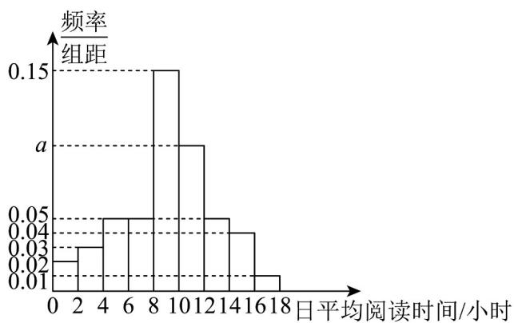

> [!faq]- 《专题04 二项分布与正态分布四大常考题型（高效培优专项训练）数学人教A版高二选择性必修第三册》官方解析
>
> > [!success]- **【答案】** (1)10 (2)此人答对2道题的可能性最大；理由见解析·
>
> > [!note]- **【分析】**
> > （1）根据已知条件，确定 $X \sim B\left(8, \frac{1}{4}\right)$ ，得分为 $5X$ ，求 $E(5X) = 5E(X) = 5 \times 2 = 10$ 即可；
> >
> > (2) 根据二项分布概率公式有 $P(X=k)=C_{8}^{k}\left(\frac{1}{4}\right)^{k}\times\left(\frac{3}{4}\right)^{8-k}$ $k=0,1,2\cdots,8$ ，通过作商法求出 $\frac{p_{k}}{p_{k-1}}=1+\frac{9-4k}{3k}$ ，与1比较大小即可确定 $p_{k}$ 在 k=2 时取最大值.
>
> > [!note]- **【解析】**
> > （1）某人答对每道题的概率都是 $\frac{1}{4}$ ，则答对题目的个数 $X$ 服从二项分布，
> >
> > 即 $X \sim B\left(8, \frac{1}{4}\right)$ ， $E(X) = 8 \times \frac{1}{4} = 2$ ，由于每道题答对得5分，
> >
> > 所以此人答题得分为 5X ，因此，在此项测试中，
> >
> > 此人答题得分的期望为 $E(5X)=5E(X)=5\times2=10$ .
> >
> > (2) 设此人答对 k 道题的可能性为 $P(X=k)=C_{8}^{k}\left(\frac{1}{4}\right)^{k}\times\left(\frac{3}{4}\right)^{8-k}$ ， $k=0,1,2,\cdots,8$ ，
> >
> > 记 $p_{k}=P(X=k)$ ，则 $\frac{p_{k}}{p_{k-1}}=\frac{P(X=k)}{P(X=k-1)}=\frac{C_{8}^{k}\left(\frac{1}{4}\right)^{k}\times\left(\frac{3}{4}\right)^{8-k}}{C_{8}^{k-1}\left(\frac{1}{4}\right)^{k-1}\times\left(\frac{3}{4}\right)^{9-k}}$
> >
> > $= \frac{\frac{8!}{k!(8 - k)!}\times\frac{1}{4}}{\frac{8!}{(k - 1)!(9 - k)!}\times\frac{3}{4}} = \frac{9 - k}{3k} = 1 + \frac{9 - 4k}{3k},$ $k = 1,2,\dots ,8$
> >
> > 当 $k < \frac{9}{4}$ 时， $p_k > p_{k-1}$ ， $p_k$ 随 $k$ 的增加而增加，即 $p_2 > p_1 > p_0$ ；
> >
> > 当 $k>\frac{9}{4}$ 时， $p_{k}<p_{k-1}$ ， $p_{k}$ 随k的增加而减小，即 $p_{8}<p_{7}<\cdots<p_{2}$ ；
> >
> > 所以当 k=2 时， $p_{2}$ 最大，因此此人答对 2 道题的可能性最大。
> >
> > 15. 随着科技的不断发展，人工智能技术的应用领域也将会更加广泛，它将会成为改变人类社会发展的重要力量。某科技公司发明了一套人机交互软件，它会从数据库中检索最贴切的结果进行应答。在对该交互软件进行测试时，如果输入的问题没有语法错误，则软件正确应答的概率为 $80\%$ ；若出现语法错误，则软件正确应答的概率为 $30\%$ 。假设每次输入的问题出现语法错误的概率为 $10\%$ 。
> >
> > (1)求一个问题能被软件正确应答的概率；
> >
> > (2)在某次测试中，输入了 $n(n-6)$ 个问题，每个问题能否被软件正确应答相互独立，记软件正确应答的个数为X， $X=k(k=0,1,\cdots,n)$ 的概率记为 $P(X=k)$ ，则n为何值时， $P(X=6)$ 的值最大？
> >
> > 【答案】(1)0.75
> >
> > (2)7 或 8
> >
> > 【分析】（ $^{1}$ ）根据题意结合全概率公式运算求解；
> >
> > (2) 由题意可知： $X \sim B\left(n, \frac{3}{4}\right)$ 且 $P(X = 6) = C_{n}^{6}\left(\frac{3}{4}\right)^{6}\left(\frac{1}{4}\right)^{n-6}$ ，结合数列单调性分析求解.
> >
> > 【详解】（1）记“输入的问题没有语法错误”为事件A，“回答正确”为事件B，
> >
> > 由题意可知： $P\left(\overline{A}\right) = 0.1, P(B|A) = 0.8, P(B|\overline{A}) = 0.3$ ，则 $P(A) = 1 - P(\overline{A}) = 0.9$
> >
> > 所以 $P(B)=P(B\mid\overline{A})P(\overline{A})+P(B\mid A)P(A)=0.75$ .
> >
> > (2) 由 (1) 可知： $P(B)=0.75=\frac{3}{4}$
> >
> > 则 $X \sim B\left(n, \frac{3}{4}\right)$ ，可得 $P(X = 6) = \mathrm{C}_n^6\left(\frac{3}{4}\right)^6\left(1 - \frac{3}{4}\right)^{n-6} = \mathrm{C}_n^6\left(\frac{3}{4}\right)^6\left(\frac{1}{4}\right)^{n-6}$ ，
> >
> > 令 $a_{n} = \mathrm{C}_{n}^{6}\left(\frac{3}{4}\right)^{6}\left(\frac{1}{4}\right)^{n - 6}$ ，则 $\frac{a_{n + 1}}{a_n} = \frac{\mathrm{C}_{n + 1}^6\left(\frac{3}{4}\right)^6\left(\frac{1}{4}\right)^{n - 5}}{\mathrm{C}_n^6\left(\frac{3}{4}\right)^6\left(\frac{1}{4}\right)^{n - 6}} = \frac{n + 1}{4(n - 5)}$
> >
> > 令 $\frac{n + 1}{4(n - 5)} > 1$ ，解得 $n < 7$ ，可知当 $n \leq 6$ ，可得 $a_{n+1} > a_n$ ；
> >
> > 令 $\frac{n + 1}{4(n - 5)} < 1$ ，解得 $n > 7$ ，可知当 $n = 8$ ，可得 $a_{n + 1} < a_n$
> >
> > 令 $\frac{n + 1}{4(n - 5)} = 1$ ，解得 $n = 7$ ，可得 $a_8 = a_7$
> >
> > 所以当 $n = 7$ 或 $n = 8$ 时， $a_{n}$ 最大，即 $n$ 为 $7$ 或 $8$ 时， $P(X = 6)$ 的值最大·
> >
> > 16. 聊天机器人（chatterbot）是一个经由对话或文字进行交谈的计算机程序·当一个问题输入给聊天机器人时，它会从数据库中检索最贴切的结果进行应答·在对某款聊天机器人进行测试时，如果输入的问题没有语法错误，则应答被采纳的概率为 $80\%$ ，若出现语法错误，则应答被采纳的概率为 $30\%$ .假设每次输入的问题出现语法错误的概率为 $10\%$
> >
> > (1)求一个问题的应答被采纳的概率；
> >
> > (2)在某次测试中，输入了 $^{8}$ 个问题，每个问题的应答是否被采纳相互独立，记这些应答被采纳的个数为X，事件X=k（ $k=0,1,\cdots,8$ ）的概率为 $P(X=k)$ ，求当 $P(X=k)$ 最大时k的值.
> >
> > 【答案】(1)0.75
> >
> > (2)6
> >
> > 【分析】（1）根据全概率公式即可求解，
> >
> > (2) 根据二项分布的概率公式，利用不等式即可求解最值.
> >
> > 【详解】（1）记“输入的问题没有语法错误”为事件 $A$ ，“一次应答被采纳”为事件 $B$ ，
> >
> > 由题意 $P(\overline{A}) = 0.1$ ， $P(B|A) = 0.8$ ， $P(B|\overline{A}) = 0.3$ ，则
> >
> > $$
> > P (A) = 1 - P (\overline {{{A}}}) = 0. 9
> > $$
> >
> > $$
> > P (B) = P (A B) + P (\bar {A} B) = P (A) P (B | A) + P (\bar {A}) P (B | \bar {A}) = 0. 9 \times 0. 8 + 0. 1 \times 0. 3 = 0. 7 5.
> > $$
> >
> > (2) 依题意， $X \sim B\left(8, \frac{3}{4}\right)$ ， $P(X = k) = \mathbf{C}_{8}^{k}\left(\frac{3}{4}\right)^{k}\left(\frac{1}{4}\right)^{8-k}$
> >
> > 当 $P(X = k)$ 最大时，有 $\left\{ \begin{array}{ll}P(X = k) & P(X = k + 1),\\ P(X = k) & P(X = k - 1), \end{array} \right.$
> >
> > 即 $\left\{ \begin{array}{ll}\mathrm{C}_{8}^{k}\left(\frac{3}{4}\right)^{k}\left(\frac{1}{4}\right)^{8 - k} & \mathrm{C}_{8}^{k + 1}\left(\frac{3}{4}\right)^{k + 1}\left(\frac{1}{4}\right)^{7 - k},\\ \mathrm{C}_{8}^{k}\left(\frac{3}{4}\right)^{k}\left(\frac{1}{4}\right)^{8 - k} & \mathrm{C}_{8}^{k - 1}\left(\frac{3}{4}\right)^{k - 1}\left(\frac{1}{4}\right)^{9 - k}, \end{array} \right.$ 解得： $\frac{23}{4}\leq k\leq \frac{27}{4}$ $k\in \mathbf{N}$
> >
> > 故当 $P(X = k)$ 最大时， $k = 6$ 。
> >
> > 17．4月23日是联合国教科文组织确定的“世界读书日”·为了解某地区高一学生阅读时间的分配情况，从该地区随机抽取了500名高一学生进行在线调查，得到了这500名学生的日平均阅读时间（单位：小时），并将样本数据分成[0,2]、(2,4]、(4,6]、(6,8]、(8,10]、(10,12]、(12,14]、(14,16]、(16,18]九组，绘制成如图所示的频率分布直方图·
> >
> > 
> >
> > (1)求频率分布直方图中 $a$ 的值；
> >
> > (2)为进一步了解这 $^{500}$ 名学生数字媒体阅读时间和纸质图书阅读时间的分配情况，从日平均阅读时间在 $(6,8]$ 、 $(14,16]$ 、 $(16,18]$ 三组内的学生中，采用分层抽样的方法抽取了 $^{10}$ 人，现从这 $^{10}$ 人中随机抽取 $^{3}$ 人，记日平均阅读时间在 $(14,16]$ 内的学生人数为X，求X的分布列和数学期望；
> >
> > (3)以样本的频率估计概率，从该地区所有高一学生中随机抽取 $^{8}$ 名学生，用 $P(k)$ 表示这 $^{8}$ 名学生中恰有k名学生日平均阅读时间在 $(8,12]$ 内的概率，其中 $k=0,1,2,\cdots,8$ .当 $P(k)$ 最大时，请直接写出k的值·（不需要说明理由）
> >
> > 【答案】(1) $a = 0.1$
> >
> > (2)分布列见解析
> >
> > (3) $k = 4$
> >
> > 【分析】（1）由题意，根据频率分布直方图中小矩形面积之和为 $^{1}$ ，，能求出a的值，进而估计出概率；
> > （2）先按比例抽取人数，由题意可知此分布列为超几何分布，即可求出分布列；
> >
> > (3) 求出 $P(k)$ 的式子进行判断.
> >
> > 【详解】（1）由概率和为1得： $2 \times (0.02 + 0.03 + 0.05 + 0.05 + 0.15 + a + 0.05 + 0.04 + 0.01) = 1$ ，
> > 解得 a = 0.1 ;
> >
> > (2) 由频率分布直方图得：这 $^{500}$ 名学生中日平均阅读时间在 $(6,8]$ 、 $(14,16]$ 、 $(16,18]$ 三组内的学生人数分别为：
> >
> > $$
> > 5 0 0 \times 0. 1 0 = 5 0 \text {人，} 5 0 0 \times 0. 0 8 = 4 0 \text {人，} 5 0 0 \times 0. 0 2 = 1 0 \text {人，}
> > $$
> >
> > 若采用分层抽样的方法抽取了 $^{10}$ 人，
> >
> > 则应从阅读时间在 $(6,8]$ 中抽取 $^5$ 人，从阅读时间在 $(14,16]$ 中抽取 $^4$ 人，从阅读时间在 $(16,18]$ 中抽取 $^1$ 人，现从这 $^{10}$ 人中随机抽取 $^3$ 人，则 $X$ 的可能取值为 $^0, 1, 2, 3$
> >
> > $$
> > P (X = 0) = \frac {\mathrm{C} _ {6} ^ {3}}{\mathrm{C} _ {1 0} ^ {3}} = \frac {2 0}{1 2 0} = \frac {1}{6}, P (X = 1) = \frac {\mathrm{C} _ {4} ^ {1} \mathrm{C} _ {6} ^ {2}}{\mathrm{C} _ {1 0} ^ {3}} = \frac {6 0}{1 2 0} = \frac {1}{2},
> > $$
> >
> > $$
> > P (X = 2) = \frac {\mathrm{C} _ {4} ^ {2} \mathrm{C} _ {6} ^ {1}}{\mathrm{C} _ {1 0} ^ {3}} = \frac {3 6}{1 2 0} = \frac {3}{1 0}, P (X = 3) = \frac {\mathrm{C} _ {4} ^ {3}}{\mathrm{C} _ {1 0} ^ {3}} = \frac {4}{1 2 0} = \frac {1}{3 0},
> > $$
> >
> > ## $\therefore X$ 的分布列为：
> >
> > <table><tr><td>X</td><td>0</td><td>1</td><td>2</td><td>3</td></tr><tr><td>P</td><td> $\frac{1}{6}$ </td><td> $\frac{1}{2}$ </td><td> $\frac{3}{10}$ </td><td> $\frac{1}{30}$ </td></tr></table>
> >
> > 数学期望 $E(X)=1\times\frac{1}{2}+2\times\frac{3}{10}+3\times\frac{1}{30}=\frac{6}{5}$
> >
> > (3) k = 4，理由如下：
> >
> > 由频率分布直方图得学生日平均阅读时间在 $^{(8,12]}$ 内的概率为0.50，
> >
> > 从该地区所有高一学生中随机抽取 $^{8}$ 名学生，恰有k名学生日平均阅读时间在 $^{(8,12]}$ 内的分布列服从二项分布 $X\sim B(8,0.50)$ ，
> >
> > $P(X = k) = \mathrm{C}_{8}^{k}\left(\frac{1}{2}\right)^{k}\left(1 - \frac{1}{2}\right)^{8 - k} = \mathrm{C}_{8}^{k}\left(\frac{1}{2}\right)^{8}$ ，由组合数的性质可得 $k = 4$ 时 $P(k)$ 最大.
