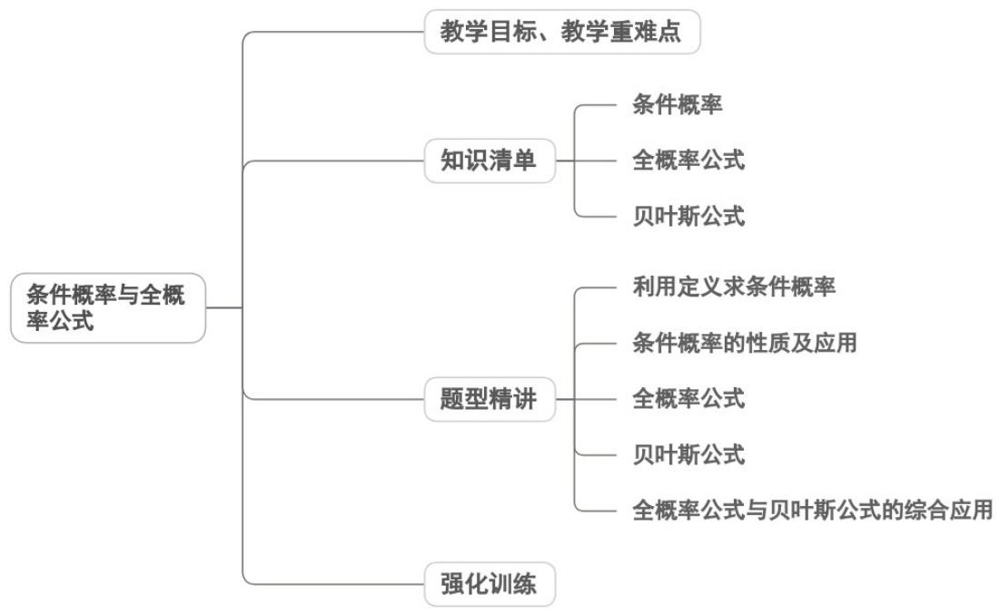

<!-- source-part:1 pages:1-36 -->

## 专题7.1 条件概率与全概率公式

## 内容概览

## 教学目标、教学重难点

<table><tr><td>教学目标</td><td>1.结合古典概型,理解条件概率定义,掌握公式及乘法公式  $P(AB)=P(B)P(A|B)$ ,能计算简单条件概率。2.理解样本空间划分,掌握全概率公式推导与结构,会用公式计算复杂事件概率;了解贝叶斯公式及简单应用。3.辨析条件概率与无条件概率、事件独立性的关联。</td></tr><tr><td>教学重难点</td><td>1.重点全概率公式的结构、推导及在实际问题中的应用。2.难点理解条件概率中“条件限定”的本质(样本空间缩减),区分  $P(A|B)$  与  $P(AB)$ 。</td></tr></table>

## 知识清单

## 知识点 01 条件概率

1、条件概率的概念：条件概率揭示了 $P(A)$ ， $P(AB)$ ， $P(B|A)$ 三者之间“知二求一”的关系

一般地，设 $A$ ， $B$ 为两个随机事件，且 $P(A) > 0$ ，我们称 $P(B|A) =$ 为在事件 $A$ 发生的条件下，事件 $B$ 发生的条

件概率，简称条件概率。

2、概率的乘法公式：由条件概率的定义，对任意两个事件 $A$ 与 $B$ ，若 $P(A) > 0$ ，则 $P(AB) = P(A)P(B|A)$ 。我们

称上式为概率的乘法公式.

3、条件概率的性质

设 $P(A) > 0$ ，则

(1) $P(\Omega|A)=1$ ;

(2)如果 $B$ 与 $C$ 是两个互斥事件，则 $P((B \cup C)|A) = P(B|A) + P(C|A)$ ；

(3)设 $B$ 和 $B$ 互为对立事件，则 $P(B) = 1 - P(B)$ .

## 【即学即练】

1．抛掷一枚均匀的骰子，掷出点数是偶数记为事件A，掷出点数为4记为事件B，则 $P(B|A)=$ \_\_\_\_。

【答案】 $\frac{1}{3}$

【分析】根据条件概率公式进行计算即可.

【详解】掷出点数是偶数记为事件 A，有 3 种情况：2，4，6，所以 $P(A)=\frac{3}{6}=\frac{1}{2}$

由于掷出点数为 $4$ 记为事件 $B$ ，所以掷出点数是偶数且掷出点数为 $4$ 的事件为 $AB$ ，

所以 $P(AB)=\frac{1}{6}$ ，所以 $P(B|A)=\frac{P(AB)}{P(A)}=\frac{1}{3}$ .

故答案为： $\frac{1}{3}$

2. 两位游客准备分别从葫芦古镇、兴城古城、龙潭大峡谷、九门口水上长城、龙湾海滨风景区5个景点中随

机选择其中一个景点游玩，记事件 $A =$ “两位游客中至少有一人选择葫芦古镇”，事件 $B =$ “两位游客选择的景

点不同”，则 $P(B|A) = (\quad)$ A. $\frac{6}{7}$ B. $\frac{7}{8}$ C. $\frac{8}{9}$ D. $\frac{9}{10}$

【答案】C

【分析】分别求出 $P(A)$ 和 $P(AB)$ ，再利用条件概率的计算公式计算即可.

【详解】两位游客从 5 个景点中任选，每人有 5 种选择，总事件数： $5 \times 5 = 25$ 种.

事件 A 的对立事件 $\overline{A}$ 为“两位游客都不选择葫芦古镇”， $\overline{A}$ 的事件数： $4 \times 4 = 16$ 种，

因此 $P(A)=1-P(\overline{A})=1-\frac{16}{25}=\frac{9}{25}$ .

事件 AB 分为两种情况：甲选葫芦古镇，乙选其余 4 个景点，4 种；

乙选葫芦古镇，甲选其余4个景点，4种；共 $4+4=8$ 种事件，

因此 $P(AB)=\frac{8}{25}$ .

所以 $P(B \mid A) = \frac{P(AB)}{P(A)} = \frac{\frac{8}{25}}{\frac{9}{25}} = \frac{8}{9}$ .

故选：C.

## 知识点 02 全概率公式

在全概率的实际问题中我们经常会碰到一些较为复杂的概率计算，这时，我们可以用“化整为零”的思想将它

们分解为一些较为容易的情况分别进行考虑

一般地，设 $A_{1}, A_{2}, \ldots, A_{n}$ 是一组两两互斥的事件， $A_{1} \cup A_{2} \cup \ldots \cup A_{n} = \Omega$ ，且 $P(A_{i}) > 0, i = 1, 2, \ldots, n$ ，则对

任意的事件 $B \subseteq \Omega$ ，有 $P(B) = \sum P(A_{i})P(B.$

我们称上面的公式为全概率公式，全概率公式是概率论中最基本的公式之一。

## 【即学即练】

1．设某批产品中，编号为 1，2，3 的三家工厂生产的产品分别占 45%，35%，20%，各厂产品的次品率分

别为 $2\%$ ， $3\%$ ， $5\%$ .现从中任取一件，则取到的是次品的概率为（ ）A.0.0259 B.0.0592 C.0.0295 D.0.0275

【答案】C

【分析】直接根据条件概率及全概率公式计算可得.

【详解】设 $A_{1}$ = “取到编号为 1 的工厂的产品”， $A_{2}$ = “取到编号为 2 的工厂的产品”， $A_{3}$ = “取到编号为 3 的工

厂的产品”，

则 $P(A_{1})=0.45, P(A_{2})=0.35, P(A_{3})=0.20$

设 $B =$ “取到产品是次品”，则 $P(B\mid A_1) = 2\% = 0.02,P(B\mid A_2) = 3\% = 0.03,P(B\mid A_3) = 5\% = 0.05$ 由全概率公式 $P(B) = P(A_{1})P(B\mid A_{1}) + P(A_{2})P(B\mid A_{2}) + P(A_{3})P(B\mid A_{3})$ $= 0.45\times 0.02 + 0.35\times 0.03 + 0.20\times 0.05 = 0.009 + 0.0105 + 0.01 = 0.0295.$

故选：C.

2．甲盒中有4个红球和3个白球，乙盒中有2个红球和3个白球，这些球除颜色外其他都相同，分两次从盒子中取球，第一次从甲盒中随机取出1个小球放入乙盒中，第二次再从乙盒中随机取出2个小球.记事件 $A_{1}$ 表示从甲盒中取出的小球是红球，事件 $A_{2}$ 表示从甲盒中取出的小球是白球，事件 $B_{1}$ 表示从乙盒中取出2个颜色

相同的小球，事件 $B_{2}$ 表示从乙盒中取出2个颜色不同的小球，则（ ）A. $P(B_{1}|A_{1}) = \frac{2}{5}$ B. $P(A_{1}B_{2}) = \frac{3}{5}$ C. $P(B_{2}|A_{2}) = \frac{8}{15}$ D. $P(B_{2}) = \frac{4}{7}$

【答案】ACD

【分析】由条件概率公式和组合数可得A；由独立事件的乘法公式结合组合数可得B错误；利用条件概率公

式和组合数可得 C；由全概率公式结合组合数可得 D

【详解】由题意可得 $P(A_{1})=\frac{4}{7}$ ， $P(A_{2})=\frac{3}{7}$ ，则 $P(B_{1}|A_{1})=\frac{P(B_{1}A_{1})}{P(A_{1})}=\frac{\frac{4}{7}\times\frac{C_{3}^{2}+C_{3}^{2}}{C_{6}^{2}}}{\frac{4}{7}}=\frac{2}{5}$ ，A 正确.

$P(A_{1}B_{2})=P(A_{1})P(B_{2})=\frac{4}{7}\times\frac{C_{3}^{1}C_{3}^{1}}{C_{6}^{2}}=\frac{12}{35}$ ，B错误.

$$
P \left(B _ {2} \mid A _ {2}\right) = \frac {P \left(B _ {2} A _ {2}\right)}{P \left(A _ {2}\right)} = \frac {\frac {3}{7} \times \frac {\mathrm{C} _ {2} ^ {1} \mathrm{C} _ {4} ^ {1}}{\mathrm{C} _ {6} ^ {2}}}{\frac {3}{7}} = \frac {8}{1 5}, \mathrm{C} \text {正确.}
$$

$$
P \left(B _ {2}\right) = P \left(A _ {1}\right) P \left(B _ {2} \mid A _ {1}\right) + P \left(A _ {2}\right) P \left(B _ {2} \mid A _ {2}\right) = \frac {4}{7} \times \frac {\frac {4}{7} \times \frac {C _ {3} ^ {1} C _ {3} ^ {1}}{C _ {6} ^ {2}}}{\frac {4}{7}} + \frac {3}{7} \times \frac {8}{1 5} = \frac {4}{7}, \mathrm{D} \text {正确}.
$$

故选：ACD.

## 知识点 03 贝叶斯公式

设 $A_{1}, A_{2}, \ldots, A_{n}$ 是一组两两互斥的事件， $A_{1} \cup A_{2} \cup \ldots \cup A_{n} = \Omega$ ，且 $P(A_{i}) > 0, i = 1, 2, \ldots, n$ ，则对任意事件

$B \subseteq \Omega$ , $P(B) > 0$ ,

有 $P(A_{i} =$

$$
= \frac {P (A _ {i}) P (B \mid A _ {i})}{\sum_ {k = 1} ^ {n} P (A _ {k}) P (B \mid A _ {k})},
$$

$i = 1,2,\dots ,n.$

在贝叶斯公式中， $P(A_{i})$ 和 $P(A_{i}|B)$ 分别称为先验概率和后验概率。

【即学即练】

1．设 $B_{1}$ ， $B_{2}$ ， $B_{n}$ 为样本空间 $\Omega$ 的一个划分，若 $P(A)>0$ ， $P(B_{i})>0(i=1,2,3,4,\cdots,n)$ ，则 $P(B_{i}\mid A)=$ \_\_
【答案】 $\frac{P(B_{i})P(A|B_{i})}{\sum_{j=1}^{n}P(B_{j})P(A|B_{j})}$

2．袋中有4个红球，6个白球，不放回地摸两次球，求：

(1)第二次摸到红球的概率；

(2)已知第二次摸到红球，求第一次也摸到红球的概率.

【答案】(1) $\frac{2}{5}$

(2) $\frac{1}{3}$

【分析】（1）设事件 $A$ 表示“第一次摸到红球”，事件 $A$ 表示“第一次摸到白球”，事件 $B$ 表示“第二次摸到红

球”，利用全概率公式即可求解；

(2) 利用贝叶斯公式即可求解.

【详解】（1）设事件 $A$ 表示“第一次摸到红球”，事件 $\overline{A}$ 表示”“第一次摸到白球”，事件 $B$ 表示“第二次摸到红

球”，

$$
P (A) = \frac {4}{1 0} = \frac {2}{5}, P (\bar {A}) = \frac {6}{1 0} = \frac {3}{5}, P (B | A) = \frac {3}{9} = \frac {1}{3}, P (B | \bar {A}) = \frac {4}{9}
$$

由全概率公式有 $P(B) = P(A)P(B|A) + P(\overline{A})P(B|\overline{A}) = \frac{2}{5}\times \frac{1}{3} +\frac{3}{5}\times \frac{4}{9} = \frac{2}{5}$

(2) 由贝叶斯公式有 $P(A|B) = \frac{P(A)P(B|A)}{P(B)} = \frac{\frac{2}{5} \times \frac{1}{3}}{\frac{2}{5}} = \frac{1}{3}$ .

## 题型精讲

![[高中/课堂同步/题库/人教A版高中数学同步讲义(2026)/05_选择性必修第三册/第七章 随机变量及其分布/专题7.1 条件概率与全概率公式（高效培优讲义）数学人教A版高二选择性必修第三册/题型01_利用定义求条件概率/题型01_利用定义求条件概率.md]]
![[高中/课堂同步/题库/人教A版高中数学同步讲义(2026)/05_选择性必修第三册/第七章 随机变量及其分布/专题7.1 条件概率与全概率公式（高效培优讲义）数学人教A版高二选择性必修第三册/题型02_条件概率的性质及应用/题型02_条件概率的性质及应用.md]]
![[高中/课堂同步/题库/人教A版高中数学同步讲义(2026)/05_选择性必修第三册/第七章 随机变量及其分布/专题7.1 条件概率与全概率公式（高效培优讲义）数学人教A版高二选择性必修第三册/题型03_全概率公式/题型03_全概率公式.md]]
![[高中/课堂同步/题库/人教A版高中数学同步讲义(2026)/05_选择性必修第三册/第七章 随机变量及其分布/专题7.1 条件概率与全概率公式（高效培优讲义）数学人教A版高二选择性必修第三册/题型04_贝叶斯公式/题型04_贝叶斯公式.md]]
![[高中/课堂同步/题库/人教A版高中数学同步讲义(2026)/05_选择性必修第三册/第七章 随机变量及其分布/专题7.1 条件概率与全概率公式（高效培优讲义）数学人教A版高二选择性必修第三册/题型05_全概率公式与贝叶斯公式的综合应用/题型05_全概率公式与贝叶斯公式的综合应用.md]]
![[高中/课堂同步/题库/人教A版高中数学同步讲义(2026)/05_选择性必修第三册/第七章 随机变量及其分布/专题7.1 条件概率与全概率公式（高效培优讲义）数学人教A版高二选择性必修第三册/强化训练/强化训练.md]]
