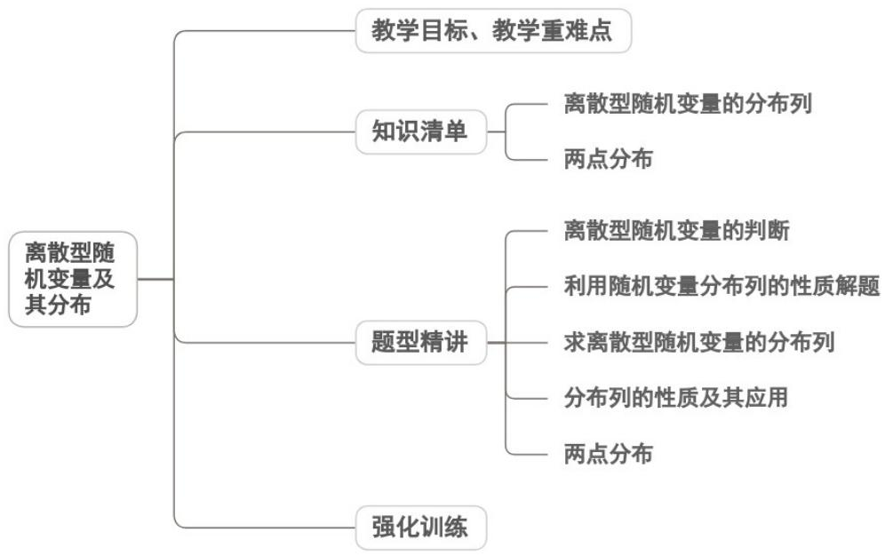
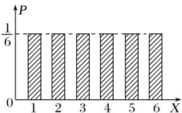

<!-- source-part:1 pages:1-44 -->

## 专题7.2 离散型随机变量及其分布

## 内容概览

## 教学目标、教学重难点

<table><tr><td>教学目标</td><td>1.理解离散型随机变量的定义,能辨析离散型与非离散型随机变量,会用字母表示随机变量并写出其可能取值。2.掌握离散型随机变量分布列的定义、性质(非负性、规范性),能根据实际问题列出分布列。3.理解两点分布、超几何分布的模型特征,熟记其分布列形式,能识别并解决两类模型的实际问题。4.能通过分布列计算随机变量取某一值的概率,初步体会分布列的统计意义。</td></tr><tr><td>教学重难点</td><td>1.重点两点分布、超几何分布的模型识别与实际应用。2.难点超几何分布的模型本质理解(不放回抽样、有限总体、两类元素),区分其与古典概型的关联。</td></tr></table>

## 知识清单

## 知识点 01 离散型随机变量的分布列

1、随机变量：随机变量是将试验的结果数量化，变量的取值对应随机试验的某一个随机事件。

一般地，对于随机试验样本空间 $\Omega$ 中的每个样本点 $\omega$ ，都有唯一的实数 $X(\omega)$ 与之对应，我们称 $X$ 为随机变量。

2、离散型随机变量：可能取值为有限个或可以一一列举的随机变量，我们称为离散型随机变量，通常用大写

英文字母表示随机变量，用小写英文字母表示随机变量的取值.

3、随机变量和函数的关系：随机变量的定义与函数的定义类似，这里的样本点 $\omega$ 相当于函数定义中的自变

量，而样本空间 $\Omega$ 相当于函数的定义域，不同之处在于 $\Omega$ 不一定是数集。

4、离散型随机变量的分布列：离散型随机变量在某一范围内取值的概率等于它取这个范围内各值的概率之和

(1)离散型随机变量的分布列：一般地，设离散型随机变量 $X$ 的可能取值为 $x_{1}, x_{2}, \ldots, x_{n}$ ，我们称 $X$ 取每一

个值 $x_{i}$ 的概率 $P(X = x_{i}) = p_{i}, i = 1,2,\dots ,n$ 为 $X$ 的概率分布列，简称为分布列.

(2)可以用表格来表示 $X$ 的分布列，如下表

<table><tr><td>X</td><td> $x_{1}$ </td><td> $x_{2}$ </td><td>...</td><td> $x_{i}$ </td><td>...</td><td> $x_{n}$ </td></tr><tr><td>P</td><td> $p_{1}$ </td><td> $p_{2}$ </td><td>...</td><td> $p_{i}$ </td><td>...</td><td> $p_{n}$ </td></tr></table>

还可以用图形表示，如下图直观地表示了掷骰子试验中掷出的点数 $X$ 的分布列，称为 $X$ 的概率分布图。

5、离散型随机变量的分布列的性质

(1) $p_{i}\geq0$ , i=1,2,...,n;

(2) $p_1 + p_2 + \ldots + p_n = 1$ .

## 【即学即练】

1. 甲、乙两名同学进行做题游戏，甲同学做试题 $A$ 和 $B$ ，乙同学做试题 $C$ ，已知甲同学做对试题 $A$ 的概率为

0.6，做对试题 $B$ 的概率为0.4，同时做对试题 $A$ 和 $B$ 的概率为0.2；乙同学做对试题 $C$ 的概率为0.6，且甲、

乙两名同学做题结果互相不受影响.

(1)求甲同学做对试题 A 没有做对试题 B 的概率；

(2)求甲同学在没有做对试题 A 的条件下做对试题 B 的概率；

(3)若甲、乙两名同学做对试题的题数之和为 $X$ ，求 $X$ 的分布列

【答案】(1)0.4

(2) $\frac{1}{2}$

(3)分布列见解析

【分析】（1）根据 $P(M)=P(MN)+P(M\overline{N})$ 求解即可；

(2) 根据条件概率公式求解即可；

(3) 根据题意 $X = 0,12,3$ ，再分别计算概率，列出分布列即可。

【详解】（1）设甲同学做对试题 A 为事件 M，甲同学做对试题 B 为事件 N，

由题设可知 $P(M)=P(MN)+P(M\overline{N})=0.6$ ，所以 $P(M\overline{N})=0.4$ ；

(2) 由题设可知， $P(M)=0.6$ ， $P(N)=0.4$ ， $P(MN)=0.2$ ， $P(\bar{M})=1-P(M)=0.4$

又 $P(N) = P(MN) + P(\overline{M} N) = 0.4$ ，所以 $P(\overline{M} N) = 0.2$

故 $P(N|\bar{M}) = \frac{P(\bar{M}N)}{P(\bar{M})} = \frac{1}{2}$

(3) 根据题意， $P(\overline{M}\overline{N})=1-P(M\overline{N})-P(\overline{M}N)-P(MN)=0.2$

分析可得 $X = 0,1,2,3$

$$
P (X = 0) = 0. 2 \times 0. 4 = 0. 0 8 \quad P (X = 1) = 0. 6 \times 0. 4 + 0. 2 \times 0. 6 = 0. 3 6
$$

$$
P (X = 2) = 0. 6 \times 0. 6 + 0. 2 \times 0. 4 = 0. 4 4 \quad P (X = 3) = 0. 2 \times 0. 6 = 0. 1 2
$$

可得 $X$ 的分布列为

<table><tr><td>X</td><td>0</td><td>1</td><td>2</td><td>3</td></tr><tr><td>P</td><td>0.08</td><td>0.36</td><td>0.44</td><td>0.12</td></tr></table>

2. 2025年是中国共产党成立的104周年，某校为传承和弘扬革命精神特举行“党史知识”竞赛，本次比赛共分

三个环节，每位参赛同学必须前两个环节均通过才有机会进入最后一个（决赛）环节，前两个环节是否通过

相互独立·只要一个环节失败，即终止比赛·现有 A，B，C 三位同学参加比赛，A 同学通过前两个环节的概率

分别为 $\frac{2}{3}$ 和 $\frac{1}{2}$ ， $B$ 同学和 $C$ 同学前两个环节中通过每一个环节的概率均为 $\frac{2}{3}$ .

(1)求恰有两位同学仅通过第一个环节的概率；

(2)设进入决赛的同学人数为 X，求 X 的分布列

【答案】(1) $\frac{4}{27}$

(2)分布列见解析

【分析】（1）分别计算出 $A, B, C$ 三位同学仅通过第一个环节的概率，再根据相互独立事件的概率求恰好两

位同学仅通过第一个环节的概率；

(2) 分别计算出 $A, B, C$ 三位同学进入决赛的概率，然后分析随机变量 $X$ 可能的取值及相应概率，即可求出

随机变量 X 的分布列.

【详解】（1）解：A,B,C三位同学仅通过第一个环节的概率分别为：

$$
P _ {1} = \frac {2}{3} \times \left(1 - \frac {1}{2}\right) = \frac {1}{3}, \quad P _ {2} = \frac {2}{3} \times \left(1 - \frac {2}{3}\right) = \frac {2}{9}, \quad P _ {3} = \frac {2}{3} \times \left(1 - \frac {2}{3}\right) = \frac {2}{9}
$$

所以恰有两位同学仅通过第一个环节的概率为：

$$
P = \frac {1}{3} \times \frac {2}{9} \times \left(1 - \frac {2}{9}\right) + \frac {1}{3} \times \left(1 - \frac {2}{9}\right) \times \frac {2}{9} + \left(1 - \frac {1}{3}\right) \times \frac {2}{9} \times \frac {2}{9} = \frac {4}{2 7};
$$

(2) 记 A, B, C 三位同学进入决赛分别为事件 $A_{1}, A_{2}, A_{3}$

则 $P(A_{1}) = \frac{2}{3} \times \frac{1}{2} = \frac{1}{3}$ ， $P(A_{2}) = \frac{2}{3} \times \frac{2}{3} = \frac{4}{9}$ ， $P(A_{3}) = \frac{2}{3} \times \frac{2}{3} = \frac{4}{9}$ ，

随机变量 X 可能的取值为：0,1,2,3，

$$
P (X = 0) = \frac {2}{3} \times \frac {5}{9} \times \frac {5}{9} = \frac {5 0}{2 4 3},
$$

$$
P (X = 1) = \frac {1}{3} \times \frac {5}{9} \times \frac {5}{9} + \frac {2}{3} \times \frac {4}{9} \times \frac {5}{9} + \frac {2}{3} \times \frac {5}{9} \times \frac {4}{9} = \frac {3 5}{8 1},
$$

$$
P (X = 2) = \frac {1}{3} \times \frac {4}{9} \times \frac {5}{9} + \frac {1}{3} \times \frac {5}{9} \times \frac {4}{9} + \frac {2}{3} \times \frac {4}{9} \times \frac {4}{9} = \frac {8}{2 7},
$$

$$
P (X = 3) = \frac {1}{3} \times \frac {4}{9} \times \frac {4}{9} = \frac {1 6}{2 4 3},
$$

所以随机变量 X 的分布列为：

<table><tr><td>X</td><td>0</td><td>1</td><td>2</td><td>3</td></tr><tr><td>P</td><td> $\frac{50}{243}$ </td><td> $\frac{35}{81}$ </td><td> $\frac{8}{27}$ </td><td> $\frac{16}{243}$ </td></tr></table>

3. 小华忘记了自家的智能门锁的数字密码，但记得大致范围，他决定尝试输入密码解锁。该门锁允许最多尝

试 $^{3}$ 次，一旦输入正确，门立即打开；若连续 $^{3}$ 次都错误，门锁将自动锁定一段时间，不再接受输入。根据小

华的记忆，他每次猜对密码的概率依次为0.5，0.6，0.7，且每次尝试是否成功相互独立。

(1)设随机变量 $X$ 表示小华实际尝试输入密码的次数，求 $X$ 的分布列；

(2)求小华在门锁被锁定前成功打开门的概率；

(3)若已知小华在门锁被锁定前成功打开门，求他第3次尝试才猜对密码的概率.

【答案】(1)分布列见解析

(2)0.94

(3) $\frac{7}{47}$

【分析】（1）先列出 X 的所有可能取值为 1, 2, 3，然后求出对应的概率，进而可得到分布列.

(2) 设“小华在门锁被锁定前成功打开门”为事件 $A$ ，求出其对立事件的概率进而得到结果.

(3) 根据条件概率公式可求得结果.

【详解】（1）由题意，X 的所有可能取值为 1, 2, 3.

$P(X = 1) = 0.5$

$$
P (X = 2) = (1 - 0. 5) \times 0. 6 = 0. 3
$$

$$
P (X = 3) = 1 - P (X = 1) - P (X = 2) = 1 - 0. 5 - 0. 3 = 0. 2
$$

因此， $X$ 的分布列为

<table><tr><td>X</td><td>1</td><td>2</td><td>3</td></tr><tr><td>P</td><td>0.5</td><td>0.3</td><td>0.2</td></tr></table>

(2) 设“小华在门锁被锁定前成功打开门”为事件 $A$ ，

$$
P (\overline {{{A}}}) = (1 - 0. 5) \times (1 - 0. 6) \times (1 - 0. 7) = 0. 0 6
$$

所以 $P(A)=1-P(\overline{A})=0.94$

(3) 设“小华第 3 次尝试才猜对密码”为事件 B，

$$
P (B) = (1 - 0. 5) \times (1 - 0. 6) \times 0. 7 = 0. 1 4
$$

所以 $P(B|A)=\frac{P(AB)}{P(A)}=\frac{P(B)}{P(A)}=\frac{0.14}{0.94}=\frac{7}{47}$

## 知识点 02 两点分布

对于只有两个可能结果的随机试验，用 $A$ 表示“成功”， $A$ 表示“失败”，定义 $X =$ 如果 $P(A) = p$ ，则 $P(A) = 1 -$

## p，那么 X 的分布列如表所示

<table><tr><td>X</td><td>0</td><td>1</td></tr><tr><td>P</td><td>1 - p</td><td>p</td></tr></table>

我们称 $X$ 服从两点分布或0-1分布.

## 【即学即练】

1. 已知随机变量 $\xi$ 服从两点分布，且 $P(\xi=1)=0.28$ ，设 $\eta=1-3\xi$ ，则 $P(\eta=1)=(\quad)$ A. 0.72 B. 0.28 C. 0.16 D. 0.84

【答案】A

【分析】根据两点分布概率公式求解即可.

【详解】由题意可得 $P(\eta=1)=P(\xi=0)=1-P(\xi=1)=0.72$

故选：A.

2. 已知随机变量 $X, Y$ 均服从两点分布，若 $P(X = 1) = \frac{1}{3}, P(Y = 1) = \frac{2}{3}, P(XY = 0) = \frac{3}{4}$ ，则 $P(Y = \mathbb{I}, X = 0) =$ （）A. $\frac{1}{4}$ B. $\frac{5}{8}$ C. $\frac{3}{4}$ D. $\frac{3}{8}$

【答案】B

【分析】由两点分布分别求得 $X = 0$ 的概率，再由 $P(Y = 1) = P(X = 0, Y = 1) + P(X = 1, Y = 1)$ 求出 $P(X = 0, Y = 1)$ ，由条件概率公式计算 $P(Y = \mathbb{I} X = 0)$ 。
【详解】因为随机变量 $X, Y$ 均服从两点分布，所以

$$
P (X = 0) = 1 - P (X = 1) = \frac {2}{3}, P (X = 1, Y = 1) = P (X Y = 1) = 1 - P (X Y = 0) = \frac {1}{4},
$$

因为 $P(Y=1)=P(X=0,Y=1)+P(X=1,Y=1)=P(X=0,Y=1)+\frac{1}{4}=\frac{2}{3}$

所以 $P(X = 0, Y = 1) = \frac{5}{12}$

由条件概率公式 $P(Y = \mathbb{1}, X = 0) = \frac{P(X = 0, Y = 1)}{P(X = 0)} = \frac{\frac{5}{12}}{\frac{2}{3}} = \frac{5}{8}$

故选：B.

3. 已知随机变量 $X$ 服从两点分布，且 $P(X = 0) = 12a^2 - 1$ ， $P(X = 1) = 3 - 7a$ ，则实数 $a$ 的值为（）A. $\frac{1}{3}$ B. $\frac{1}{4}$ C. $\frac{2}{3}$ D. $\frac{1}{4}$ 或 $\frac{1}{3}$

【答案】A

【分析】根据两点分布的性质以及概率的取值范围来确定实数 a 的值.

【详解】因为随机变量 X 服从两点分布，所以 $P(X=0)+P(X=1)=1$

$$
1 2 a ^ {2} - 1 + 3 - 7 a = 1
$$

整理得 $12a^{2} - 7a + 1 = 0$ ，解得 $a_1 = \frac{1}{3}$ ， $a_2 = \frac{1}{4}$

$$
a = \frac {1}{3} \text {时,} P (X = 0) = 1 2 \times \left(\frac {1}{3}\right) ^ {2} - 1 = 1 2 \times \frac {1}{9} - 1 = \frac {4}{3} - 1 = \frac {1}{3} \in [ 0, 1 ], P (X = 1) = 3 - 7 \times \frac {1}{3} = 3 - \frac {7}{3} = \frac {2}{3} \in [ 0, 1 ]
$$

当 $a = \frac{1}{4}$ 时， $P(X = 0) = 12 \times \left(\frac{1}{4}\right)^2 - 1 = 12 \times \frac{1}{16} - 1 = \frac{3}{4} - 1 = -\frac{1}{4} \notin [0,1]$ ，故 $a = \frac{1}{4}$ 不合题意。

综上，可得 $a=\frac{1}{3}$

## 题型精讲

![[高中/课堂同步/题库/人教A版高中数学同步讲义(2026)/05_选择性必修第三册/第七章 随机变量及其分布/专题7.2 离散型随机变量及其分布（高效培优讲义）数学人教A版高二选择性必修第三册/题型01_离散型随机变量的判断/题型01_离散型随机变量的判断.md]]
![[高中/课堂同步/题库/人教A版高中数学同步讲义(2026)/05_选择性必修第三册/第七章 随机变量及其分布/专题7.2 离散型随机变量及其分布（高效培优讲义）数学人教A版高二选择性必修第三册/题型02_利用随机变量分布列的性质解题/题型02_利用随机变量分布列的性质解题.md]]
![[高中/课堂同步/题库/人教A版高中数学同步讲义(2026)/05_选择性必修第三册/第七章 随机变量及其分布/专题7.2 离散型随机变量及其分布（高效培优讲义）数学人教A版高二选择性必修第三册/题型03_求离散型随机变量的分布列/题型03_求离散型随机变量的分布列.md]]
![[高中/课堂同步/题库/人教A版高中数学同步讲义(2026)/05_选择性必修第三册/第七章 随机变量及其分布/专题7.2 离散型随机变量及其分布（高效培优讲义）数学人教A版高二选择性必修第三册/题型04_分布列的性质及其应用/题型04_分布列的性质及其应用.md]]
![[高中/课堂同步/题库/人教A版高中数学同步讲义(2026)/05_选择性必修第三册/第七章 随机变量及其分布/专题7.2 离散型随机变量及其分布（高效培优讲义）数学人教A版高二选择性必修第三册/题型05_两点分布/题型05_两点分布.md]]
![[高中/课堂同步/题库/人教A版高中数学同步讲义(2026)/05_选择性必修第三册/第七章 随机变量及其分布/专题7.2 离散型随机变量及其分布（高效培优讲义）数学人教A版高二选择性必修第三册/强化训练/强化训练.md]]
