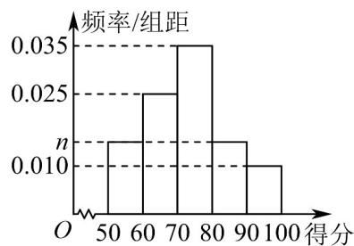

<!-- question-source:start -->
【典例1】为提高学生学习数学的积极性，某校举办数学竞赛并且设置奖项：现从参加初赛的学生中选拔出男

生 20 名、女生 20 名参加此次数学竞赛决赛，根据这 40 名学生的得分情况绘制如图所示的频率分布直方图·规

定得分不低于 80 分即可获得奖励，其中获得奖励的男学生有 7 人.

(1)求图中 n 的值;

(2)从获得奖励的学生中任取2人，求这2人中至少有1人获得奖励的概率；

(3)现从获得奖励的学生中随机抽取4人，记其中女学生的人数为 $X$ ，求 $X$ 的分布列与期望.
<!-- question-source:end -->

![[高中/课堂同步/题库/人教A版高中数学同步讲义(2026)/05_选择性必修第三册/第七章 随机变量及其分布/专题7.2 离散型随机变量及其分布（高效培优讲义）数学人教A版高二选择性必修第三册/题型03_求离散型随机变量的分布列/questions/answers/Q00083238A1.md]]
