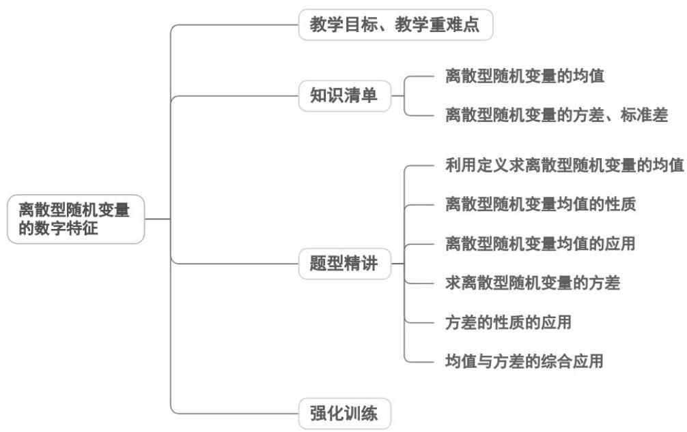
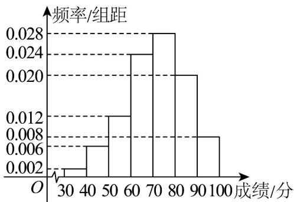

<!-- source-part:1 pages:1-50 -->

专题7.3 离散型随机变量的数字特征

## 内容概览

## 教学目标、教学重难点

<table><tr><td>教学目标</td><td>1.理解离散型随机变量均值(数学期望)和方差、标准差的定义,掌握其计算公式,能准确计算简单离散型随机变量的均值、方差与标准差。2.熟记两点分布、超几何分布的均值和方差公式,能直接运用公式求解对应模型的数字特征。3.理解均值、方差的统计意义,能根据数字特征分析随机变量的取值规律(平均水平、波动程度)。4.掌握均值、方差的简单性质,并能运用性质简化计算。</td></tr><tr><td>教学重难点</td><td>1.重点两点分布、超几何分布的均值和方差公式的识记与直接应用。2.难点复杂离散型随机变量(非典型模型)的均值、方差计算,尤其是权重(概率)的准确分析与运算。</td></tr></table>

## 知识清单

## 知识点 01 离散型随机变量的均值

## 1、离散型随机变量的均值或数学期望

正确地求出离散型随机变量的分布列是求解期望的关键一般地，若离散型随机变量 $X$ 的分布列为

<table><tr><td>X</td><td> $x_{1}$ </td><td> $x_{2}$ </td><td>...</td><td> $x_{i}$ </td><td>...</td><td> $x_{n}$ </td></tr><tr><td>P</td><td> $p_{1}$ </td><td> $p_{2}$ </td><td>...</td><td> $p_{i}$ </td><td>...</td><td> $p_{n}$ </td></tr></table>

则称 $E(X) = x_{1}p_{1} + x_{2}p_{2} + \ldots +x_{i}p_{i} + \ldots x_{n}p_{n} = \sum x_{i}p_{i}$ 为随机变量 $X$ 的均值或数学期望，数学期望简称为期望．均

值是随机变量可能取值关于取值概率的加权平均数，它综合了随机变量的取值和取值的概率，反映了随机变

量取值的平均水平.

## 2、两点分布的期望

一般地，如果随机变量 $X$ 服从两点分布，那么 $E(X) = 0 \times (1 - p) + 1 \times p = p$ ；

## 3、离散型随机变量的均值的性质

设 $X$ 的分布列为 $P(X = x_{i}) = p_{i}, i = 1,2,\dots ,n.$ ；一般地，下面的结论成立： $E(aX + b) = aE(X) + b$

【即学即练】

1. 第31届世界大学生夏季运动会的三个吉祥物是“蓉宝”、“嘟嘟”和“飞飞”深受大家喜爱·某经销商提供如下两

种购买方式：

·方式一：购买盲盒，每个盲盒售价 $^{20}$ 元，内部随机放有“蓉宝”、“嘟嘟”和“飞飞”三款中的一款或者为空盒，

只有拆开才会知道购买情况，买到各种盲盒是等可能的；

方式二：直接购买吉祥物，每个 $^{30}$ 元

(1)小明若以方式一购买吉祥物，每次购买一个盲盒并拆开．求他第 $^{3}$ 次购买时恰好首次出现与已买到的吉祥

物款式相同的概率；

(2)为了集齐三款吉祥物，现有两套方案待选：

方案一：先购买一个盲盒，再按方式二补齐剩下的款式：

方案二：先购买两个盲盒，再按方式二补齐剩下的款式。

若以所需费用的期望值为决策依据，小明应选择哪套方案？

【答案】(1) $\frac{9}{32}$

(2)选择方案一

【分析】（ $^{1}$ ）根据古典概型求得概率；

(2) 分别求得两种方案的分布列，然后求得数学期望值，可得结论

【详解】（1）设小明第3次购买时恰好首次出现与已买到的吉祥物款式相同的概率为 $P$ ，

则分为有空盒和无空盒两种情况， $P = \frac{C_2^1\times C_3^1 + C_3^1\times C_2^1\times C_2^1}{4\times 4\times 4} = \frac{9}{32}$

(2) 方案一：令小明集齐 $^{3}$ 款吉祥物所需要的总费用为 X.

X 的可能取值为 80, 110.

$$
P (X = 8 0) = \frac {C _ {3} ^ {1}}{4} = \frac {3}{4} \quad P (X = 1 1 0) = \frac {1}{4}
$$

所以 $E(X)=80\times\frac{3}{4}+110\times\frac{1}{4}=\frac{175}{2}$

方案二：令小明集齐 $^{3}$ 款吉祥物所需要的总费用为 Y.

依题意，Y 的可能取值为 70，100，130，

$$
P (Y = 7 0) = \frac {\mathrm{C} _ {3} ^ {1} \times \mathrm{C} _ {2} ^ {1}}{4 \times 4} = \frac {6}{1 6} = \frac {3}{8}
$$

$$
P (Y = 1 0 0) = \frac {\mathrm{C} _ {2} ^ {1} \times \mathrm{C} _ {3} ^ {1} + \mathrm{C} _ {3} ^ {1}}{4 \times 4} = \frac {9}{1 6}
$$

$$
P (Y = 1 3 0) = \frac {1}{4 \times 4} = \frac {1}{1 6}.
$$

所以 $E(Y)=70\times\frac{6}{16}+100\times\frac{9}{16}+130\times\frac{1}{16}=\frac{725}{8}$

因为 $\frac{175}{2}<\frac{725}{8}$ ，所以小明应该选择方案一

2. 某企业招聘方式分笔试、面试两个环节进行，先进行笔试，笔试合格后才能参加面试，面试合格后便正式

录取，且这两个环节能否通过相互独立．现有甲、乙、丙三名大学生参加了该企业的招聘，假设甲通过笔试、

面试的概率分别为 $\frac{1}{2}$ ， $\frac{1}{3}$ ；乙、丙通过笔试的概率均为 $\frac{2}{3}$ ，通过面试的概率均为 $\frac{1}{2}$ 。

(1)求甲、乙、丙三人中至少有一人被该企业正式录取的概率；

(2)为鼓励优秀大学生积极参与企业的招聘工作，该企业决定给报名参加应聘的大学生一定的补贴，补贴标准

如下表：

<table><tr><td>参与环节</td><td>笔试</td><td>面试</td></tr><tr><td>补贴(元)</td><td>100</td><td>150</td></tr></table>

记甲、乙、丙三人获得的所有补贴之和为 $X$ 元，求 $X$ 的分布列和数学期望。

【答案】(1) $\frac{17}{27}$

(2)分布列见解析，575

【分析】（1）分析甲、乙、丙三人各自被录取的概率，求得三人都没有被正式录取的概率，根据对立事件概

率的求法求得至少有一人被该企业正式录取的概率；

(2) 易知 X 的所有可能取值为 300,450,600,750，分析其对应的事件，分别求得其概率，即可得到 X 的分布

列，并求得 $X$ 的数学期望·

【详解】（1）设事件 $A$ 表示“甲被该企业正式录取”，事件 $B$ 表示“乙被该企业正式录取”，事件 $C$ 表示“丙被该

企业正式录取”·

则由题可知 $P(A) = \frac{1}{2} \times \frac{1}{3} = \frac{1}{6}, P(B) = P(C) = \frac{2}{3} \times \frac{1}{2} = \frac{1}{3}$ .

事件 D 表示“甲、乙、丙三人都没有被该企业正式录取”，

$$
P (D) = P (\bar {A} \bar {B} \bar {C}) = P (\bar {A}) P (\bar {B}) P (\bar {C}) = \left(1 - \frac {1}{6}\right) \times \left(1 - \frac {1}{3}\right) \times \left(1 - \frac {1}{3}\right) = \frac {1 0}{2 7}
$$

所以甲、乙、丙三人中至少有一人被该企业正式录取的概率 $P = 1 - P(D) = 1 - \frac{10}{27} = \frac{17}{27}$

(2) X 的所有可能取值为 300,450,600,750，对应事件分别为“三人均未通过笔试”，“三人中恰有一人通过笔

试”，“三人中恰有两人通过笔试”，“三人均通过笔试”

$$
P (X = 3 0 0) = \frac {1}{2} \times \frac {1}{3} \times \frac {1}{3} = \frac {1}{1 8},
$$

$$
P (X = 4 5 0) = \frac {1}{2} \times \frac {1}{3} \times \frac {1}{3} + 2 \times \frac {1}{2} \times \frac {2}{3} \times \frac {1}{3} = \frac {5}{1 8},
$$

$$
P (X = 6 0 0) = 2 \times \frac {1}{2} \times \frac {2}{3} \times \frac {1}{3} + \frac {1}{2} \times \frac {2}{3} \times \frac {2}{3} = \frac {4}{9},
$$

$$
P (X = 7 5 0) = \frac {1}{2} \times \frac {2}{3} \times \frac {2}{3} = \frac {2}{9}.
$$

所以 $X$ 的分布列为

<table><tr><td>X</td><td>300</td><td>450</td><td>600</td><td>750</td></tr><tr><td>P</td><td>1/18</td><td>5/18</td><td>4/9</td><td>2/9</td></tr></table>

数学期望 $E(X) = 300 \times \frac{1}{18} + 450 \times \frac{5}{18} + 600 \times \frac{4}{9} + 750 \times \frac{2}{9} = 575$

3. 已知随机变量 $X$ 的概率分布如表且 $P(X > 2) = 0.3$ ；则 $E(5X + 4) =$ \_\_\_\_；

<table><tr><td>X</td><td>1</td><td>2</td><td>4</td></tr><tr><td>P</td><td>0.4</td><td>a</td><td>b</td></tr></table>

【答案】15

【分析】根据分布列的概率性质，结合题意，求出参数 $b, a$ ，再根据数学期望的性质计算可得答案

【详解】因为 $P(X > 2) = 0.3 = b$ ，所以 $a = 1 - P(X = 4) - P(X = 1) = 0.3$

所以 $E(X) = 1 \times 0.4 + 2 \times 0.3 + 4 \times 0.3 = 2.2$

则 $E(5X+4)=5E(X)+4=5\times2.2+4=15$ .

故答案为：15.

## 知识点 02 离散型随机变量的方差、标准差

## 1、离散型随机变量的方差、标准差

正确求解随机变量的方差的关键是正确求解分布列及其期望值

设离散型随机变量 $X$ 的分布列为

<table><tr><td>X</td><td> $x_{1}$ </td><td> $x_{2}$ </td><td>...</td><td> $x_{i}$ </td><td>...</td><td> $x_{n}$ </td></tr><tr><td>P</td><td> $p_{1}$ </td><td> $p_{2}$ </td><td>...</td><td> $p_{i}$ </td><td>...</td><td> $p_{n}$ </td></tr></table>

考虑 $X$ 所有可能取值 $x_{i}$ 与 $E(X)$ 的偏差的平方 $(x_{1} - E(X))^{2}$ ， $(x_{2} - E(X))^{2}$ ，…， $(x_{n} - E(X))^{2}$ ，因为 $X$ 取每个值的

概率不尽相同，所以我们用偏差平方关于取值概率的加权平均，来度量随机变量 $X$ 取值与其均值 $E(X)$ 的偏离

程度，我们称 $D(X) = (x_{1} - E(X))^{2}p_{1} + (x_{2} - E(X))^{2}p_{2} + \dots +(x_{n} - E(X))^{2}p_{n} = \sum (x_{i} - E(X))^{2}p_{i}$

为随机变量 X 的方差，有时也记为 $Var(X)$ ，并称为随机变量 X 的标准差，记为 $\sigma(X)$ 。

2、几个常见的结论

(1) $D(aX + b) = a^{2}D(X)$ .

(2)若 $X$ 服从两点分布，则 $D(X) = p(1 - p)$

## 【即学即练】

1. 已知随机变量 $X$ 的分布列如下，若 $E(X) = 0$ ，则 $D(3X + 1) = (\quad)$

<table><tr><td>X</td><td>-2</td><td>0</td><td>1</td><td>2</td></tr><tr><td>P</td><td>m</td><td> $\frac{1}{6}$ </td><td> $\frac{1}{3}$ </td><td>n</td></tr></table>

A. $\frac{7}{3}$ B. 7 C. 21 D. 22

【答案】C

【分析】先根据分布列性质计算求参数，再根据方差定义计算方差，最后应用方差性质计算求解

【详解】由题意可得： $\left\{\begin{aligned}m+n&=\frac{1}{2}\\ -2m+0+\frac{1}{3}+2n&=0\end{aligned}\right.$ ，解得 $\left\{\begin{aligned}m&=\frac{1}{3}\\ n&=\frac{1}{6}\end{aligned}\right.$

则 $D(X) = \sum_{i=1}^{4}\left(x_i - EX\right)^2 \cdot P_i = 4 \times \frac{1}{3} + 0 + 1 \times \frac{1}{3} + 4 \times \frac{1}{6} = \frac{7}{3}$

所以 $D(3X + 1) = 9D(X) = 9 \times \frac{7}{3} = 21$

故选：C.

2. 某高中在选拔学生参加高中数学联赛中，对数学成绩较好的 $100$ 名学生进行了一次测试，将测试所得的成

绩（满分100分）分成7组： $[30,40)$ ， $[40,50)$ ， $[50,60)$ ， $[60,70)$ ， $[70,80)$ ， $[80,90)$ ， $[90,100]$ ，整理得到

如图所示的频率分布直方图·

(1)求此次测试成绩的平均数（同组数据以该组区间的中点值作代表）；

(2)从测试成绩在区间 $[30,50)$ 内的学生中随机抽取 $^4$ 人，记 $^4$ 人中测试成绩在区间 $[40,50)$ 内的人数为 $X$ ，求

$X$ 的分布列、数学期望和方差·

【答案】(1)71.2

(2)分布列见解析， $E(X)=3$ ， $D(X)=\frac{3}{7}$ .

【分析】（ $^{1}$ ）根据频率分布直方图求出测试成绩的平均数；

(2) 求出测试成绩在区间 $[30,40)$ 和 $[40,50)$ 内的学生的人数，得到 $X$ 可能的取值及对应的概率，得到分布列，

求出数学期望和方差·

【详解】（1）由图知测试成绩的平均数为：

$$
0. 0 0 2 \times 1 0 \times 3 5 + 0. 0 0 6 \times 1 0 \times 4 5 + 0. 0 1 2 \times 1 0 \times 5 5 + 0. 0 2 4 \times 1 0 \times 6 5
$$

$$
+ 0. 0 2 8 \times 1 0 \times 7 5 + 0. 0 2 0 \times 1 0 \times 8 5 + 0. 0 0 8 \times 1 0 \times 9 5 = 7 1. 2
$$

(2) 测试成绩在区间 $[30,40)$ 内的学生人数为 $0.002 \times 10 \times 100 = 2$ 人，

测试成绩在区间 $[40,50)$ 内的学生人数为 $0.006 \times 10 \times 100 = 6$ 人，

所以 X 的可能取值为 2, 3, 4.

故 $P(X = 2) = \frac{\mathrm{C}_2^2\mathrm{C}_6^2}{\mathrm{C}_8^4} = \frac{3}{14}$ ， $P(X = 3) = \frac{\mathrm{C}_2^1\mathrm{C}_6^3}{\mathrm{C}_8^4} = \frac{4}{7}$ ， $P(X = 4) = \frac{\mathrm{C}_2^0\mathrm{C}_6^4}{\mathrm{C}_8^4} = \frac{3}{14}$ ，

所以 $X$ 的分布列为：

<table><tr><td>X</td><td>2</td><td>3</td><td>4</td></tr><tr><td>P</td><td>3/14</td><td>4/7</td><td>3/14</td></tr></table>

所以 $E(X) = 2 \times \frac{3}{14} + 3 \times \frac{4}{7} + 4 \times \frac{3}{14} = 3$

$$
D (X) = (2 - 3) ^ {2} \times \frac {3}{1 4} + (3 - 3) ^ {2} \times \frac {4}{7} + (4 - 3) ^ {2} \times \frac {3}{1 4} = \frac {3}{7}.
$$

3. 现有编号 $123, \ldots, n$ 的 $n$ 个学生，入座编号 $123, \ldots, n$ 的 $n$ 个座位，设学生所坐的座位号与该生的编号不同的学生数为 $X$ ，已知 $X = 3$ 时共 $8$ 种坐法，则（）

【答案】

A. $n = 6$ B. $P(X = 4) = \frac{3}{8}$ C. $E(X) = 2$ D. $D(X) = 1$

【答案】BD

【分析】根据 $X$ 的意义，结合组合数公式，求 $n$ ，再根据古典概型概率公式，求 $P(X = 4)$ ，再写出所有 $X$ 的

取值和概率，代入期望公式和方差公式，即可判断选项·

【详解】A.由条件可知，3人错位排列有2种方法，所以 $C_{n}^{3}\times2=\frac{n(n-1)(n-2)}{1\times2\times3}\times2=8$ ，解得n=4，故A错误；

B. $X = 4$ 表示 $^4$ 人全部坐错， $^4$ 人全部坐错有 $3 \times 3 = 9$ 种方法， $^4$ 人的全部坐法有 $\mathrm{A}_4^4 = 24$ 种坐法，

所以 $P(X=4)=\frac{9}{24}=\frac{3}{8}$ ，故 B 正确；

C. $X = 0,2,3,4$ ， $P(X = 0) = \frac{1}{24}$ ， $P(X = 2) = \frac{C_4^2\times 1}{24} = \frac{6}{24} = \frac{1}{4}$ ， $P(X = 3) = \frac{8}{24} = \frac{1}{3},$

所以 $E(X)=0\times\frac{1}{24}+2\times\frac{1}{4}+3\times\frac{1}{3}+4\times\frac{3}{8}=3$ ，故 C 错误；

D. $D(X)=(0-3)^{2}\times\frac{1}{24}+(2-3)^{2}\times\frac{1}{4}+(3-3)^{2}\times\frac{1}{3}+(4-3)^{2}\times\frac{3}{8}=1$ ，故 D 正确.

故选：BD

## 题型精讲

![[高中/课堂同步/题库/人教A版高中数学同步讲义(2026)/05_选择性必修第三册/第七章 随机变量及其分布/专题7.3 离散型随机变量的数字特征（高效培优讲义）数学人教A版高二选择性必修第三册/题型01_利用定义求离散型随机变量的均值/题型01_利用定义求离散型随机变量的均值.md]]
![[高中/课堂同步/题库/人教A版高中数学同步讲义(2026)/05_选择性必修第三册/第七章 随机变量及其分布/专题7.3 离散型随机变量的数字特征（高效培优讲义）数学人教A版高二选择性必修第三册/题型02_离散型随机变量均值的性质/题型02_离散型随机变量均值的性质.md]]
![[高中/课堂同步/题库/人教A版高中数学同步讲义(2026)/05_选择性必修第三册/第七章 随机变量及其分布/专题7.3 离散型随机变量的数字特征（高效培优讲义）数学人教A版高二选择性必修第三册/题型03_离散型随机变量均值的应用/题型03_离散型随机变量均值的应用.md]]
![[高中/课堂同步/题库/人教A版高中数学同步讲义(2026)/05_选择性必修第三册/第七章 随机变量及其分布/专题7.3 离散型随机变量的数字特征（高效培优讲义）数学人教A版高二选择性必修第三册/题型04_求离散型随机变量的方差/题型04_求离散型随机变量的方差.md]]
![[高中/课堂同步/题库/人教A版高中数学同步讲义(2026)/05_选择性必修第三册/第七章 随机变量及其分布/专题7.3 离散型随机变量的数字特征（高效培优讲义）数学人教A版高二选择性必修第三册/题型05_方差的性质的应用/题型05_方差的性质的应用.md]]
![[高中/课堂同步/题库/人教A版高中数学同步讲义(2026)/05_选择性必修第三册/第七章 随机变量及其分布/专题7.3 离散型随机变量的数字特征（高效培优讲义）数学人教A版高二选择性必修第三册/题型06_均值与方差的综合应用/题型06_均值与方差的综合应用.md]]
![[高中/课堂同步/题库/人教A版高中数学同步讲义(2026)/05_选择性必修第三册/第七章 随机变量及其分布/专题7.3 离散型随机变量的数字特征（高效培优讲义）数学人教A版高二选择性必修第三册/强化训练/强化训练.md]]
