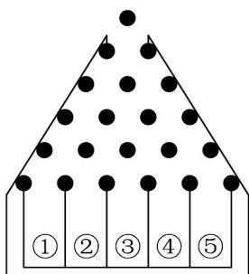

<!-- question-source:start -->
【变式3】如图是一块改进型高尔顿板，将小木块设计成5层，使小球在下落的过程中与小木块碰接时，有

$\frac{1}{3}$ 的概率向左， $\frac{2}{3}$ 的概率向右落下，最后落入编号为 $1, 2, 3, 4, 5$ 的球槽内·游戏制定者规定：玩一次游

戏所获奖金为 $\xi$ 元， $\xi = |X - n| (n = 0,1,2,3)$ ，其中 $X$ 表示小球落入球槽的号数·则当 $E(\xi)$ 最大时， $n = (\quad)$

A.0 B.1 C.2 D.3
<!-- question-source:end -->

![[高中/课堂同步/题库/人教A版高中数学同步讲义(2026)/05_选择性必修第三册/第七章 随机变量及其分布/专题7.3 离散型随机变量的数字特征（高效培优讲义）数学人教A版高二选择性必修第三册/题型02_离散型随机变量均值的性质/questions/answers/Q00083262A1.md]]
