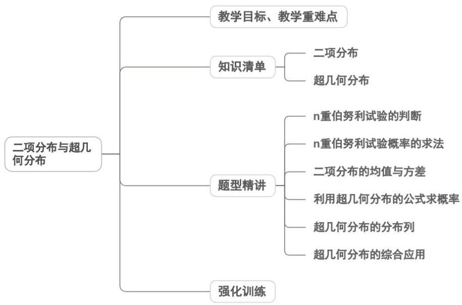

<!-- source-part:1 pages:1-50 -->

## 专题7.4 二项分布与超几何分布

## 内容概览



## 教学目标、教学重难点

<table><tr><td>教学目标</td><td>1.理解n重伯努利试验的定义及特征(相同条件重复、结果独立、仅两种可能、概率恒定),掌握二项分布的概念,能准确表述随机变量服从二项分布的符号及概率计算公式。2.理解超几何分布的概念,明确其适用场景的核心要素(总体分两类、已知各类数量、不放回抽取),掌握概率计算公式,能辨识公式中参数N(总体容量)、M(某类个体数)、n(抽取容量)的含义。3.掌握二项分布的数字特征,熟记若X~B(n,p),则均值E(X)=np、方差D(X)=np(1-p),理解超几何分布的均值计算方法,能熟练进行两类分布的概率、均值与方差的基本运算。</td></tr><tr><td>教学重难点</td><td>1.重点两类分布的应用基础:能准确构建二项分布与超几何分布的分布列,熟练进行概率与数</td></tr></table>

```txt
字特征的计算，为实际问题解决奠定基础。
2.难点
两类分布的本质差异辨析：对“二项分布无需知道总体容量，超几何分布依赖总体容量”“二项分布是独立重复试验，超几何分布是相依试验”的核心区别理解不深刻，导致应用中混淆公式。
```

## 知识清单

## 知识点 01 二项分布

1、 $n$ 重伯努利试验的概念：只包含两个可能结果的试验叫做伯努利试验，将一个伯努利试验独立地重复进行

$n$ 次所组成的随机试验称为 $n$ 重伯努利试验.

2、n 重伯努利试验具有如下共同特征

(1)同一个伯努利试验重复做 $n$ 次；

(2)各次试验的结果相互独立.

## 3、二项分布

一般地，在 $n$ 重伯努利试验中，设每次试验中事件 $A$ 发生的概率为 $p(0 < p < 1)$ ，用 $X$ 表示事件 $A$ 发生的次数，

则 $X$ 的分布列为： $P(X = k) = \mathrm{C}_n^k p^k (1 - p)^{n - k},\quad k = 0,1,2,\ldots ,n$

如果随机变量 $X$ 的分布列具有上式的形式，则称随机变量 $X$ 服从二项分布，记作 $X \sim B(n, p)$ 。

一般地，可以证明：如果 $X \sim B(n, p)$ ，那么 $E(X) = np$ ， $D(X) = np(1 - p)$ 。

【即学即练】

1. 一个不透明的袋子中装有若干个均匀的红球和白球，从袋子中摸一个红球的概率是 $^{3}$ ，现在从袋子中有放

$$
\frac {1}{3}
$$

回地摸球，每次摸出一个。

(1)若一共摸 $^{3}$ 次球，设摸到红球的次数为 $\xi$ ，求随机变量 $\xi$ 的分布列和数学期望：

(2)若有 $^{3}$ 次摸到红球则停止摸球，求恰好摸 $^{5}$ 次停止的概率.

【答案】(1)分布列见解析，数学期望为 $^{1}$ ;

(2) $\frac{8}{81}$ .

【分析】（1）求出 $\xi$ 的可能取值及各个值对应的概率，列出分布列并求出期望

(2) 利用独立重复试验的概率公式列式求解.

【详解】（1）随机变量 $\xi$ 的可能取值为 0,1,2,3，则 $\xi \sim B(3,\frac{1}{3})$ ， $P(\xi=k)=C_{3}^{k}(\frac{1}{3})^{k}(\frac{2}{3})^{3-k}, k=0,1,2,3$

$$
P (\xi = 0) = \mathrm{C} _ {3} ^ {0} \left(\frac {1}{3}\right) ^ {0} \left(\frac {2}{3}\right) ^ {3} = \frac {8}{2 7}, P (\xi = 1) = \mathrm{C} _ {3} ^ {1} \left(\frac {1}{3}\right) ^ {1} \left(\frac {2}{3}\right) ^ {2} = \frac {4}{9},
$$

$$
P (\xi = 2) = \mathrm{C} _ {3} ^ {2} \left(\frac {1}{3}\right) ^ {2} \left(\frac {2}{3}\right) ^ {1} = \frac {2}{9}, P (\xi = 3) = \mathrm{C} _ {3} ^ {3} \left(\frac {1}{3}\right) ^ {3} \left(\frac {2}{3}\right) ^ {0} = \frac {1}{2 7},
$$

所以随机变量 $\xi$ 的分布列为：

<table><tr><td>ξ</td><td>0</td><td>1</td><td>2</td><td>3</td></tr><tr><td>P</td><td>8/27</td><td>4/9</td><td>2/9</td><td>1/27</td></tr></table>

数学期望

$$
E (\xi) = 3 \times \frac {1}{3} = 1
$$

(2) 有 $^{3}$ 次摸到红球则停止摸球，恰好摸 $^{5}$ 次停止的事件是前 $^{4}$ 次摸到红球 $^{2}$ 次，第 $^{5}$ 次摸到红球，

所以恰好摸 $^{5}$ 次停止的概率为 $C_{4}^{2}\left(\frac{1}{3}\right)^{2}\left(\frac{2}{3}\right)^{2}\cdot\frac{1}{3}=\frac{8}{81}$

2. 已知随机变量 $X \sim B\left(6, \frac{2}{3}\right)$ ，随机变量 $Y = -3X + 4$ ，则 $D(Y) =$ \_\_\_\_.

【答案】12

【分析】利用二项分布的方差公式求出 $D(X)$ ，再由方差的性质计算 $D(Y)$ .

【详解】因为 $X \sim B\left(6, \frac{2}{3}\right)$ ，所以 $D(X) = 6 \times \frac{2}{3} \times \frac{1}{3} = \frac{4}{3}$

故 $D(Y) = D(-3X + 4) = (-3)^{2}D(X) = 9 \times \frac{4}{3} = 12$

故答案为：12·

3. 抛掷一枚质地均匀的正四面体骰子（四个面上分别标有数字 $1, 2, 3, 4$ ），底面的点数为 $1$ 记为事件 $A$ ，

抛掷 $n$ 次后事件 $A$ 发生奇数次的概率记为 $P_{n}$ ，则 $P_{1} =$ \_\_\_\_， $P_{2026} =$ \_\_\_\_。

【答案】 $\frac{1}{4} / 0.25$ $\frac{1}{2} -\left(\frac{1}{2}\right)^{2027}$

【分析】根据 $n$ 次独立重复实验事件 $A$ 发生的概率为 $\frac{1}{4}$ ，根据二项分布求 $P_{n}$ ，构造二项式应用赋值法分别计

算即可·

【详解】抛掷 $^{1}$ 次后事件A发生奇数次，只能发生 $^{1}$ 次， $P_{1}=\frac{1}{4}$ ；

抛掷 n 次后事件 A 发生 1 次，3 次，5 次，……，

抛掷 n 次后事件 A 发生奇数次的概率记为 $P_{n}$ ，

当 n 为偶数时， $P_{n} = C_{n}^{1}\left(\frac{1}{4}\right)\left(\frac{3}{4}\right)^{n-1} + C_{n}^{3}\left(\frac{1}{4}\right)^{3}\left(\frac{3}{4}\right)^{n-3} + \cdots + C_{n}^{n-1}\left(\frac{1}{4}\right)^{n-1}\left(\frac{3}{4}\right)$

$$
\text {构造二项式} \left(\frac {3}{4} + \frac {1}{4} x\right) ^ {n} = \mathrm{C} _ {n} ^ {0} \left(\frac {3}{4}\right) ^ {n} + \mathrm{C} _ {n} ^ {1} \left(\frac {1}{4} x\right) \left(\frac {3}{4}\right) ^ {n - 1} + \mathrm{C} _ {n} ^ {2} \left(\frac {1}{4} x\right) ^ {2} \left(\frac {3}{4}\right) ^ {n - 2} + \mathrm{C} _ {n} ^ {3} \left(\frac {1}{4} x\right) ^ {3} \left(\frac {3}{4}\right) ^ {n - 3} + \dots + \mathrm{C} _ {n} ^ {n} \left(\frac {1}{4} x\right) ^ {n}
$$

当 n 为偶数时，

$$
\text {令} x = 1, 1 = \left(\frac {3}{4} + \frac {1}{4}\right) ^ {n} = \mathrm{C} _ {n} ^ {0} \left(\frac {3}{4}\right) ^ {n} + \mathrm{C} _ {n} ^ {1} \left(\frac {1}{4}\right) \left(\frac {3}{4}\right) ^ {n - 1} + \mathrm{C} _ {n} ^ {2} \left(\frac {1}{4}\right) ^ {2} \left(\frac {3}{4}\right) ^ {n - 2} + \mathrm{C} _ {n} ^ {3} \left(\frac {1}{4}\right) ^ {3} \left(\frac {3}{4}\right) ^ {n - 3} + \dots + \mathrm{C} _ {n} ^ {n} \left(\frac {1}{4}\right) ^ {n}
$$

$$
\text {令} x = - 1, \left(\frac {1}{2}\right) ^ {n} = \left(\frac {3}{4} - \frac {1}{4}\right) ^ {n} = \mathrm{C} _ {n} ^ {0} \left(\frac {3}{4}\right) ^ {n} - \mathrm{C} _ {n} ^ {1} \left(\frac {1}{4}\right) \left(\frac {3}{4}\right) ^ {n - 1} + \mathrm{C} _ {n} ^ {2} \left(\frac {1}{4}\right) ^ {2} \left(\frac {3}{4}\right) ^ {n - 2} - \mathrm{C} _ {n} ^ {3} \left(\frac {1}{4}\right) ^ {3} \left(\frac {3}{4}\right) ^ {n - 3} + \dots + \mathrm{C} _ {n} ^ {n} \left(\frac {1}{4}\right) ^ {n}
$$

$$
\text {两式作差得} 1 - \left(\frac {1}{2}\right) ^ {n} = 2 \left[ C _ {n} ^ {1} \left(\frac {1}{4}\right) \left(\frac {3}{4}\right) ^ {n - 1} + C _ {n} ^ {3} \left(\frac {1}{4}\right) ^ {3} \left(\frac {3}{4}\right) ^ {n - 3} + \dots + C _ {n} ^ {n - 1} \left(\frac {1}{4}\right) ^ {n - 1} \left(\frac {3}{4}\right) \right],
$$

可得 $P_{n}=\mathrm{C}_{n}^{1}\left(\frac{1}{4}\right)\left(\frac{3}{4}\right)^{n-1}+\mathrm{C}_{n}^{3}\left(\frac{1}{4}\right)^{3}\left(\frac{3}{4}\right)^{n-3}+\cdots+\mathrm{C}_{n}^{n-1}\left(\frac{1}{4}\right)^{n-1}\left(\frac{3}{4}\right)=\frac{1}{2}-\left(\frac{1}{2}\right)^{n+1}$

因为 n = 2026 ，所以 $P_{2026} = \frac{1}{2} - \left(\frac{1}{2}\right)^{2027}$

故答案为： $\frac{1}{4}$ ； $\frac{1}{2}-\left(\frac{1}{2}\right)^{2027}$

## 知识点 02 超几何分布

## 1、超几何分布

超几何分布模型是一种不放回抽样

一般地，假设一批产品共有 $N$ 件，其中有 $M$ 件次品，从 $N$ 件产品中随机抽取 $n$ 件(不放回)，用 $X$ 表示抽取的

$P(X=k)=\frac{C_{M}^{k}C_{N-M}^{n-k}}{C_{N}^{n}}$ ，k=m， $m+1$ ， $m+2$ ，…，r.

其中 $n$ ， $N$ ， $M\in \mathbb{N}^*$ ， $M\leq N$ ， $n\leq N$ ， $m = \max \{0$ ， $n - N + M\}$ ， $r = \min \{n$ ， $M\}$ .如果随机变量 $X$ 的分布列具有

上式的形式，那么称随机变量 $X$ 服从超几何分布。

## 2、超几何分布的期望

$E(X)=\underline{=np}(p \text{ 为 } N \text{ 件产品的次品率})$ .

## 【即学即练】

1. 下列选项正确的是（ ）

【答案】
A．若随机变量 X 服从两点分布（或 $^{0-1}$ 分布），且 $E(X)=\frac{1}{2}$ ，则 $D(X)=\frac{1}{8}$ B．若随机变量 X 满足 $P(X=k)=\frac{C_{2}^{k}C_{4}^{2-k}}{C_{6}^{2}}$ ，k=0,1,2，则 $E(X)=\frac{2}{3}$ C．若随机变量 $X \sim B(2, \frac{1}{3})$ ，则 $D(X)=\frac{4}{9}$ D．某人在 $^{10}$ 次射击中，击中目标的次数为Z，若 $Z \sim B(10,0.7)$ ，则此人最有可能 $^{7}$ 次击中目标

【答案】BCD

【分析】利用两点分布，结合期望及方差的意义求解判断 $^{A}$ ；利用超几何分布求出期望判断 $^{B}$ ；利用二项分

布求出方差判断 $^{C}$ ；利用不等式法求解判断 $^{D}$ .

【详解】对于 $^{A}$ ，由随机变量X服从两点分布， $E(X)=\frac{1}{2}$ ，得试验成功的概率

因此 $D(X)=(0-\frac{1}{2})^{2}\times(1-\frac{1}{2})+(1-\frac{1}{2})^{2}\times\frac{1}{2}=\frac{1}{4}$ ，A 错误；

对于 $^{B}$ ，由随机变量X满足 $P(X=k)=\frac{C_{2}^{k}C_{4}^{2-k}}{C_{6}^{2}}$ ，k=0,1,2，

得 $X$ 服从超几何分布，因此 $E(X) = 2 \times \frac{2}{6} = \frac{4}{6} = \frac{2}{3}$ ，B正确；

对于 $C$ ，由随机变量 $X\sim B(2,\frac{1}{3})$ ，得 $D(X) = 2\times \frac{1}{3}\times (1 - \frac{1}{3}) = \frac{4}{9}$ ， $C$ 正确；

对于 D， $P(Z=k)=C_{10}^{k}\times0.7^{k}\times0.3^{10-k},k\in\mathbf{N},k\leq10$ ，由 $\left\{\begin{aligned}P(Z=k)&\quad P(Z=k+1)\\ P(Z=k)&\quad P(Z=k-1)\end{aligned}\right.$

得 $\left\{\begin{aligned}C_{10}^{k}\times0.7^{k}\times0.3^{10-k}&C_{10}^{k+1}\times0.7^{k+1}\times0.3^{9-k}\\ C_{10}^{k}\times0.7^{k}\times0.3^{10-k}&C_{10}^{k-1}\times0.7^{k-1}\times0.3^{11-k}\end{aligned}\right.$ ，解得 $6.7\leq k\leq7.7$ ，

则 $k = 7$ ，即 $P(Z = 7)$ 最大，此人最有可能7次击中目标，D正确.

故选：BCD

2. 一个盒子中装有 $^{4}$ 个白球， $^{3}$ 个黑球，现从中一次取出 $^{3}$ 个球，则取出的黑球个数为（）时，其概率最大.
A.0 B.1 C.2 D.3

【答案】B

【分析】设 X 为取出的 $^{3}$ 个球中黑球的个数，分别求解 $P(X=0)$ , $P(X=1)$ , $P(X=2)$ , $P(X=3)$ 的值，比较即

可得结论·

【详解】设 X 为取出的 $^{3}$ 个球中黑球的个数，则 X 的取值为 0,1,2,3，

$$
P (X = 0) = \frac {\mathrm{C} _ {4} ^ {3} \mathrm{C} _ {3} ^ {0}}{\mathrm{C} _ {7} ^ {3}} = \frac {4}{3 5}, P (X = 1) = \frac {\mathrm{C} _ {4} ^ {2} \mathrm{C} _ {3} ^ {1}}{\mathrm{C} _ {7} ^ {3}} = \frac {1 8}{3 5}, P (X = 2) = \frac {\mathrm{C} _ {4} ^ {1} \mathrm{C} _ {3} ^ {2}}{\mathrm{C} _ {7} ^ {3}} = \frac {1 2}{3 5}, P (X = 3) = \frac {\mathrm{C} _ {4} ^ {0} \mathrm{C} _ {3} ^ {3}}{\mathrm{C} _ {7} ^ {3}} = \frac {1}{3 5}
$$

故取出的黑球个数为 $^{1}$ 时，其概率最大。

故选：B.

3. 某学校组织“最强大脑”解密比赛，每个参赛队伍人数限制为 $^{2}$ 人·某班有 $^{6}$ 名学生想要组队参加比赛，其中

$^{2}$ 人有比赛经验（参加过该项比赛即视为有比赛经验）， $^{4}$ 人没有比赛经验·现先从这 $^{6}$ 名学生中随机抽选 $^{2}$ 名

参加比赛，此次比赛结束后，再从这 $^{6}$ 名学生中随机抽选 $^{2}$ 名参加下一期解密比赛·

(1)记第一次抽选的 $^{2}$ 名学生中，有比赛经验的人数为X，求X的分布列和数学期望；

(2)求“再次抽选的 $^{2}$ 名学生中，有比赛经验的人数为 $^{1}$ ”的概率·

【答案】 $^{(1)}$ 分布列见解析， $\frac{2}{3}$

(2) $\frac{128}{225}$

【分析】（1）由题意，X 的可能取值为 0,1,2，根据超几何分布的知识求得 X 的分布列和数学期望；

(2) 利用全概率公式来求得答案.

【详解】（1）由题意知，X 的可能取值为 0,1,2

$$
P (X = 0) = \frac {\mathrm{C} _ {2} ^ {0} \mathrm{C} _ {4} ^ {2}}{\mathrm{C} _ {6} ^ {2}} = \frac {6}{1 5} = \frac {2}{5}, P (X = 1) = \frac {\mathrm{C} _ {2} ^ {1} \mathrm{C} _ {4} ^ {1}}{\mathrm{C} _ {6} ^ {2}} = \frac {8}{1 5}, P (X = 2) = \frac {\mathrm{C} _ {4} ^ {0} \mathrm{C} _ {2} ^ {2}}{\mathrm{C} _ {6} ^ {2}} = \frac {1}{1 5}
$$

故随机变量 $X$ 的分布列为：

<table><tr><td>X</td><td>0</td><td>1</td><td>2</td></tr><tr><td>P</td><td> $\frac{2}{5}$ </td><td> $\frac{8}{15}$ </td><td> $\frac{1}{15}$ </td></tr></table>

数学期望

$$
E (X) = 0 \times \frac {2}{5} + 1 \times \frac {8}{1 5} + 2 \times \frac {1}{1 5} = \frac {2}{3}
$$

(2) 记“第一次抽选的 $^{2}$ 名学生中，有比赛经验的人数为i”为事件 $A_{i}(i=0,1,2)$ ，则 $A_{0}, A_{1}, A_{2}$ 两两互斥，

$$
\sum_ {i = 0} ^ {2} A _ {i} = \Omega
$$

记“再次抽选的 $^{2}$ 名学生中，有比赛经验的人数为 $^{1}$ ”为事件B，

由（1）知， $P(A_0) = \frac{2}{5}, P(A_1) = \frac{8}{15}, P(A_2) = \frac{1}{15}$

由全概率公式， $P(B)=\sum_{i=0}^{2}P(A_{i})P(B,A_{i})=\frac{2}{5}\times\frac{C_{4}^{1}C_{2}^{1}}{C_{6}^{2}}+\frac{8}{15}\times\frac{C_{3}^{1}C_{3}^{1}}{C_{6}^{2}}+\frac{1}{15}\times\frac{C_{2}^{1}C_{4}^{1}}{C_{6}^{2}}=\frac{128}{225}$

故“再次抽选的 $^{2}$ 名学生中，有比赛经验的人数为 $^{1}$ ”的概率为 $\frac{128}{225}$ .

## 题型精讲

![[高中/课堂同步/题库/人教A版高中数学同步讲义(2026)/05_选择性必修第三册/第七章 随机变量及其分布/专题7.4 二项分布与超几何分布（高效培优讲义）数学人教A版高二选择性必修第三册/题型01_n_重伯努利试验的判断/题型01_n_重伯努利试验的判断.md]]
![[高中/课堂同步/题库/人教A版高中数学同步讲义(2026)/05_选择性必修第三册/第七章 随机变量及其分布/专题7.4 二项分布与超几何分布（高效培优讲义）数学人教A版高二选择性必修第三册/题型02_n重伯努利试验概率的求法/题型02_n重伯努利试验概率的求法.md]]
![[高中/课堂同步/题库/人教A版高中数学同步讲义(2026)/05_选择性必修第三册/第七章 随机变量及其分布/专题7.4 二项分布与超几何分布（高效培优讲义）数学人教A版高二选择性必修第三册/题型03_二项分布的均值与方差/题型03_二项分布的均值与方差.md]]
![[高中/课堂同步/题库/人教A版高中数学同步讲义(2026)/05_选择性必修第三册/第七章 随机变量及其分布/专题7.4 二项分布与超几何分布（高效培优讲义）数学人教A版高二选择性必修第三册/题型04_利用超几何分布的公式求概率/题型04_利用超几何分布的公式求概率.md]]
![[高中/课堂同步/题库/人教A版高中数学同步讲义(2026)/05_选择性必修第三册/第七章 随机变量及其分布/专题7.4 二项分布与超几何分布（高效培优讲义）数学人教A版高二选择性必修第三册/题型05_超几何分布的分布列/题型05_超几何分布的分布列.md]]
![[高中/课堂同步/题库/人教A版高中数学同步讲义(2026)/05_选择性必修第三册/第七章 随机变量及其分布/专题7.4 二项分布与超几何分布（高效培优讲义）数学人教A版高二选择性必修第三册/题型06_超几何分布的综合应用/题型06_超几何分布的综合应用.md]]
![[高中/课堂同步/题库/人教A版高中数学同步讲义(2026)/05_选择性必修第三册/第七章 随机变量及其分布/专题7.4 二项分布与超几何分布（高效培优讲义）数学人教A版高二选择性必修第三册/强化训练/强化训练.md]]
