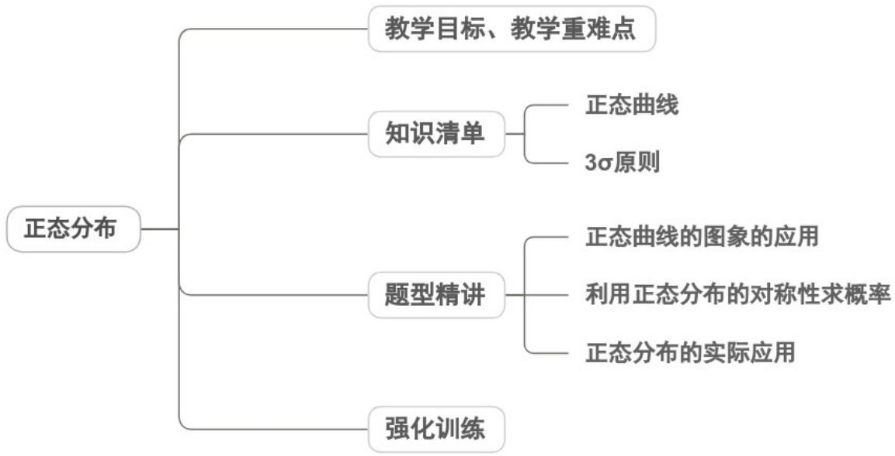
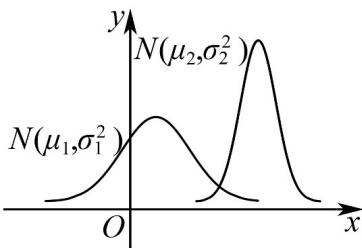

<!-- source-part:1 pages:1-36 -->

## 专题7.5 正态分布

## 内容概览

## 教学目标、教学重难点

<table><tr><td>教学目标</td><td>1.掌握正态曲线的六大特征(单峰、对称、钟形、过定点、总面积为1、参数影响形态),能结合特征描述正态曲线的形状与位置变化。2.理解3σ原则的内涵,熟记正态总体在 $(\mu-\sigma,\mu+\sigma)$ 、 $(\mu-2\sigma,\mu+2\sigma)$ 、 $(\mu-3\sigma,\mu+3\sigma)$ 内的取值概率,能运用3σ原则解决简单的概率计算问题。3.能结合实际情境判断随机变量是否服从正态分布,会用正态分布的性质解决与概率、取值范围相关的实际问题,初步掌握正态分布的简单应用。</td></tr><tr><td>教学重难点</td><td>1.重点正态分布的概念与正态曲线的核心特征,能结合特征分析参数μ、σ对曲线形状和位置的影响。2.难点正态分布与实际问题的建模转化,对于未明确说明“服从正态分布”的实际情境(如考试成绩、产品尺寸),难以判断是否可近似用正态分布模型分析,缺乏建模的直观性与准确性。</td></tr></table>

## 知识清单

## 知识点 01 正态曲线

## 1、正态曲线

正态曲线沿着横轴方向水平移动只能改变对称轴的位置，曲线的形状没有改变，所得的曲线依然是正态曲线

函数 $f(x) = \frac{\frac{1}{\sigma\sqrt{2\pi}}\mathrm{e}^{-\frac{(x - \mu)^2}{2\sigma^2}}}{\sigma}$ ， $x \in \mathbb{R}$ ，其中 $\mu \in \mathbb{R}$ ， $\sigma > 0$ 为参数。

显然对于任意 $x \in \mathbb{R}$ , $f(x) > 0$ , 它的图象在 $x$ 轴的上方. 可以证明 $x$ 轴和曲线之间的区域的面积为 1 . 我们称

$f(x)$ 为正态密度函数，称它的图象为正态分布密度曲线，简称正态曲线。

若随机变量 $X$ 的概率密度函数为 $f(x)$ ，则称随机变量 $X$ 服从正态分布，记为 $X \sim N(\mu, \sigma^2)$ ，特别地，当 $\mu =$

0， $\sigma=1$ 时，称随机变量X服从标准正态分布。

2、由 $X$ 的密度函数及图象可以发现，正态曲线还有以下特点

(1)曲线是单峰的，它关于直线 $x = \mu$ 对称；

(2)曲线在 $x = \mu$ 处达到峰值；

(3)当无限增大时，曲线无限接近 $x$ 轴.

【即学即练】

1. 下列说法正确的有（）

【答案】

A．若随机变量 $X\sim B\left(5,\frac{2}{3}\right)$ ，则 $D(3X + 1) = 11$

B．已知随机变量 $X \sim N(\mu, \sigma^{2})$ ，若 $P(X - 1) + P(X 5) = 1$ ，则 $\mu = 2$

C．已知某 $^{4}$ 个数据的平均数为 $^{5}$ ，方差为 $^{3}$ ，现又加入一个数据 $^{5}$ ，此时这 $^{5}$ 个数据的方差为 $^{2.4}$

D．已知按从小到大顺序排列的两组数据（甲组：27，30，37，m，40，50；乙组：24，n，33，44，48）

52）的第30百分位数相等，第50百分位数也相等，则 $m+n=67$

【答案】BC

【分析】根据二项分布的方差公式、正态分布的性质、平均数和方差公式以及百分位数的公式逐项计算判断

即可·

【详解】对于 $^{A}$ ：因为随机变量 $X \sim B\left(5, \frac{2}{3}\right)$ ，所以 $D(X) = 5 \times \frac{2}{3} \times \left(1 - \frac{2}{3}\right) = \frac{10}{9}$

所以 $D(3X+1)=9D(X)=10$ ，A 错误；

对于 $^{B}$ ：因为随机变量 $X \sim N(\mu, \sigma^{2})$ ， $P(X - 1) + P(X 5) = 1$ ，

所以 $P(X - 1) + 1 - P(X < 5) = 1$ ，所以 $P(X - 1) = P(X < 5)$ ，

所以 $\mu=\frac{5-1}{2}=2$ ，B 正确；

对于 C：因为某 $^{4}$ 个数据的平均数为 $\overline{x}=5$ ，方差为 $^{3}$ ，

那么这四个数据的总和为 $5 \times 4 = 20$ ，且 $\sum_{i=1}^{4}(x_{i}-5)^{2}=4 \times 3=12$

所以加入一个数据 $^{5}$ 后，五个数据之和为 $20+5=25$ ，此时平均数为 $\frac{25}{5}=5$ ，

方差为 $\frac{12+\left(5-5\right)^{2}}{5}=2.4$ ，C 正确；

对于 D : $6 \times 30\% = 1.8, 6 \times 50\% = 3$ .

对于甲组数据，第 $^{30}$ 百分位数为第二项 $^{30}$ ，第 $^{50}$ 百分位数为第三项和第四项的平均数，即 2

$$
\frac {3 7 + m}{2}
$$

对于乙组数据，第 $^{30}$ 百分位数为第二项n，第 $^{50}$ 百分位数为第三项和第四项的平均数，即 $\frac{33+44}{2}=38.5$

那么根据题意可得， $n=30,\frac{37+m}{2}=38.5$ ，解得m=40，所以 $m+n=70$ ，D错误·

故选：BC.

2. 已知随机变量 $X \sim N(1, \sigma^{2})$ ，且 $P(X < 0) = 0.3$ ，则 $P(0 < X < 2)$ 的值为（）

【答案】
A. 0.2 B. 0.4 C. 0.7 D. 0.35

【答案】B

【分析】利用正态分布曲线的对称性，即可求值·

【详解】因为随机变量 $X \sim N(1, \sigma^2)$ ，则正态分布曲线的对称轴为 $x = 1$

所以 $P(X > 2) = P(X < 0) = 0.3$ ，即 $P(0 < X < 2) = 1 - 0.3 \times 2 = 0.4$

故选：B

3. 设两个正态分布 $N\left(\mu_1, \sigma_1^2\right)\left(\sigma_1 > 0\right)$ 和 $N\left(\mu_2, \sigma_2^2\right)\left(\sigma_2 > 0\right)$ 曲线如图所示，则有（）

【答案】

A $\mu_{1} <   \mu_{2},\sigma_{1} > \sigma_{2}$ B $\mu_1 <   \mu_2,\sigma_1 <   \sigma_2$

C $\mu_{1} > \mu_{2},\sigma_{1} > \sigma_{2}$ D $\mu_1 > \mu_2,\sigma_1 <   \sigma_2$

【答案】A

【分析】从正态曲线关于直线 $x = \mu$ 对称，看 $\mu_{1},\mu_{2}$ 的大小，从曲线越“矮胖”，表示总体越分散； $\sigma$ 越小，曲

线越“瘦高”，表示总体的分布越集中．看出 $\sigma_{1}, \sigma_{2}$ 的大小即可解决．

【详解】从正态曲线的对称轴的位置看，显然 $\mu_{1} < \mu_{2}$

正态曲线越“瘦高”，表示取值越集中， $\sigma$ 越小，则 $\sigma_{1} > \sigma_{2}$ ，所以 A 正确。

故选：A.

知识点 02 3σ 原则

1、正态分布的期望与方差

若 $X \sim N(\mu, \sigma^{2})$ ，则 $E(X) = \underline{\mu}$ ， $D(X) = \underline{\sigma}^{2}$ 。

2、正态变量在三个特殊区间内取值的概率

(1) $P(\mu - \sigma \leq X \leq \mu + \sigma) \approx 0.6827$ ;

(2) $P(\mu - 2\sigma \leq X \leq \mu + 2\sigma) \approx 0.9545$ ;

$$
(3) P (\mu - 3 \sigma \leq X \leq \mu + 3 \sigma) \approx 0. 9 9 7 3.
$$

在实际应用中，通常认为服从于正态分布 $N(\mu, \sigma^2)$ 的随机变量 $X$ 只取 $[\mu - 3\sigma, \mu + 3\sigma]$ 中的值，这在统计学中

称为 $3\sigma$ 原则.

## 【即学即练】

1. 某产品的质量指标服从正态分布 $N(596, \sigma^2)$ ·质量指标介于 $^{593}$ 至 $^{599}$ 之间的产品为合格品，为使这种产
品的合格率达到 $^{99.74\%}$ ，则需调整生产技术，使得 $\sigma$ 至多为 \_\_\_\_ ·（参考数据：若 $X \sim N(\mu, \sigma^2)$ ，则 $P(|X - \mu| < 3\sigma) \approx 0.9974$ ）

【答案】1

【分析】根据题意以及正态曲线的特征可知， $(596-3\sigma,596+3\sigma)\subseteq(593,599)$ ，然后列不等式组可解。

【详解】依题意可知， $\mu=596$ ，又 $P\left(\left|X-\mu\right|<3\sigma\right)\approx0.9974$

所以，要使合格率达到 $99.74\%$ ，则 $\left(596 - 3\sigma, 596 + 3\sigma\right) \subseteq (593, 599)$

所以 $\left\{\begin{aligned}596-3\sigma&593\\ 596+3\sigma&\leq599\end{aligned}\right.$ ，解得： $\sigma\leq1$ ，故 $\sigma$ 至多为 $^{1}$ .

故答案为：1.

2．统计学中，通常认为服从于正态分布 $N\left(\mu,\sigma^{2}\right)$ 的随机变量X只取 $\left[\mu-3\sigma,\mu+3\sigma\right]$ 中的值，简称为 $3\sigma$ 原则，某厂有一条零件加工的生产线，生产的零件长度服从正态分布 $N\left(30,4^{2}\right)$ （单位：毫米），则下列说法正确的是（）（参考数据： $P(\mu - \sigma \leq \chi \leq \mu + \sigma) = 0.6827$ ， $P(\mu - 3\sigma \leq X \leq \mu + 3\sigma) = 0.9973$ A. $E(X) = 30, D(X) = 4^{2}$ B. 若 $P(X \leq 20) = P(X - b)$ ，则 b = 40

C. $P(X \leq 30) + P(X - 42) > P(26 \leq X \leq 34)$ D. 若抽检的 10 个样本中有 1 个样本的长度为 45 毫米，应对生产线进行检修

【答案】ABD

【分析】根据正态分布的概念可判断 $^{A}$ ；根据正太分布的对称性可判断 $^{BC}$ ；根据题设 $3\sigma$ 原则计算概率进行比

较可判断 D

【详解】A选项：由题可得均值 $E(X)=\mu=30$ ，方差 $D(X)=\delta^{2}=4^{2}$ ，故 A 正确；

B 选项： $X \leq 20$ 与 X 40 关于 X = 30 对称， $P(X \leq 20) = P(X - 40)$ ，故 B 正确；

C 选项： $P(26 \leq X \leq 34) = P(\mu - \sigma \leq X \leq \mu + \sigma) = 0.6827$

$\because 42 = \mu +3\delta ,\therefore P(X42) = \frac{1 - 0.9973}{2}\approx 0.00135$

$$
\mu = 3 0 \quad , \quad P (X \leq 3 0) = 0. 5
$$

$P(X \leq 30) + P(X - 42) \approx 0.5 + 0.00135 = 0.50135 < P(26 \leq X \leq 34)$ ，故 C 错误；

D选项：根据 $3\sigma$ 原则，零件长度大于 $^{42}$ 的概率应该小于 $\frac{1 - 0.9973}{2} \approx 0.00135$

现在抽检的 $^{10}$ 个样本中有 $^{1}$ 个样本的长度为 $^{45}$ 毫米，其概率为 $\frac{1}{10}=0.1$ ，这远远大于0.00135

故应该对生产线进行检修，故 $^{D}$ 正确。

故选：ABD.

3. 某地区有 $^{20000}$ 名考生参加了高三第二次调研考试·经过数据分析，数学成绩 X 近似服从正态分布 $N(72,8^{2})$ ，则数学成绩位于 $^{[88,96]}$ 的人数约为（）

【答案】

参考数据： $P(\mu - \sigma \leq x \leq \mu + \sigma) \approx 0.6827$ ， $P(\mu - 2\sigma \leq x \leq \mu + 2\sigma) \approx 0.9545$ ， $P(\mu - 3\sigma \leq x \leq \mu + 3\sigma) \approx 0.9973$ .

A. 790 B. 2720 C. 430 D. 1360

【答案】C

【分析】根据题设条件结合对称性得出数学成绩位于[88,96]的人数.

【详解】由题意可知， $\mu=72,\sigma=8$

$P(88 \leq x \leq 96) = \frac{1}{2} [P(\mu - 3\sigma \leq x \leq \mu + 3\sigma) - P(\mu - 2\sigma \leq x \leq \mu + 2\sigma)]$ $\approx \frac{1}{2}[0.9973 - 0.9545] = 0.0214$

则数学成绩位于[88,96]的人数约为 $20000 \times 0.0214 = 428$ 。

故选：C.

## 题型精讲

![[高中/课堂同步/题库/人教A版高中数学同步讲义(2026)/05_选择性必修第三册/第七章 随机变量及其分布/专题7.5 正态分布（高效培优讲义）数学人教A版高二选择性必修第三册/题型01_正态曲线的图象的应用/题型01_正态曲线的图象的应用.md]]
![[高中/课堂同步/题库/人教A版高中数学同步讲义(2026)/05_选择性必修第三册/第七章 随机变量及其分布/专题7.5 正态分布（高效培优讲义）数学人教A版高二选择性必修第三册/题型02_利用正态分布的对称性求概率/题型02_利用正态分布的对称性求概率.md]]
![[高中/课堂同步/题库/人教A版高中数学同步讲义(2026)/05_选择性必修第三册/第七章 随机变量及其分布/专题7.5 正态分布（高效培优讲义）数学人教A版高二选择性必修第三册/题型03_正态分布的实际应用/题型03_正态分布的实际应用.md]]
![[高中/课堂同步/题库/人教A版高中数学同步讲义(2026)/05_选择性必修第三册/第七章 随机变量及其分布/专题7.5 正态分布（高效培优讲义）数学人教A版高二选择性必修第三册/强化训练/强化训练.md]]
