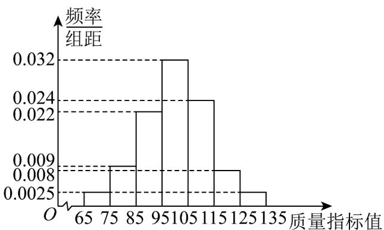

<!-- question-source:start -->
【变式1】从某企业生产的某种产品中随机抽取 $1000$ 件，测量这些产品的一项质量指标值，由测量结果得如

下频率分布直方图：

(1)求这 $1000$ 件产品质量指标值的样本平均数 $\overline{x}$ （同一组中的数据用该组区间的中点值作为代表）.

(2)由频率分布直方图可以认为，这种产品的质量指标值 $Z$ 服从正态分布 $N(\mu, \sigma^2)$ ，其中 $\mu$ 近似为样本平均数

$\overline{x}$ ， $\sigma^{2}$ 近似为样本方差 $s^{2}$ ，已知 $^{s}$ 的估计值为12.61.

(i) 试估计这批产品质量指标值在 $[74.78,100]$ 的数量；

(ii) 为监控该产品的生产质量，每天抽取 $^{10}$ 件产品进行检测，若出现了质量指标值在 $(\mu-3\sigma,\mu+3\sigma)$ ，之

外的产品，就认为这一天的生产过程中可能出现了异常情况，需对当天的生产过程进行检查，请说明上述监

控生产过程方法的合理性．

参考数据：若 $X\sim N(\mu ,\sigma^2)$ ，则 $P(\mu -\sigma < X < \mu +\sigma)\approx 0.6826$ ， $P(\mu -2\sigma < X < \mu +2\sigma)\approx 0.9544$

$$
P \big (\mu - 3 \sigma <   X <   \mu + 3 \sigma \big) \approx 0. 9 9 7 4 \quad 0. 9 9 7 4 ^ {1 0} \approx 0. 9 7 4 3
$$
<!-- question-source:end -->

![[高中/课堂同步/题库/人教A版高中数学同步讲义(2026)/05_选择性必修第三册/第七章 随机变量及其分布/专题7.5 正态分布（高效培优讲义）数学人教A版高二选择性必修第三册/题型03_正态分布的实际应用/questions/answers/Q00083325A1.md]]
