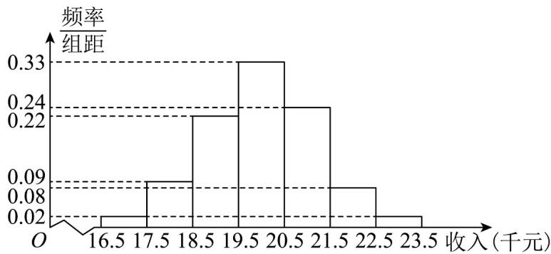

<!-- question-source:start -->
19．（17分）某市为提升农民的年收入，更好地实现2021年精准扶贫的工作计划，统计了2020年50位农

民的年收入并制成频率分布直方图，如图。

(1) 根据频率分布直方图，估计这 $^{50}$ 位农民的年平均收入 $\overline{x}$ （单位：千元）（同一数据用该组数据区间

的中点值表示）；

(2) 由频率分布直方图，可以认为该市农民年收入 X 服从正态分布 $N(\mu, \sigma^{2})$ ，其中 $\mu$ 近似为年平均收入

$\overline{x}$ ， $\sigma^{2}$ 近似为样本方差 $s^{2}$ ，经计算得 $s^{2}=1.5$ ，利用该正态分布，求：

①在扶贫攻坚工作中，若使该市约有占农民人数的84.135%的农民的年收入高于本市规定的最低年收入标

准，则此最低年收入标准大约为多少千元？

②该市为了调研“精准扶贫，不落一人”的政策落实情况，随机走访了1000位农民。若每位农民的年收入互

相独立，问：这1000位农民中的年收入不少于17.56千元的人数最有可能是多少？

附： $\sqrt{1.5}\approx 1.22$ ；若 $X\sim N(\mu ,\sigma^2)$ ，则 $P(\mu -\sigma \leq X\leq \mu +\sigma)\approx 0.6827$ ， $P(\mu -2\sigma \leq X\leq \mu +2\sigma)$

$$
P (\mu - 3 \sigma \leq X \leq \mu + 3 \sigma) \approx 0. 9 9 7 3
$$
<!-- question-source:end -->

![[高中/课堂同步/题库/人教A版高中数学同步讲义(2026)/05_选择性必修第三册/第七章 随机变量及其分布/单元测试/第七章_随机变量及其分布_高效培优单元自测_提升卷_数学人教A版高二选/三_填空题_sec_04/questions/answers/Q00059827A1.md]]
