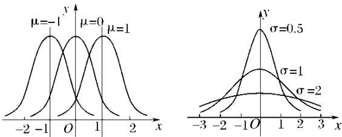
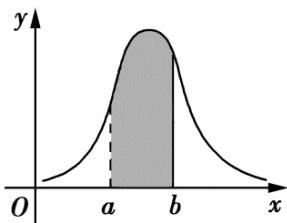

<!-- source-part:1 pages:1-50 -->

## 第七章 随机变量及其分布列


## 教学目标、教学重难点

<table><tr><td>教学目标</td><td>1. 理解随机变量的定义,能区分离散型随机变量(取值可一一列举)与连续型随机变量(取值不可一一列举),掌握用字母表示随机变量的规范方法,能将随机试验结果数字化(如用0-1表示硬币正反面)。2.掌握离散型随机变量分布列的概念与结构,明确分布列“表格形式”“概率等式形式”的表示方法,牢记分布列的两大核心性质(所有概率非负、概率和为1),能依据性质检验分布列的合理性。3.熟练掌握两类经典分布模型:两点分布(0-1分布)、超几何分布与二项分布,理解各分布的适用场景(如放回抽样对应二项分布、不放回抽样对应超几何分布),能准确写出对应分布列。4.掌握数学期望与方差的定义式及计算方法,理解其统计意义(期望反映平均水平,方差刻画离散程度),能运用期望、方差分析随机现象的稳定性与集中趋势。</td></tr><tr><td>教学重难点</td><td>重点1.随机变量的概念理解与数字化转化:核心是让学生掌握“用数字表示随机试验结果”的方法,无论是自然对应(如骰子点数)还是人为约定(如硬币正反面用0-1表示),明确随机变量的本质是“刻画随机现象的变量”。2.离散型随机变量分布列的概念与性质:理解分布列是“随机变量取值与对应概率的对应关系”,能规范列出分布列,并利用“概率非负”“概率和为1”两大性质检验结果正确性。3.经典分布模型的识别与应用:能根据实际问题情境(放回/不放回、独立重复试验等)准确区分两点分布、超几何分布与二项分布,熟练写出分布列并计算相关概率。4.期望与方差的计算与意义解读:掌握期望、方差的基本计算方法,能结合具体问题解释其实际含义(如比较两组数据的稳定性、评估方案的合理性)。难点1.随机变量的抽象理解:难以摆脱“变量必为确定性数值”的固有认知,对“随机变量取值的不确定性与概率的确定性”存在困惑,不会恰当定义随机变量。2.分布列与函数的关系辨析:类比函数研究分布列时,难以理解“随机变量为自变量、</td></tr></table>

```txt
概率为因变量”的对应关系，对分布列的表示方法掌握不灵活。

3. 经典分布模型的精准区分：易混淆超几何分布与二项分布（核心是“不放回”与“放回/独立重复”的判断），对两点分布的适用条件（只有两个可能取值）理解不透彻。

4. 复杂情境下的概率计算与模型构建：面对含限制条件的实际问题（如多步随机试验、分层抽样中的概率问题），难以准确界定随机变量的取值范围，易出现概率计算重复或遗漏。

5. 期望与方差的意义内化：能机械套用公式计算，但无法结合具体情境解释结果的实际价值（如不知道方差越小说明数据越稳定），缺乏运用数字特征分析问题的意识。
```

## 知识清单

## 知识点 01 条件概率

(一) 定义

一般地，设 $A$ ， $B$ 为两个事件，且 $P(A) > 0$ ，称 $P(B\mid A) = \frac{P(AB)}{P(A)}$ 为在事件 $A$ 发生的条件下，事件 $B$ 发生的

条件概率.

注意：（1）条件概率 $P(B|A)$ 中“|”后面就是条件；（2）若 $P(A) = 0$ ，表示条件 $A$ 不可能发生，此时用条件

概率公式计算 $P(B|A)$ 就没有意义了，所以条件概率计算必须在 $P(A) > 0$ 的情况下进行。

(二) 性质

(1) 条件概率具有概率的性质，任何事件的条件概率都在 0 和 1 之间，即 $0 \leq P(B \mid A) \leq 1$ 。

(2) 必然事件的条件概率为 1，不可能事件的条件概率为 0。

(3) 如果 $B$ 与 $C$ 互斥，则 $P(B \cup C \mid A) = P(B \mid A) + P(C \mid A)$

注意：（1）如果知道事件 A 发生会影响事件 B 发生的概率，那么 $P(B) \neq P(B \mid A)$ ;

(2) 已知 $A$ 发生，在此条件下 $B$ 发生，相当于 $AB$ 发生，要求 $P(B|A)$ ，相当于把 $A$ 看作新的基本事件空间

计算 发生的概率，即 $P(B \mid A) = \frac{n(AB)}{n(A)} = \frac{\frac{n(AB)}{n(\Omega)}}{\frac{n(A)}{n(\Omega)}} = \frac{P(AB)}{P(A)}$ .

相互独立与条件概率的关系

（一）相互独立事件的概念及性质

(1) 相互独立事件的概念

对于两个事件 $A$ ， $B$ ，如果 $P(B\mid A) = P(B)$ ，则意味着事件 $A$ 的发生不影响事件 $B$ 发生的概率．设 $P(A) > 0$

，根据条件概率的计算公式， $P(B) = P(B\mid A) = \frac{P(AB)}{P(A)}$ ，从而 $P(AB) = P(A)P(B)$

由此我们可得：设 A，B 为两个事件，若 $P(AB)=P(A)P(B)$ ，则称事件 A 与事件 B 相互独立。

(2) 概率的乘法公式

由条件概率的定义，对于任意两个事件 $A$ 与 $B$ ，若 $P(A) > 0$ ，则 $P(AB) = P(A)P(B|A)$ 。我们称上式为概率的

乘法公式.

(3) 相互独立事件的性质

如果事件 $A$ ， $B$ 互相独立，那么 $A$ 与 $\overline{B}$ ， $\overline{A}$ 与 $B$ ， $\overline{A}$ 与 $\overline{B}$ 也都相互独立.

(4) 两个事件的相互独立性的推广

两个事件的相互独立性可以推广到 $n(n > 2, n \in \mathbf{N}^*)$ 个事件的相互独立性，即若事件 $A_1, A_2, \ldots, A_n$ 相互独

立，则这 n 个事件同时发生的概率 $P(A_{1}A_{2}\cdots A_{n}) = P(A_{1})(A_{2})\cdots P(A_{n})$

（二）事件的独立性

(1) 事件 $A$ 与 $B$ 相互独立的充要条件是 $P(AB) = P(A) \cdot P(B)$ .

(2) 当 $P(B) > 0$ 时， $A$ 与 $B$ 独立的充要条件是 $P(A \mid B) = P(A)$

(3) 如果 $P(A) > 0$ ，A 与 B 独立，则 $P(B \mid A) = \frac{P(AB)}{P(A)} = \frac{P(A) \cdot P(B)}{P(A)} = P(B)$ 成立.

## 【即学即练】

1. 袋中有 $^{10}$ 个大小相同的小球，其中 $^{6}$ 个白球和 $^{4}$ 个黑球，每次从袋中随机摸出 $^{1}$ 个球，摸出的球不再放

回．现在从袋中摸出 $^{2}$ 个球，X 表示摸到白球的个数，设事件 A：第一次摸到白球，事件 B：第二次摸到白球

球，则（ ）A. $P(B) = \frac{3}{5}$ B. $P(B,A) = \frac{5}{9}$

C $X\sim H(2,4,10)$ D $E(X) = \frac{6}{5}$

【答案】ABD

【分析】由全概率公式计算即可判断 $^{A}$ 选项；由条件概率公式计算求解即可判断 $^{B}$ 选项；由超几何分布的定

义可判断 $^{C}$ 选项；根据超几何分布的期望公式计算可判断 $^{D}$ .

【详解】对于 A， $P(B)=P(AB)+P(\overline{A}B)=P(A)P(B|A)+P(B|\overline{A})=\frac{6}{10}\times\frac{5}{9}+\frac{4}{10}\times\frac{6}{9}=\frac{3}{5}$ ，故 A 正确；

对于 $^{B}$ ，已知第一次摸到白球，此时袋中还剩 $^{9}$ 个球，其中 $^{5}$ 个白球，所以 $P(B, A) = \frac{5}{9}$ ，故 $^{B}$ 正确；

对于 $C$ ， $X$ 表示摸到白球的个数，从 $^{10}$ 个球中摸 $^{2}$ 个球，其中 $^{6}$ 个白球， $^{4}$ 个黑球，

所以 $X$ 服从超几何分布，即 $X \sim H(2,6,10)$ ，故 $\mathbb{C}$ 不正确；

对于 D， $X \sim H(2,6,10)$ ，所以 $E(X) = 2 \times \frac{6}{10} = \frac{6}{5}$ ，故 D 正确；

故选：ABD

2．甲箱中有 $^{2}$ 个红球和 $^{2}$ 个黑球，乙箱中有 $^{1}$ 个红球和 $^{3}$ 个黑球．先从甲箱中等可能地取出 $^{2}$ 个球放入乙箱，

再从乙箱中等可能地取出 1 个球，记事件“从甲箱中取出的球恰有 i 个红球”为 $A_{i}(i=0,1,2)$ ，“从乙箱中取出的

球是黑球”为 $B$ ，则（ ）A. $P(A_0) = \frac{1}{6}$ B. $P(B|A_1) = \frac{5}{6}$ C. $P(B) = \frac{2}{3}$ D. $P(A_2|B) = \frac{1}{8}$

【答案】ACD

【分析】根据古典概型的概率公式、条件概率概率公式和全概率公式逐项判断即可·

【详解】根据题意，甲箱中有 $^{2}$ 个红球和 $^{2}$ 个黑球，则 $P(A_{0})=\frac{C_{2}^{2}}{C_{4}^{2}}=\frac{1}{6},P(A_{1})=\frac{C_{2}^{1}\cdot C_{2}^{1}}{C_{4}^{2}}=\frac{2}{3},P(A_{2})=\frac{C_{2}^{2}}{C_{4}^{2}}=\frac{1}{6}$ ，

故 $^{A}$ 正确；

乙箱中有 $^{1}$ 个红球和 $^{3}$ 个黑球，则 $P(B|A_{0})=\frac{5}{4+2}=\frac{5}{6}$ ， $P(B|A_{1})=\frac{4}{4+2}=\frac{2}{3}$ ， $P(B|A_{2})=\frac{3}{4+2}=\frac{1}{2}$ ，故 $^{B}$ 不正

确；

$$
P (B) = P \left(A _ {0}\right) P \left(B \mid A _ {0}\right) + P \left(A _ {1}\right) P \left(B \mid A _ {1}\right) + P \left(A _ {2}\right) \times P \left(B \mid A _ {2}\right)
$$

$= \frac{1}{6} \times \frac{5}{6} + \frac{2}{3} \times \frac{2}{3} + \frac{1}{6} \times \frac{1}{2} = \frac{2}{3}$ 故C正确；

$P(A_{2}|B)=\frac{P(A_{2}B)}{P(B)}=\frac{P(A_{2})P(B|A_{2})}{P(B)}=\frac{\frac{1}{6}\times\frac{1}{2}}{\frac{2}{3}}=\frac{1}{8}$ ，故D正确；

故选：ACD

## 知识点 02 全概率公式

(一) 全概率公式

$$
P (B) = P (A) P (B \mid A) + P (\overline {{A}}) P (B \mid \overline {{A}})
$$

(2) 定理1若样本空间 $\Omega$ 中的事件 $A_{1}$ , $A_{2}$ , ..., $A_{n}$ 满足:

①任意两个事件均互斥，即 $A_{i}A_{j} = \emptyset$ ， $i,j = 1,2,\dots ,n,i\neq j$

② $A_{1} + A_{2} + \cdots + A_{n} = \Omega$

③ $P(A_{i}) > 0$ , i = 1, 2, $\cdots$ , n.

则对 $\Omega$ 中的任意事件 B，都有 $B = BA_{1} + BA_{2} + \cdots + BA_{n}$ ，且

$$
P (B) = \sum_ {i = 1} ^ {n} P (B A _ {i}) = \sum_ {i = 1} ^ {n} P (A _ {i}) P (B \mid A _ {i})
$$

注意：（1）全概率公式是用来计算一个复杂事件的概率，它需要将复杂事件分解成若干简单事件的概率计

算，即运用了“化整为零”的思想处理问题。

(2) 什么样的问题适用于这个公式？所研究的事件试验前提或前一步骤试验有多种可能，在这多种可能中均

有所研究的事件发生，这时要求所研究事件的概率就可用全概率公式。

（二）贝叶斯公式

(1) 一般地，当 $0 < P(A) < 1$ 且 $P(B) > 0$ 时，有 $P(A|B) = \frac{P(A)P(B|A)}{P(B)} = \frac{P(A)P(B|A)}{P(A)P(B|A) + P(\overline{A})P(B|\overline{A})}$

(2) 定理 2 若样本空间 $\Omega$ 中的事件 $A_{1}, A_{2}, \cdots, A_{n}$ 满足：

①任意两个事件均互斥，即 $A_{i}A_{j} = \emptyset$ ， $i,j = 1,2,\dots ,n,i\neq j$

② $A_{1} + A_{2} + \cdots + A_{n} = \Omega$

则对 $\Omega$ 中的任意概率非零的事件 B，都有 $B = BA_{1} + BA_{2} + \cdots + BA_{n}$

$$
P \left(A _ {j} \mid B\right) = \frac {P \left(A _ {j}\right) P \left(B \mid A _ {j}\right)}{P (B)} = \frac {P \left(A _ {j}\right) P \left(B \mid A _ {j}\right)}{\sum_ {i = 1} ^ {n} P \left(A _ {i}\right) P \left(B \mid A _ {i}\right)}
$$

注意：（1）在理论研究和实际中还会遇到一类问题，这就是需要根据试验发生的结果寻找原因，看看导致这

一试验结果的各种可能的原因中哪个起主要作用，解决这类问题的方法就是使用贝叶斯公式．贝叶斯公式的

意义是导致事件 $B$ 发生的各种原因可能性的大小，称之为后验概率。

(2) 贝叶斯公式充分体现了 $P(A \mid B)$ , $P(A)$ , $P(B)$ , $P(B \mid A)$ , $P(B \mid \overline{A})$ , $P(AB)$ 之间的转关系, 即

$P(A\mid B) = \frac{P(AB)}{P(B)}$ ， $P(AB) = P(A\mid B)P(B) = P(B\mid A)P(A)$ ， $P(B) = P(A)P(B\mid A) + P(\overline{A})P(B\mid \overline{A})$ 之间的内在联

系.

## 【即学即练】

1. 某学校有 $A, B$ 两家餐厅，王同学第 $^{1}$ 天午餐时随机地选择一家餐厅用餐，如果第 $^{1}$ 天去 $A$ 餐厅，那么第

$^{2}$ 天去 A 餐厅的概率为 0.6；如果第 $^{1}$ 天去 B 餐厅，那么第 $^{2}$ 天去 A 餐厅的概率为 0.8。则王同学第 $^{2}$ 天去 B 餐厅的概率为 0.8。

厅用餐的概率为\_\_\_\_。

【答案】 $0.3 / \frac{3}{10}$

【分析】根据题意结合全概率公式和对立事件的概率公式计算即得·

【详解】设 $A_{1} =$ “第 1 天去 A 餐厅用餐”， $B_{1} =$ “第 1 天去 B 餐厅用餐”， $A_{2} =$ “第 2 天去 A 餐厅用餐”，

根据题意得 $P(A_{1}) = P(B_{1}) = 0.5$ ， $P(A_{2}, A_{1}) = 0.6$ ， $P(A_{2}, B_{1}) = 0.8$

由全概率公式，得 $P(A_{2}) = P(A_{1})P(A_{2} \quad A_{1}) + P(B_{1})P(A_{2} \quad B_{1}) = 0.5 \times 0.6 + 0.5 \times 0.8 = 0.7$

即王同学第 $^{2}$ 天去A餐厅用餐的概率为0.7，故王同学第 $^{2}$ 天去B餐厅用餐的概率为1-0.7=0.3.

故答案为：0.3

$$
A _ {1}, A _ {2}, \dots , A _ {n}
$$

$$
A _ {1} \cup A _ {2} \cup \dots \cup A _ {n} = \Omega
$$

$$
B \subseteq \Omega
$$

$$
P (B) = P \left(A _ {1}\right) P \left(B \mid A _ {1}\right) + P \left(A _ {2}\right) P \left(B \mid A _ {2}\right) + \dots + P \left(A _ {n}\right) P \left(B \mid A _ {n}\right)
$$

市旅游，去西安市与汉中市的概率分别为 $0.7$ ， $0.3$ ，在西安市去游乐园的概率为 $0.6$ ，在汉中市去游乐园的概

率为 $0.4$ ，则小张一家去游乐园的概率为（ ）A.0.48 B.0.49 C.0.52 D.0.54

【答案】D

【分析】根据全概率公式计算即可·

【详解】设去西安市与汉中市旅游分别为事件 $A_{1}$ ， $A_{2}$ ，则 $P(A_{1})=0.7$ ， $P(A_{2})=0.3$

设事件 B 为去游乐园，则 $P(B \mid A_{1}) = 0.6$ ， $P(B \mid A_{2}) = 0.4$

所以 $P(B) = P(A_1)P(B|A_1) + P(A_2)P(B|A_2) = 0.7\times 0.6 + 0.3\times 0.4 = 0.54\cdot$

故选：D

## 知识点 03 离散型随机变量的分布列

1、随机变量

在随机试验中，我们确定了一个对应关系，使得每一个试验结果都用一个确定的数字表示。在这个对应关系

下，数字随着试验结果的变化而变化．像这种随着试验结果变化而变化的变量称为随机变量．随机变量常用

字母 $X$ ， $Y$ ， $\xi$ ， $\eta$ ，…表示.

注意：

(1) 一般地，如果一个试验满足下列条件：①试验可以在相同的情形下重复进行；②试验的所有可能结果是

明确可知的，并且不止一个；③每次试验总是恰好出现这些可能结果中的一个，但在一次试验之前不能确定

这次试验会出现哪个结果．这种试验就是随机试验．

(2) 有些随机试验的结果虽然不具有数量性质，但可以用数来表示．如掷一枚硬币，X=0 表示反面向上，

$X = 1$ 表示正面向上.

(3) 随机变量的线性关系：若 $X$ 是随机变量， $Y = aX + b$ ， $a, b$ 是常数，则 $Y$ 也是随机变量。

2、离散型随机变量

对于所有取值可以一一列出来的随机变量，称为离散型随机变量。

注意：

(1) 本章研究的离散型随机变量只取有限个值.

(2) 离散型随机变量与连续型随机变量的区别与联系：①如果随机变量的可能取值是某一区间内的一切值，

这样的变量就叫做连续型随机变量；②离散型随机变量与连续型随机变量都是用变量表示随机试验的结果，

但离散型随机变量的结果可以按一定的次序一一列出，而连续型随机变量的结果不能一一列出。

## 3、离散型随机变量的分布列的表示

一般地，若离散型随机变量 $X$ 可能取的不同值为 $x_{1}, x_{2}, \dots, x_{i}, \dots, x_{n}$ ， $X$ 取每一个值 $x_{i} (i = 1, 2, \dots, n)$ 的概

率 $P(X = x_{i}) = p_{i}$ ，以表格的形式表示如下：

<table><tr><td>X</td><td> $x_{1}$ </td><td> $x_{2}$ </td><td>...</td><td> $x_{i}$ </td><td>...</td><td> $x_{n}$ </td></tr><tr><td>P</td><td> $p_{1}$ </td><td> $p_{2}$ </td><td>...</td><td> $p_{i}$ </td><td>...</td><td> $p_{n}$ </td></tr></table>

我们将上表称为离散型随机变量 $X$ 的概率分布列，简称为 $X$ 的分布列。有时为了简单起见，也用等式

$P(X=x_{i})=p_{i},\quad i=1,2,\cdots,n$ 表示 X 的分布列.

## 4、离散型随机变量的分布列的性质

根据概率的性质，离散型随机变量的分布列具有如下性质：

(1) $p_{i}$ 0, i=1,2;…,n; (2) $p_{1}+p_{2}+\cdots+p_{n}=1$ .

注意：

① 性质（2）可以用来检查所写出的分布列是否有误，也可以用来求分布列中的某些参数。

②随机变量 $\xi$ 所取的值分别对应的事件是两两互斥的，利用这一点可以求相关事件的概率。

## 【即学即练】

1. 人工智能对人们的生活有较大的影响，为了让老师更加重视人工智能，某校随机抽出 $^{30}$ 名男教师和 $^{20}$ 名

女教师参加学校组织的“人工智能”相关知识问卷调查（满分 $100$ 分），若分数为 $80$ 分及以上的为优秀，其他

为非优秀，统计并得到如下列联表：

<table><tr><td></td><td>男教师</td><td>女教师</td><td>总计</td></tr><tr><td>优秀</td><td>20</td><td>15</td><td>35</td></tr><tr><td>非优秀</td><td>10</td><td>5</td><td>15</td></tr><tr><td>总计</td><td>30</td><td>20</td><td>50</td></tr></table>

(1)根据小概率值 $\alpha = 0.1$ 的独立性检验，能否认为这次成绩是否优秀与性别有关？

(2)从样本中成绩非优秀的 $^{15}$ 名老师中，随机抽取 $^{2}$ 人进行调研，记抽出的 $^{2}$ 人中女老师的人数为X，求X

的分布列和数学期望·

附： $\chi^2 = \frac{n(ad - bc)^2}{(a + b)(c + d)(a + c)(b + d)}$ ，其中 $n = a + b + c + d\cdot$

<table><tr><td> $\alpha$ </td><td>0.1</td><td>0.05</td><td>0.01</td><td>0.001</td></tr><tr><td> $x_{\alpha}$ </td><td>2.706</td><td>3.841</td><td>6.635</td><td>10.828</td></tr></table>

【答案】(1)不能认为这次成绩是否优秀与性别有关·

(2)分布列见解析， $E(X)=\frac{2}{3}$

【分析】（1）先作出零假设，根据列联表计算出 $\chi^2 < 2.706$ ，所以不能认为这次成绩是否优秀与性别有关·

(2) 先写出 X 的可能取值为 0,1,2，再根据题目算出对应的概率，列出概率分布列，求出数学期望即可.

【详解】（1）零假设 $H_{0}$ ：这次成绩是否优秀与性别无关·

根据表中数据，计算得到 $\chi^{2}=\frac{50\times(20\times5-15\times10)^{2}}{35\times15\times30\times20}=0.397<2.706$

根据小概率值 $\alpha = 0.1$ 的独立性检验，推断 $H_{0}$ 成立，所以不能认为这次成绩是否优秀与性别有关

(2) X 的可能取值为 0,1,2.

$$
P (X = 0) = \frac {\mathrm{C} _ {1 0} ^ {2}}{\mathrm{C} _ {1 5} ^ {2}} = \frac {3}{7}; P (X = 1) = \frac {\mathrm{C} _ {1 0} ^ {1} \mathrm{C} _ {5} ^ {1}}{\mathrm{C} _ {1 5} ^ {2}} = \frac {1 0}{2 1}; P (X = 2) = \frac {\mathrm{C} _ {5} ^ {2}}{\mathrm{C} _ {1 5} ^ {2}} = \frac {2}{2 1};
$$

$X$ 的分布列为：

<table><tr><td>X</td><td>0</td><td>1</td><td>2</td></tr><tr><td>P(X)</td><td>3/7</td><td>10/21</td><td>2/21</td></tr></table>

数学期望 $E(X)=0\times\frac{3}{7}+1\times\frac{10}{21}+2\times\frac{2}{21}=\frac{2}{3}$

2．设离散型随机变量 X 可能取的值为 1、2、3、4. $P(X=k)=ak+b(k=1,2,3,4)$ . 又 X 的均值 $E(X)=3$ ，则 $a+b=$ \_\_\_\_.

【答案】 $\frac{1}{10}$

【分析】根据概率和为 $^{1}$ 和均值的定义列出关于a,b的方程组，解出即可·

【详解】因为 $P(X = k) = ak + b(k = 1,2,3,4)$

所以 $a + b + 2a + b + 3a + b + 4a + b = 10a + 4b = 1$

又因为 $E(X)=3$

所以 $(a+b)+2(2a+b)+3(3a+b)+4(4a+b)=30a+10b=3$

解得 $a=\frac{1}{10}$ ，b=0，所以 $a+b=\frac{1}{10}$ ，

故答案为： $\frac{1}{10}$

## 知识点 04 离散型随机变量的均值与方差

1、均值

若离散型随机变量 $X$ 的分布列为

<table><tr><td>X</td><td> $x_{1}$ </td><td> $x_{2}$ </td><td>...</td><td> $x_{i}$ </td><td>...</td><td> $x_{n}$ </td></tr><tr><td>P</td><td> $p_{1}$ </td><td> $p_{2}$ </td><td>...</td><td> $p_{i}$ </td><td>...</td><td> $p_{n}$ </td></tr></table>

称 $E(X) = x_{1}p_{1} + x_{2}p_{2} + \dots +x_{i}p_{i} + \dots +x_{n}p_{n} = 1$ 为随机变量 $X$ 的均值或数学期望，它反映了离散型随机变量取

值的平均水平.

注意：（1）均值 $E(X)$ 刻画的是 $X$ 取值的“中心位置”，这是随机变量 $X$ 的一个重要特征；

(2) 根据均值的定义，可知随机变量的分布完全确定了它的均值。但反过来，两个不同的分布可以有相同的

均值．这表明分布描述了随机现象的规律，从而也决定了随机变量的均值．而均值只是刻画了随机变量取值

的“中心位置”这一重要特征，并不能完全决定随机变量的性质。

2、均值的性质

(1) $E(C) = C$ （ $C$ 为常数）.

(2) 若 $Y = aX + b$ ，其中 a, b 为常数，则 Y 也是随机变量，且 $E(aX + b) = aE(X) + b$

(3) $E(X_{1} + X_{2}) = E(X_{1}) + E(X_{2})$

(4) 如果 $X_{1}, X_{2}$ 相互独立，则 $E(X_{1} \cdot X_{2}) = E(X_{1}) \cdot E(X_{2})$

## 3、方差

若离散型随机变量 $X$ 的分布列为

<table><tr><td>X</td><td> $x_{1}$ </td><td> $x_{2}$ </td><td>...</td><td> $x_{i}$ </td><td>...</td><td> $x_{n}$ </td></tr><tr><td>P</td><td> $p_{1}$ </td><td> $p_{2}$ </td><td>...</td><td> $p_{i}$ </td><td>...</td><td> $p_{n}$ </td></tr></table>

则称 $D(X) = \sum_{i=1}^{n}(x_i - E(X))^2 p_i$ 为随机变量 $X$ 的方差，并称其算术平方根 $\sqrt{D(X)}$ 为随机变量 $X$ 的标准差.

注意：（1） $(x_{i}-E(X))^{2}$ 描述了 $x_{i}(i=1,2,\cdots,n)$ 相对于均值 $E(X)$ 的偏离程度，而 $D(X)$ 是上述偏离程度的加

权平均，刻画了随机变量 $X$ 与其均值 $E(X)$ 的平均偏离程度。随机变量的方差和标准差均反映了随机变量取

值偏离于均值的平均程度．方差或标准差越小，则随机变量偏离于均值的平均程度越小；

(2) 标准差与随机变量有相同的单位，而方差的单位是随机变量单位的平方.

## 4、方差的性质

(1) 若 $Y = aX + b$ ，其中 $a, b$ 为常数，则 $Y$ 也是随机变量，且 $D(aX + b) = a^2 D(X)$

(2) 方差公式的变形： $D(X)=E(X^{2})-[E(X)]^{2}$

## 【即学即练】

1. 设 $0 < a < \frac{3}{4}$ ，随机变量的分布列如下：

<table><tr><td>ξ</td><td>0</td><td>a</td><td>2</td></tr><tr><td>P</td><td>3/4-a</td><td>1/4</td><td>a</td></tr></table>

当 $a$ 增大时，有（ ）A. $E(\xi)$ 增大， $D(\xi)$ 先减小后增大 B. $E(\xi)$ 减小， $D(\xi)$ 减小C. $E(\xi)$ 增大， $D(\xi)$ 先增大后减小 D. $E(\xi)$ 减小， $D(\xi)$ 增大

【答案】C

【分析】先根据分布列表求得 $E(\xi)$ 的表达式，即可判断其单调性，然后列出变量 $\xi^2$ 的分布列表，同法求得 $E\left(\xi^2\right)$ 的表达式，进而得到 $D(\xi)$ 的表达式，利用二次函数的性质即可判断 $D(\xi)$ 的单调性·【详解】由随机变量的分布列表可知， $E(\xi) = \frac{1}{4}\times a + 2\times a = \frac{9}{4} a$ ，故 $E(\xi)$ 单调递增；

因随机变量 $\xi^2$ 的分布列如下：

<table><tr><td> $\xi^{2}$ </td><td>0</td><td> $a^{2}$ </td><td>4</td></tr><tr><td>P</td><td> $\frac{3}{4}-a$ </td><td> $\frac{1}{4}$ </td><td>a</td></tr></table>

所以 $E\left(\xi^2\right) = a^2 \times \frac{1}{4} + 4a = \frac{1}{4} a^2 + 4a$

$$
D (\xi) = E \left(\xi^ {2}\right) - [ E (\xi) ] ^ {2} = \left(\frac {1}{4} a ^ {2} + 4 a\right) - \left(\frac {9}{4} a\right) ^ {2} = - \frac {7 7}{1 6} a ^ {2} + 4 a
$$

因为 $0 < a < \frac{3}{4}$ ，而 $-\frac{4}{2 \times (-\frac{77}{16})} = \frac{32}{77} < \frac{3}{4}$ ，所以 $D(\xi)$ 先增大后减小。

故选：C.

2．在“一带一路”倡议推动下，中国与中亚国家合作日益紧密·2025年，某省计划向海外“郑和学院”项目派遣教

师，为此举办了专项教学能力培训·参会人员包括 $^{600}$ 名高职院校教师和 $^{400}$ 名企业工程师转岗教师·培训后均

参加教学能力考核，考核结果为优秀、合格两种情况，统计得到如下列联表：

<table><tr><td></td><td>高职院校教师</td><td>企业工程师</td><td>总计</td></tr><tr><td>优秀</td><td>350</td><td>170</td><td>520</td></tr><tr><td>合格</td><td>250</td><td>230</td><td>480</td></tr><tr><td>总计</td><td>600</td><td>400</td><td>1000</td></tr></table>

(1)根据小概率值 $\alpha = 0.01$ 的独立性检验，能否认为这次考核结果与教师背景类型有关？

(2)若从参会人员中，采用分层抽样的方法随机抽取 $^{10}$ 名教师，再从这 $^{10}$ 人中随机抽取 $^{3}$ 人进行海外教学意

愿调研，设抽取的 $^{3}$ 人中企业工程师的人数为 X，求 X 的分布列和数学期望。

附： $\chi^{2}=\frac{n(ad-bc)^{2}}{(a+b)(c+d)(a+c)(b+d)}$ ，其中 $n=a+b+c+d\cdot$

<table><tr><td> $\alpha$ </td><td>0.1</td><td>0.05</td><td>0.01</td><td>0.001</td></tr><tr><td> $x_{\alpha}$ </td><td>2.706</td><td>3.841</td><td>6.635</td><td>10.828</td></tr></table>

【答案】 $^{(1)}$ 能认为这次考核结果与教师背景类型有关

(2)分布列见解析，1.2

【分析】（1）根据卡方的计算公式，结合独立性检验的思想即可下结论；

(2) 易知 $X = 0,1,2,3$ ，利用超几何分布求出对应的概率，列出分布列，求出数学期望，即可求解

【详解】（1）零假设为 $H_{0}$ ：这次考核结果与教师背景类型无关，

$$
\chi^ {2} = \frac {1 0 0 0 \times (3 5 0 \times 2 3 0 - 2 5 0 \times 1 7 0) ^ {2}}{6 0 0 \times 4 0 0 \times 5 2 0 \times 4 8 0} = \frac {4 5 1 2 5}{1 8 7 2} \approx 2 4. 1 1,
$$

查临界值表， $\alpha = 0.01$ 对应的临界值 $x_{0.01} = 6.635$ ，由于 $24.11 > 6.635$

故依据小概率值 $\alpha = 0.01$ 的独立性检验，我们推断 $H_0$ 不成立，

即认为这次考核结果与教师背景类型有关，此推断犯错的概率不大于 0.01.

(2) 分层抽样时，总抽取比例为 600:400 = 3:2

因此：高职院校教师抽取人数： $10 \times \frac{3}{5} = 6$ （人），

企业工程师抽取人数： $10 \times \frac{2}{5} = 4$ （人）

从 $^{10}$ 人中抽取 $^{3}$ 人，设企业工程师人数为X，则X服从超几何分布，

可能取值为 X = 0,1,2,3

$$
P (X = 0) = \frac {\mathrm{C} _ {4} ^ {0} \mathrm{C} _ {6} ^ {3}}{\mathrm{C} _ {1 0} ^ {3}} = \frac {1 \times \frac {6 \times 5 \times 4}{3 \times 2 \times 1}}{\frac {1 0 \times 9 \times 8}{3 \times 2 \times 1}} = \frac {2 0}{1 2 0} = \frac {1}{6},
$$

$$
P (X = 1) = \frac {\mathrm{C} _ {4} ^ {1} \mathrm{C} _ {6} ^ {2}}{\mathrm{C} _ {1 0} ^ {3}} = \frac {4 \times \frac {6 \times 5}{2 \times 1}}{\frac {1 0 \times 9 \times 8}{3 \times 2 \times 1}} = \frac {6 0}{1 2 0} = \frac {1}{2},
$$

$$
P (X = 2) = \frac {\mathrm{C} _ {4} ^ {2} \mathrm{C} _ {6} ^ {1}}{\mathrm{C} _ {1 0} ^ {3}} = \frac {\frac {4 \times 3}{2 \times 1} \times 6}{\frac {1 0 \times 9 \times 8}{3 \times 2 \times 1}} = \frac {3 6}{1 2 0} = \frac {3}{1 0},
$$

$$
P (X = 3) = \frac {\mathrm{C} _ {4} ^ {3} \mathrm{C} _ {6} ^ {0}}{\mathrm{C} _ {1 0} ^ {3}} = \frac {4}{\frac {1 0 \times 9 \times 8}{3 \times 2 \times 1}} = \frac {4}{1 2 0} = \frac {1}{3 0},
$$

则 $X$ 的分布列为：

<table><tr><td>X</td><td>0</td><td>1</td><td>2</td><td>3</td></tr><tr><td>P</td><td> $\frac{1}{6}$ </td><td> $\frac{1}{2}$ </td><td> $\frac{3}{10}$ </td><td> $\frac{1}{30}$ </td></tr></table>

数学期望 $E(X)$ 由超几何分布性质得： $E(X)=3\times\frac{4}{10}=3\times\frac{2}{5}=1.2$

## 知识点 05 两点分布

1、若随机变量 X 服从两点分布，即其分布列为

<table><tr><td>X</td><td>0</td><td>1</td></tr><tr><td>P</td><td>1-p</td><td>p</td></tr></table>

其中 $0 < p < 1$ ，则称离散型随机变量 $X$ 服从参数为 $p$ 的两点分布．其中 $P(X = 1)$ 称为成功概率．

注意：

(1) 两点分布的试验结果只有两个可能性，且其概率之和为1；

(2) 两点分布又称 $0 - 1$ 分布、伯努利分布，其应用十分广泛。

2、两点分布的均值与方差：若随机变量 $X$ 服从参数为 $p$ 的两点分布，则 $E(X) = 1 \times p + 0 \times (1 - p) = p$

$$
D (X) = p (1 - p)
$$

【即学即练】

1. 若随机变量 $X$ 服从两点分布，其中 $P(X = 0) = \frac{1}{3}$ ，则下列结论正确的是（）A. $P(X = 1) = E(X)$ B. $E(3X + 2) = 4$ C. $D(3X + 2) = 4$ D. $D(X) = \frac{4}{9}$

【答案】AB

【分析】根据两点分布得 $P(X=1)=\frac{2}{3}$ ，再根据期望和方差公式以及性质，即可求解

【详解】由题意可知， $P(X=1)=\frac{2}{3}$ ，

所以 $E(X)=0\times\frac{1}{3}+1\times\frac{2}{3}=\frac{2}{3}$ ，故 A 正确；

$D(X)=\left(0-\frac{2}{3}\right)^{2}\times\frac{1}{3}+\left(1-\frac{2}{3}\right)^{2}\times\frac{2}{3}=\frac{2}{9}$ ，故D错误；

$E(3X+2)=3E(X)+2=4$ ，故 $^{B}$ 正确；

$D(3X+2)=9D(X)=2$ ，故C错误.

故选：AB

2. 已知随机变量 $X$ ， $Y$ 均服从两点分布，且 $P(X = 1) = \frac{1}{2}$ ， $P(Y = 1) = \frac{2}{3}$ ，若 $P(X = 1, Y = 1) = \frac{2}{5}$ ，则 $P(Y = 1|X = 0) = (\quad)$ A. $\frac{2}{5}$ B. $\frac{3}{5}$ C. $\frac{7}{15}$ D. $\frac{8}{15}$

【答案】D

【分析】利用全概率公式，由 $P(X = 1, Y = 1)$ 的值，得到 $P(X = 0, Y = 1)$ 的值，再由条件概率计算公式即可·
【详解】由于 $X$ 服从两点分布，且 $P(X = 1) = \frac{1}{2}$ ，因此 $P(X = 0) = 1 - P(X = 1) = 1 - \frac{1}{2} = \frac{1}{2}$ .

由全概率公式得 $P(Y=1)=P(X=0,Y=1)+P(X=1,Y=1)$

即 $\frac{2}{3}=P(X=0,Y=1)+\frac{2}{5}$

所以 $P(X=0,Y=1)=\frac{2}{3}-\frac{2}{5}=\frac{10}{15}-\frac{6}{15}=\frac{4}{15}$

由条件概率计算公式得 $P(Y=\|X=0)=\frac{P(X=0,Y=1)}{P(X=0)}=\frac{\frac{4}{15}}{\frac{1}{2}}=\frac{4}{15}\times2=\frac{8}{15}$ .

故选：D

知识点 06 二项分布

$n$ 次独立重复试验

1、定义

一般地，在相同条件下重复做的 $n$ 次试验称为 $n$ 次独立重复试验。

注意：独立重复试验的条件：①每次试验在同样条件下进行；②各次试验是相互独立的；③每次试验都只有

两种结果，即事件要么发生，要么不发生。

2、特点

(1) 每次试验中，事件发生的概率是相同的；

(2) 每次试验中的事件是相互独立的，其实质是相互独立事件的特例。

二项分布

1、定义

一般地，在 $n$ 次独立重复试验中，用 $X$ 表示事件 $A$ 发生的次数，设每次试验中事件 $A$ 发生的概率为 $p$ ，不发

生的概率 $q = 1 - p$ ，那么事件 $A$ 恰好发生 $k$ 次的概率是 $P(X = k) = \mathrm{C}_n^k p^k q^{n - k}$ （ $k = 0,1,2,\dots ,n$ ）

于是得到 $X$ 的分布列

<table><tr><td>X</td><td>0</td><td>1</td><td>...</td><td>k</td><td>...</td><td>n</td></tr><tr><td>p</td><td> $C_{n}^{0} p^{0} q^{n}$ </td><td> $C_{n}^{1} p^{1} q^{n-1}$ </td><td>...</td><td> $C_{n}^{k} p^{k} q^{n-k}$ </td><td>...</td><td> $C_{n}^{n} p^{n} q^{0}$ </td></tr></table>

由于表中第二行恰好是二项式展开式

$\left(q + p\right)^{n} = \mathrm{C}_{n}^{0}p^{0}q^{n} + \mathrm{C}_{n}^{1}p^{1}q^{n - 1} + \dots +\mathrm{C}_{n}^{k}p^{k}q^{n - k} + \dots +\mathrm{C}_{n}^{n}p^{n}q^{0}$ 各对应项的值，称这样的离散型随机变量 $X$ 服从参

数为 $n$ ， $p$ 的二项分布，记作 $X\sim B(n,p)$ ，并称 $p$ 为成功概率.

注意：由二项分布的定义可以发现，两点分布是一种特殊的二项分布，即 $n = 1$ 时的二项分布，所以二项分布

可以看成是两点分布的一般形式.

2、二项分布的适用范围及本质

(1) 适用范围：

①各次试验中的事件是相互独立的；

②每次试验只有两种结果：事件要么发生，要么不发生；

③随机变量是这 $n$ 次独立重复试验中事件发生的次数.

(2) 本质：二项分布是放回抽样问题，在每次试验中某一事件发生的概率是相同的。

3、二项分布的期望、方差

若 $X \sim B(n, p)$ ，则 $E(X) = np$ ， $D(X) = np(1 - p)$

【即学即练】

1. 甲、乙、丙三人参加“校史知识竞答”比赛，若甲、乙、丙三人荣获一等奖的概率分别为 $\frac{1}{3}, \frac{2}{3}, \frac{3}{4}$ ，且三人是

【答案】

否获得一等奖相互独立，则这三人中仅有两人获得一等奖的概率为（）
A. $\frac{11}{36}$ B. $\frac{17}{36}$ C. $\frac{11}{24}$ D. $\frac{17}{24}$

【答案】B

【分析】根据独立事件概率公式，计算即可得出答案·

【详解】设这三人中仅有两人获得一等奖为事件 A，

$$
P (A) = \frac {1}{3} \times \frac {2}{3} \times \left(1 - \frac {3}{4}\right) + \frac {1}{3} \times \left(1 - \frac {2}{3}\right) \times \frac {3}{4} + \left(1 - \frac {1}{3}\right) \times \frac {2}{3} \times \frac {3}{4} = \frac {1 7}{3 6}.
$$

故选：B

2．已知一个古典概型的样本空间 $\Omega$ 和事件 A，B 如图所示·其中 $n(\Omega)=12, n(A)=6, n(B)=4, n(A\cup B)=8$

则事件 A 与事件 B ( )


A. 是互斥事件，不是独立事件 B. 不是互斥事件，是独立事件 C. 既是互斥事件，也是独立事件 D. 既不是互斥事件，也不是独立事件

【答案】B

【分析】根据互斥事件和独立事件的定义和概率公式计算即得

【详解】因 $n(\Omega) = 12, n(A) = 6, n(B) = 4, n(A \cup B) = 8$

则 $n(A \cap B) = n(A) + n(B) - n(A \cup B) = 2$

于是 $P(A) = \frac{1}{2}, P(B) = \frac{1}{3}, P(A \cup B) = \frac{2}{3}, P(A \cap B) = \frac{1}{6}$ ，

因 $P(A)+P(B)=\frac{1}{2}+\frac{1}{3}=\frac{5}{6}\neq P(A\cup B)$ ，则事件 A 与事件 B 不是互斥事件；

$P(A \cap B) = \frac{1}{6} = P(A) \cdot P(B)$ 又，则事件 A 与事件 B 是独立事件.

故选：B.

## 知识点 07 超几何分布

1、定义

在含有 $M$ 件次品的 $N$ 件产品中，任取 $n$ 件，其中恰有 $X$ 件次品，则事件 $\{X = k\}$ 发生的概率为

$P(X = k) = \frac{C_M^k C_{N - M}^{n - k}}{C_N^n}$ ， $k = 0$ ， $1$ ， $2$ ， $\dots$ ， $m$ ，其中 $m = \min \left\{M, n\right\}$ ，且 $n \leq N$ ， $M \leq N$ ， $n$ ， $M$ ， $N \in N^*$

，称分布列为超几何分布列．如果随机变量 X 的分布列为超几何分布列，则称随机变量 X 服从超几何分

布.

<table><tr><td>X</td><td>0</td><td>1</td><td>...</td><td>m</td></tr><tr><td>P</td><td> $\frac{C_{M}^{0} C_{N-M}^{n-0}}{C_{N}^{n}}$ </td><td> $\frac{C_{M}^{1} C_{N-M}^{n-1}}{C_{N}^{n}}$ </td><td>...</td><td> $\frac{C_{M}^{m} C_{N-M}^{n-m}}{C_{N}^{n}}$ </td></tr></table>

2、超几何分布的适用范围件及本质

(1) 适用范围：

①考察对象分两类；

②已知各类对象的个数；

③从中抽取若干个个体，考察某类个体个数 $Y$ 的概率分布。

(2) 本质：超几何分布是不放回抽样问题，在每次试验中某一事件发生的概率是不相同的。

## 【即学即练】

1. 高考结束后，小明一家四口到阳新仙岛湖度假，中午在某餐厅就餐，该餐厅推出七种特色美食，其中有1

种汤类， $^{3}$ 种炒菜类， $^{3}$ 种米面类，小明一家要点四道美食（每道不重复）.

(1)小明家点一道汤和恰好一种米面类美食的不同组合方式有多少种？

(2)用随机变量 $X$ 表示所选美食中米面类的数量，求 $X$ 的分布列和期望.

【答案】(1)9

(2)分布列见解析， $E(X)=\frac{12}{7}$

【分析】（ $^{1}$ ）根据分步乘法计数原理，结合组合即可求解，

(2) 根据超几何分布的概率公式求解概率，即可得分布列，由期望公式即可求解

【详解】（1）汤有一种选择；米面类美食三种里选择一种方法数为 $C_3^1$ ；其他菜类3种里选择2种方法数为 $C_3^2$

不同组合共计 $1\times C_{3}^{1}C_{3}^{2}=9$ （种）

(2) X 的可能取值有 0、1、2、3；

$$
P (X = 0) = \frac {\mathrm{C} _ {4} ^ {4}}{\mathrm{C} _ {7} ^ {4}} = \frac {1}{3 5}; P (X = 1) = \frac {\mathrm{C} _ {3} ^ {1} \times \mathrm{C} _ {4} ^ {3}}{\mathrm{C} _ {7} ^ {4}} = \frac {1 2}{3 5};
$$

$$
P (X = 2) = \frac {\mathrm{C} _ {3} ^ {2} \times \mathrm{C} _ {4} ^ {2}}{\mathrm{C} _ {7} ^ {4}} = \frac {1 8}{3 5}; P (X = 3) = \frac {\mathrm{C} _ {3} ^ {3} \times \mathrm{C} _ {4} ^ {1}}{\mathrm{C} _ {7} ^ {4}} = \frac {4}{3 5}
$$

分布列为：

<table><tr><td>X</td><td>0</td><td>1</td><td>2</td><td>3</td></tr><tr><td>P</td><td> $\frac{1}{35}$ </td><td> $\frac{12}{35}$ </td><td> $\frac{18}{35}$ </td><td> $\frac{4}{35}$ </td></tr></table>

所以 $E(X)=\frac{12}{7}$ ;

2．一批照明灯泡有 $100$ 个，规定其使用寿命达到 $1000$ 小时以上的为合格品，使用寿命不足 $1000$ 小时的为不

合格品．使用方从该批灯泡中抽样，采用抽样方案 $(5,0)$ ，即从该批灯泡中随机抽取 $^{5}$ 个，若全部合格，则该

批灯泡通过验收，否则该批灯泡未通过验收。

(1)假定生产方和使用方约定，允许这批灯泡有 $3\%$ 的不合格率，实际这批灯泡中有7个不合格品．经检测该

批产品未通过验收的概率有多大？（结果精确到0.001）

(2)现已知这批灯泡中有 $^{2}$ 个不合格品，写出抽样方案中合格品数的分布并求这批灯泡通过验收的概率。（结

果精确到 $0.001$

【答案】(1)0.310

(2)分布列见解析，0.902

【分析】（ $^{1}$ ）由超几何分布的概率、对立事件的概率公式求解即可·

(2) 由超几何分布的概率公式即可求解.

【详解】（1）记抽到的合格品数为 $X$ ，该批灯泡中的合格品为93个，不合格品为7个，

所以采取抽样方案 $(5,0)$ 时通过验收的概率为 $P(X = 5) = \frac{C_{93}^5\times C_7^0}{C_{100}^5}\approx 0.690$

所以未通过验收的概率约为 1 - 0.690 = 0.310

(2) 该批灯泡中的合格品为 $98$ 个，不合格品为 $2$ 个，

$$
P (X = 3) = \frac {\mathrm{C} _ {9 8} ^ {3} \times \mathrm{C} _ {2} ^ {2}}{\mathrm{C} _ {1 0 0} ^ {5}} \approx 0. 0 0 2, P (X = 4) = \frac {\mathrm{C} _ {9 8} ^ {4} \times \mathrm{C} _ {2} ^ {1}}{\mathrm{C} _ {1 0 0} ^ {5}} \approx 0. 0 9 6, P (X = 5) = \frac {\mathrm{C} _ {9 8} ^ {5} \times \mathrm{C} _ {2} ^ {0}}{\mathrm{C} _ {1 0 0} ^ {5}} \approx 0. 9 0 2
$$

所以采取抽样方案 $(5,0)$ 时的合格品数的分布为所以该批产品通过验收的概率为 $\frac{893}{990} \approx 0.902$

<table><tr><td>X</td><td>3</td><td>4</td><td>5</td></tr><tr><td rowspan="2">P</td><td>0.00</td><td>0.09</td><td>0.90</td></tr><tr><td>2</td><td>6</td><td>2</td></tr></table>

## 知识点 08 正态分布

正态曲线

1、定义：我们把函数 $\varphi_{\mu ,\sigma}(x) = \frac{1}{\sqrt{2\pi}\sigma}\mathrm{e}^{-\frac{(x - \mu)^2}{2\sigma^2}}$ ， $x\in (-\infty , + \infty)$ （其中 $\mu$ 是样本均值， $\sigma$ 是样本标准差）的图象

称为正态分布密度曲线，简称正态曲线．正态曲线呈钟形，即中间高，两边低．

2、正态曲线的性质

(1) 曲线位于 x 轴上方，与 x 轴不相交；

(2) 曲线是单峰的，它关于直线 $x = \mu$ 对称；

(3) 曲线在 $x = \mu$ 处达到峰值（最大值） $\frac{1}{\sqrt{2\pi}\sigma}$ ;

(4) 曲线与 x 轴之间的面积为 1；

(5) 当 $\sigma$ 一定时，曲线的位置由 $\mu$ 确定，曲线随着 $\mu$ 的变化而沿 $x$ 轴平移，如图甲所示：

(6) 当 $\mu$ 一定时，曲线的形状由 $\sigma$ 确定。 $\sigma$ 越小，曲线越“高瘦”，表示总体的分布越集中； $\sigma$ 越大，曲线越

“矮胖”，表示总体的分布越分散，如图乙所示：：



甲乙

正态分布

1、定义

随机变量 $X$ 落在区间 $(a, b]$ 的概率为 $P(a < X \leq b) = \int_{a}^{b} \varphi_{\mu, \sigma}(x) \mathrm{d}x$ ，即由正态曲线，过点 $(a, 0)$ 和点 $(b, 0)$ 的两条 $x$ 轴的垂线，及 $x$ 轴所围成的平面图形的面积，如下图中阴影部分所示，就是 $X$ 落在区间 $(a, b]$ 的概率

的近似值.



一般地，如果对于任何实数 $a$ ， $b(a < b)$ ，随机变量 $X$ 满足 $P(a < X \leq b) = \int_{a}^{b} \varphi_{\mu, \sigma}(x) \mathrm{d}x$ ，则称随机变量 $X$ 服从正态分布．正态分布完全由参数 $\mu$ ， $\sigma$ 确定，因此正态分布常记作 $N(\mu, \sigma^2)$ ．如果随机变量 $X$ 服从正态分布，则记为 $X \sim N(\mu, \sigma^2)$ ：

其中，参数 $\mu$ 是反映随机变量取值的平均水平的特征数，可以用样本的均值去估计； $\sigma$ 是衡量随机变量总体

波动大小的特征数，可以用样本的标准差去估计。

2、 $3\sigma$ 原则

若 $X \sim N(\mu, \sigma^2)$ ，则对于任意的实数 $a > 0$ ， $P(\mu - a < X \leq \mu + a) = \int_{\mu - a}^{\mu + a} \varphi_{\mu, \sigma}(x) \mathrm{d}x$ 为下图中阴影部分的面积，对于固定的 $\mu$ 和 $a$ 而言，该面积随着 $\sigma$ 的减小而变大。这说明 $\sigma$ 越小， $X$ 落在区间 $(\mu - a, \mu + a]$ 的概率越大，即 $X$ 集中在 $\mu$ 周围的概率越大


特别地，有 $P(\mu - \sigma < X \leq \mu + \sigma) = 0.6826$ ； $P(\mu - 2\sigma < X \leq \mu + 2\sigma) = 0.9544$ ； $P(\mu - 3\sigma < X \leq \mu + 3\sigma)$ $= 0.9974$

由 $P(\mu - 3\sigma < X \leq \mu + 3\sigma) = 0.9974$ ，知正态总体几乎总取值于区间 $(\mu - 3\sigma, \mu + 3\sigma)$ 之内。而在此区间以外取值的概率只有 $0.0026$ ，通常认为这种情况在一次试验中几乎不可能发生，即为小概率事件。在实际应用中，通常认为服从于正态分布 $N(\mu, \sigma^2)$ 的随机变量 $X$ 只取 $(\mu - 3\sigma, \mu + 3\sigma)$ 之间的值，并简称之为 $3\sigma$ 原则。

## 【即学即练】

1. 某校舞蹈队队员的身高 $X$ （单位：cm）近似服从正态分布 $N(172,4)$ ，则 $P(X - 168) \approx (\quad)$ （附：若 $X \sim N(\mu, \sigma^2)$ ，则 $P(\mu - \sigma \leq X \leq \mu + \sigma) \approx 0.6827$ ， $P(\mu - 2\sigma \leq X \leq \mu + 2\sigma) \approx 0.9544$ ）
A. 0.6827 B. 0.8414 C. 0.9544 D. 0.9772

【答案】D

【分析】根据给定条件，利用正态分布的对称性求出概率·

【详解】由 $X \sim N(172,4)$ ，得 $P(X - 168) = P(172 - 2 \times 2 \leq X \leq 172) + P(X > 172)$

$$
= \frac {1}{2} P (1 7 2 - 2 \times 2 \leq X \leq 1 7 2 + 2 \times 2) + 0. 5 \approx \frac {1}{2} \times 0. 9 5 4 4 + 0. 5 \approx 0. 9 7 7 2.
$$

故选：D

2. 实验测量中，测量数据往往存在误差，故测量数据常常服从正态分布·在一次实验测量中，某同学的测量

数据 X 近似服从正态分布 $X \sim N(2, \sigma^{2})$ ，且 $P(2 < X \leq 6) = 0.4$ .

(1)在 $X \leq 2$ 的条件下，求 $X > -2$ 的概率；

(2)已知事件“ $|X-2|>4$ ”与事件“X>a”相互独立，求实数a；

(3)若认为该实验在 $\sigma^2 < 4$ 时测量精度较高，且已知随机变量 $Y\sim N(\mu ,\sigma^2)$ 时， $P(\mu -\sigma < Y\leq \mu +2\sigma)\approx 0.8186$

请评价本次实验测量的测量精度·

【答案】(1)0.8

(2) $a = 2$

(3)本次实验的测量精度不高

【分析】（ $^{1}$ ）利用正态分布的对称性及条件概率计算即可；

(2) 利用正态分布的对称性及事件的相互关系、相互独立事件的性质分类讨论计算参数即可；

(3) 设变量 $x_{1}, x_{2}$ ，分类讨论二者大小，结合条件得出 $P\left(2 - x_{1} < X \leq 2 + 2x_{1}\right) > P\left(2 - x_{2} < X \leq 2 + 2x_{2}\right)$ 的充要

条件，利用正态分布的性质计算得出 $\sigma > 2$ ，从而判定测量精度即可·

【详解】（1）在 $X \leq 2$ 的条件下， $X > -2$ 的概率等价于 $P(X > -2 \mid X \leq 2)$

由题意可知 $X \sim N(2, \sigma^2)$ ，其概率密度函数图象关于直线 $x = 2$ 对称，

所以 $P(X \leq 2) = 0.5$

根据对称性， $P(-2 < X \leq 2) = P(2 < X \leq 6) = 0.4$

故 $P(X > -2 \mid X \leq 2) = \frac{P(-2 < X \leq 2)}{P(X \leq 2)} = \frac{0.4}{0.5} = 0.8$

(2) 设事件 A 为“ $|X-2|>4$ ”，事件 B 为“X>a”，

且事件“ $|X-2|>4$ ”等价于事件“X>6 或 X<-2”。

由题意得 $P(X>6)=P(X>2)-P(2<X\leq6)=0.1$

则由对称性得 $P(X < -2) = P(X > 6) = 0.1$

由事件“ $X > 6$ ”与“ $X < -2$ ”互斥，则 $P(A) = P(X > 6) + P(X < -2) = 0.2$

因为事件 $A$ 与 $B$ 相互独立，所以 $P(A \cap B) = P(A)P(B) = 0.2 \times P(X > a)$

当 a 6 时， $A \cap B$ 等价于事件“X > a”，

则 $P(X > a) = 0.2 \times P(X > a)$ ，解得 $P(X > a) = 0$ ，无解；

当 $-2 \leq a < 6$ 时， $A \cap B$ 等价于事件“X > 6”，

则 $P(X > 6) = 0.2 \times P(X > a)$ ，即 $0.1 = 0.2 \times P(X > a)$ ，解得 $P(X > a) = 0.5$

由于 $X \sim N(2, \sigma^{2})$ ，故 $a = \mu = 2$ .

当 a<-2 时， $A \cap B$ 等价于事件“a<X<-2 或 X>6”.

此时有 $P(a < X < -2) + P(X > 6) = 0.2 \times P(X > a)$

故由正态分布性质，拆分可得

$$
0. 1 + P (a <   X <   - 2) = 0. 2 \left(P (a <   X <   - 2) + P (X - 2)\right)
$$

$$
P (X - 2) = 1 - P (X <   - 2) = 0. 9 \quad , \text {代入解得} \quad P (a <   X <   - 2) = 0. 1
$$

而 $P(a < X < -2) = P(X < -2) - P(X \leq a) = 0.1 - P(X \leq a)$ ，故 $P(X \leq a) = 0$ ，无解

综上所述，a = 2；

(3) 由题可计算得 $P(-2 < X \leq 6) = 1 - 2P(X > 6) = 0.8$

又对于任意 $x_{1} > x_{2} > 0$ ，由于 $P\left(2 - x_{1} < X \leq 2 + 2x_{1}\right) - P\left(2 - x_{2} < X \leq 2 + 2x_{2}\right)$ 等价于

$$
P \left(2 - x _ {1} <   X \leq 2 - x _ {2}\right) + P \left(2 + 2 x _ {2} <   X \leq 2 + 2 x _ {1}\right) > 0
$$

则对于任意 $x_{1} > x_{2} > 0$ 均有 $P\left(2 - x_1 < X < 2 + 2x_1\right) > P\left(2 - x_2 < X \leq 2 + 2x_2\right)$

$x_{2}>x_{1}>0$ 时，同理，

故 $x_{1} > x_{2} > 0$ 是 $P\left(2 - x_{1} < X \leq 2 + 2x_{1}\right) > P\left(2 - x_{2} < X \leq 2 + 2x_{2}\right)$ 的充要条件.

由正态分布性质有 $P(0 < X \leq 6) < P(-2 < X \leq 6) = 0.8$ ，且数据比较 0.8 < 0.8186

$$
P (- 2 <   X \leq 6) <   P (2 - \sigma <   X \leq 2 + 2 \sigma)
$$

故 $P(0 < X \leq 6) < P(2 - \sigma < X \leq 2 + 2\sigma)$ ，再由上述的充要条件，

这等价于 $x_{1} = \sigma ,x_{2} = 2$ 的情况，故必有 $\sigma_1 > \sigma_2$ ，即 $\sigma >2$

故 $\sigma^2 > 4$ ，即可做出本次实验的测量精度不高的评价。

## 题型精讲

![[高中/课堂同步/题库/人教A版高中数学同步讲义(2026)/05_选择性必修第三册/第七章 随机变量及其分布/第七章 随机变量及其分布列（高效培优讲义）数学人教A版高二选择性必修第三册/题型01_条件概率/题型01_条件概率.md]]
![[高中/课堂同步/题库/人教A版高中数学同步讲义(2026)/05_选择性必修第三册/第七章 随机变量及其分布/第七章 随机变量及其分布列（高效培优讲义）数学人教A版高二选择性必修第三册/题型02_相互独立事件概率的计算/题型02_相互独立事件概率的计算.md]]
![[高中/课堂同步/题库/人教A版高中数学同步讲义(2026)/05_选择性必修第三册/第七章 随机变量及其分布/第七章 随机变量及其分布列（高效培优讲义）数学人教A版高二选择性必修第三册/题型03_全概率公式及其应用/题型03_全概率公式及其应用.md]]
![[高中/课堂同步/题库/人教A版高中数学同步讲义(2026)/05_选择性必修第三册/第七章 随机变量及其分布/第七章 随机变量及其分布列（高效培优讲义）数学人教A版高二选择性必修第三册/题型04_贝叶斯公式及其应用/题型04_贝叶斯公式及其应用.md]]
![[高中/课堂同步/题库/人教A版高中数学同步讲义(2026)/05_选择性必修第三册/第七章 随机变量及其分布/第七章 随机变量及其分布列（高效培优讲义）数学人教A版高二选择性必修第三册/题型05_离散型随机变量的分布列/题型05_离散型随机变量的分布列.md]]
![[高中/课堂同步/题库/人教A版高中数学同步讲义(2026)/05_选择性必修第三册/第七章 随机变量及其分布/第七章 随机变量及其分布列（高效培优讲义）数学人教A版高二选择性必修第三册/题型06_离散型随机变量的均值与方差/题型06_离散型随机变量的均值与方差.md]]
![[高中/课堂同步/题库/人教A版高中数学同步讲义(2026)/05_选择性必修第三册/第七章 随机变量及其分布/第七章 随机变量及其分布列（高效培优讲义）数学人教A版高二选择性必修第三册/题型07_两点分布/题型07_两点分布.md]]
![[高中/课堂同步/题库/人教A版高中数学同步讲义(2026)/05_选择性必修第三册/第七章 随机变量及其分布/第七章 随机变量及其分布列（高效培优讲义）数学人教A版高二选择性必修第三册/题型08_二项分布/题型08_二项分布.md]]
![[高中/课堂同步/题库/人教A版高中数学同步讲义(2026)/05_选择性必修第三册/第七章 随机变量及其分布/第七章 随机变量及其分布列（高效培优讲义）数学人教A版高二选择性必修第三册/题型09_超几何分布/题型09_超几何分布.md]]
![[高中/课堂同步/题库/人教A版高中数学同步讲义(2026)/05_选择性必修第三册/第七章 随机变量及其分布/第七章 随机变量及其分布列（高效培优讲义）数学人教A版高二选择性必修第三册/题型10_正态分布/题型10_正态分布.md]]
![[高中/课堂同步/题库/人教A版高中数学同步讲义(2026)/05_选择性必修第三册/第七章 随机变量及其分布/第七章 随机变量及其分布列（高效培优讲义）数学人教A版高二选择性必修第三册/强化训练/强化训练.md]]
