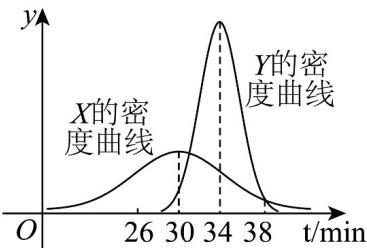

> [!faq]- 《第七章 随机变量及其分布（高效培优单元自测·强化卷）数学人教A版高二选择性必修第三册》官方解析
>
> > [!success]- **【答案】** C
>
> > [!note]- **【分析】**
> > 利用正态分布曲线的意义以及对称性，对四个选项逐一分析判断即可.
>
> > [!note]- **【解析】**
> > 对于 A，依题意随机变量 X 的均值为 $E(X)=30$ ，方差为 $D(X)=36$ ，即 $X \sim N(30, 6^{2})$ ， $\mu_{1}=30$ ， $\sigma_{1}=6$
> >
> > 随机变量 Y 的均值为 $E(Y)=34$ ，方差为 $D(Y)=4$ ，则 $Y\sim N\left(34,2^{2}\right)$ ， $\mu_{2}=34$ ， $\sigma_{2}=2$ ；
> >
> > 所以 $P(Y < 30) = P(Y > 38) > P(Y > 45)$ ，故 A 错误；
> >
> > 对于 C， $P(X < 24) = P(X < 30 - 6) = \frac{1 - P(\mu_{1} - \sigma_{1} < X < \mu_{1} + \sigma_{1})}{2}$
> >
> > $$
> > P (Y > 3 5) > P (Y > 3 6) = P (Y > 3 4 + 2) = \frac {1 - P (\mu_ {2} - \sigma_ {2} <   X <   \mu_ {2} + \sigma_ {2})}{2}
> > $$
> >
> > 因为 $P(\mu_{1}-\sigma_{1}<X<\mu_{1}+\sigma_{1})=P(\mu_{2}-\sigma_{2}<X<\mu_{2}+\sigma_{2})$
> >
> > 所以 $P(X < 24) < P(Y > 35)$ ，故 C 正确；
> >
> > 对于 B，X 与 Y 的密度曲线大致如下，
> >
> > 
> >
> > 若某天只有 $34\mathrm{min}$ 可用，由图可知 $P(X \leq 34) > P(Y \leq 34) = \frac{1}{2}$ ，所以李明应选择公交车，故B错误。对于D，若某天只有 $40\mathrm{min}$ 可用，由图可知 $P(X > 40) > P(Y > 40)$ ，
> >
> > 所以 $P(X \leq 40) = 1 - P(X > 40) < P(Y \leq 40) = 1 - P(Y > 40)$ ，所以李明应选择自行车，故D错误。
> >
> > 故选：C.
> >
> > 8. 投掷一枚均匀硬币，掷出正面得 $^{1}$ 分，掷出反面得 $^{2}$ 分、投掷了 $^{3}$ 次，设总分为 X，那么 X 的数学期
> >
> > 望为（ ）A. $\frac{9}{4}$ B. 4 C. $\frac{9}{2}$ D. 5
> >
> > 【答案】C
> >
> > 【分析】根据已知条件，结合二项分布的概率公式，求出 $X$ 的分布列，进而计算期望即可·
> > 【详解】根据已知条件有 $X$ 的可能取值为3，4，5，6；
> >
> > $$
> > P (X = 3) = \mathrm{C} _ {3} ^ {0} \left(\frac {1}{2}\right) ^ {0} \times \left(\frac {1}{2}\right) ^ {3} = \frac {1}{8}, P (X = 4) = \mathrm{C} _ {3} ^ {1} \left(\frac {1}{2}\right) ^ {1} \times \left(\frac {1}{2}\right) ^ {2} = \frac {3}{8},
> > $$
> >
> > $$
> > P (X = 5) = \mathrm{C} _ {3} ^ {2} \left(\frac {1}{2}\right) ^ {2} \times \left(\frac {1}{2}\right) ^ {1} = \frac {3}{8}, P (X = 6) = \mathrm{C} _ {3} ^ {3} \left(\frac {1}{2}\right) ^ {3} \times \left(\frac {1}{2}\right) ^ {0} = \frac {1}{8}
> > $$
> >
> > 所以 $X$ 的分布列为：
> >
> > <table><tr><td>X</td><td>3</td><td>4</td><td>5</td><td>6</td></tr><tr><td>P</td><td> $\frac{1}{8}$ </td><td> $\frac{3}{8}$ </td><td> $\frac{3}{8}$ </td><td> $\frac{1}{8}$ </td></tr></table>
> >
> > 所以 $D(X)=3\times\frac{1}{8}+4\times\frac{3}{8}+5\times\frac{3}{8}+6\times\frac{1}{8}=\frac{9}{2}$
> >
> > 故选：C
> >
> > ## 二、选择题：本题共3小题，每小题6分，共18分．在每小题给出的选项中，有多项符合题目要求．全部选对的得6分，部分选对的得部分分，有选错的得0分.
