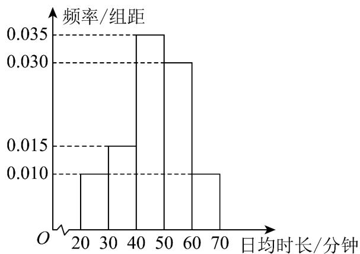

<!-- question-source:start -->
18. (16 分) 体育锻炼有助于学生全面发展，为研究某市学生体育锻炼时长，随机抽取了 $^{100}$ 名学生进行

调查，并绘制频率分布直方图如下：

(1)估计这 $^{100}$ 名学生日均体育锻炼时长的平均数；

(2)若规定“日均锻炼时长不少于 $^{40}$ 分钟为运动积极型学生”

(i) 采用分层随机抽样抽取 $^{8}$ 人，再从这 $^{8}$ 人中随机抽出 $^{3}$ 人，记抽到运动积极型学生人数为X，求X的

分布列和数学期望；

(ii) 用样本估计总体，从本市任选 $^{4}$ 名学生，求这 $^{4}$ 名学生中运动积极型学生个数 Y 的期望与方差·
<!-- question-source:end -->

![[高中/课堂同步/题库/人教A版高中数学同步讲义(2026)/05_选择性必修第三册/第七章 随机变量及其分布/第七章 随机变量及其分布（高效培优单元自测·强化卷）数学人教A版高二选择性必修第三册/三_填空题/questions/answers/Q00083405A1.md]]
