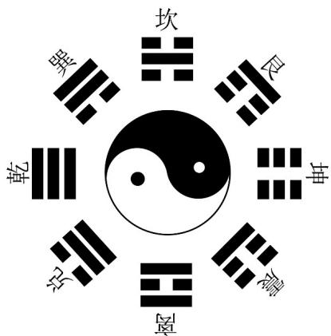

> [!faq]- 《第七章 随机变量及其分布（高效培优单元自测·提升卷）数学人教A版高二选择性必修第三册》官方解析
>
> > [!success]- **【答案】** 附：若 $Z \sim N\left(\mu, \sigma^{2}\right)$ ，则 $P(\mu - \sigma < Z \leq \mu + \sigma) \approx 0.683$ ， $P(\mu - 2\sigma < Z \leq \mu + 2\sigma) \approx 0.954$ 。 A. 0.1355 B. 0.1587 C. 0.2718 D. 0.3413
>
> > [!note]- **【分析】**
> > 求出函数的导函数，若 $f^{\prime}(x)\leq 0$ 恒成立，求出 $Z$ 的取值范围，即可得到 $\mu = 3$ ， $\sigma = 1$ ，再由正态
> >
> > 曲线的性质计算可得·
>
> > [!note]- **【解析】**
> > 因为 $f(x) = -x^{3} + 3x^{2} - Zx$ ，所以 $f'(x) = -3x^{2} + 6x - Z = -3(x - 1)^{2} - Z + 3$
> >
> > 若 $f^{\prime}(x) = -3(x - 1)^{2} - Z + 3\leq 0$ 对任意实数 $_{x}$ 恒成立，则 $Z_{3}$ ，所以 $P(Z3) = \frac{1}{2}$
> >
> > 又 $Z\sim N(\mu ,1)$ ，所以 $\mu = 3$ ， $\sigma = 1$ ， $\mu -\sigma = 2$ ， $\mu +\sigma = 4$ ， $\mu -2\sigma = 1$ ， $\mu +2\sigma = 5$
> >
> > 所以 $P(2 < Z \leq 4) \approx 0.683$ ， $P(1 < Z \leq 5) \approx 0.954$
> >
> > 则 $P(1 < Z \leq 2) = \frac{1}{2}\left[P(1 < Z \leq 5) - P(2 < Z \leq 4)\right] \approx \frac{1}{2}(0.954 - 0.683) = 0.1355$
> >
> > 故选：A.
> >
> > 7. 宋代著名类书《太平御览》记载：“伏羲坐于方坛之上，听八风之气，乃画八卦、”乾为天，坤为地，震
> > 为雷，坎为水，艮为山，巽为风，离为火，兑为泽，象征八种自然现象，以类万物之情·如图所示为太极八
> > 卦图，八卦分据八方，中绘太极，古代常用此图作为除凶避灾的吉祥图案·八卦中的每一卦均由纵向排列的
> > 三个爻组成，其中“■”为阳爻，“■■”为阴爻·现从八卦中任取两卦，已知取出的两卦中至少有一卦恰有一个
> >
> > 阳爻，则另一卦至少有两个阳爻的概率为（）
> >
> > 
> >
> > A. $\frac{4}{7}$ B. $\frac{3}{7}$ C. $\frac{5}{6}$ D. $\frac{2}{3}$
> >
> > 【答案】D
> >
> > 【分析】设有 $^{1}$ 卦没有阳爻·设取出的两卦中“有一卦恰有一个阳爻”为事件 A，“另一卦至少有两个阳爻”为
> >
> > 事件 B ，然后根据古典概型和条件概率定义求解即可 .
> >
> > 【详解】由八卦图可知，八卦中有 $^{1}$ 卦有三个阳爻，有 $^{3}$ 卦恰有一个阳爻，有 $^{3}$ 卦恰有两个阳爻，有 $^{1}$ 卦
> >
> > 没有阳爻．设取出的两卦中“有一卦恰有一个阳爻”为事件 A，“另一卦至少有两个阳爻”为事件 B．
> >
> > 因为 $P(A)=1-P(\overline{A})=1-\frac{C_{5}^{2}}{C_{8}^{2}}=\frac{9}{14}$ ， $P(AB)=\frac{C_{3}^{1}C_{4}^{1}}{C_{8}^{2}}=\frac{3}{7}$ ，所以 $P(B|A)=\frac{P(AB)}{P(A)}=\frac{2}{3}$
> >
> > 故选：D
> >
> > 8. 随机变量 $X$ 的分布列为 $P(X = i) = p_i, i = 1,2,3,4$ ，若 $p_2 + 2p_3 + 3p_4 = 2,7p_2 + 12p_3 + 15p_4 = 11$ ，则 $D(X) =$ ( )
> >
> > 【答案】
> >
> > A. 4 B. 3 C. 2 D. 1
> >
> > 【答案】D
> >
> > 【分析】根据已知条件求得 $E(X), E(X^{2})$ ，然后由 $D(X)=E(X^{2})-[E(X)]^{2}$ 来求得正确答案。
> > 【详解】首先，根据随机变量的概率分布性质， $\sum_{i=1}^{4}p_{i}=1$
> >
> > 即 $p_1 + p_2 + p_3 + p_4 = 1$ ，所以 $p_1 = 1 - (p_2 + p_3 + p_4)$
> >
> > 已知期望 $E(X)=\sum_{i=1}^{4}ip_{i}=p_{1}+2p_{2}+3p_{3}+4p_{4}$
> >
> > 将 $p_1 = 1 - (p_2 + p_3 + p_4)$ 代入期望公式可得：
> >
> > $$
> > E (X) = 1 - \left(p _ {2} + p _ {3} + p _ {4}\right) + 2 p _ {2} + 3 p _ {3} + 4 p _ {4} = 1 + p _ {2} + 2 p _ {3} + 3 p _ {4}
> > $$
> >
> > 因为 $p_{2} + 2p_{3} + 3p_{4} = 2$ ，所以 $E(X) = 1 + 2 = 3$ 。
> >
> > 然后求 $E(X^{2})$ ：
> >
> > $$
> > E \left(X ^ {2}\right) = \sum_ {i = 1} ^ {4} i ^ {2} p _ {i} = p _ {1} + 4 p _ {2} + 9 p _ {3} + 1 6 p _ {4}.
> > $$
> >
> > 同样将 $p_1 = 1 - (p_2 + p_3 + p_4)$ 代入可得：
> >
> > $$
> > E \left(X ^ {2}\right) = 1 - \left(p _ {2} + p _ {3} + p _ {4}\right) + 4 p _ {2} + 9 p _ {3} + 1 6 p _ {4} = 1 + 3 p _ {2} + 8 p _ {3} + 1 5 p _ {4}.
> > $$
> >
> > 已知 $7p_{2}+12p_{3}+15p_{4}=11$ ，且 $p_{2}+2p_{3}+3p_{4}=2$ ，即 $3p_{2}+6p_{3}+9p_{4}=6$ 。
> >
> > 用 $7p_{2} + 12p_{3} + 15p_{4} = 11$ 减去 $3p_{2} + 6p_{3} + 9p_{4} = 6$ 可得：
> >
> > $$
> > \left(7 p _ {2} + 1 2 p _ {3} + 1 5 p _ {4}\right) - \left(3 p _ {2} + 6 p _ {3} + 9 p _ {4}\right) = 1 1 - 6
> > $$
> >
> > $4p_{2}+6p_{3}+6p_{4}=5$ ，即 $2p_{2}+3p_{3}+3p_{4}=\frac{5}{2}$ .
> >
> > 又因为 $p_2 + 2p_3 + 3p_4 = 2$ ，两式相减得：
> >
> > $$
> > \left(2 p _ {2} + 3 p _ {3} + 3 p _ {4}\right) - \left(p _ {2} + 2 p _ {3} + 3 p _ {4}\right) = \frac {5}{2} - 2, \text {即} p _ {2} + p _ {3} = \frac {1}{2}.
> > $$
> >
> > 所以 $p_1 + p_4 = \frac{1}{2}$ ，则 $p_4 = \frac{1}{2} - p_1$
> >
> > 把 $p_{2} + p_{3} = \frac{1}{2}$ 变形为 $p_{2} = \frac{1}{2} - p_{3}$
> >
> > 将 $p_4 = \frac{1}{2} - p_1$ 和 $p_2 = \frac{1}{2} - p_3$ 代入 $p_2 + 2p_3 + 3p_4 = 2$ 得： $p_3 = 3p_1$ ，则 $p_2 = \frac{1}{2} - 3p_1$
> >
> > 所以 $E\left(X^{2}\right)=p_{1}+4p_{2}+9p_{3}+16p_{4}=10$
> >
> > 根据方差公式 $D(X)=E\left(X^{2}\right)-\left[E(X)\right]^{2}=10-9=1$
> >
> > 故选：D
> >
> > ## 二、选择题：本题共3小题，每小题6分，共18分．在每小题给出的选项中，有多项符合题目要求．全部选对的得6分，部分选对的得部分分，有选错的得0分.
