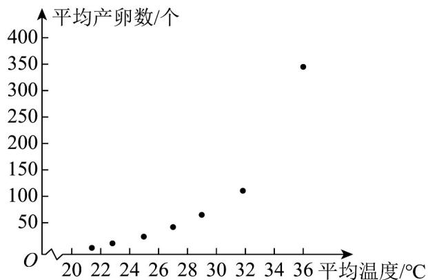

<!-- question-source:start -->
17.（16分）红蜘蛛是柚子的主要害虫之一，能对柚子树造成严重伤害，每只红蜘蛛的平均产卵数 $Y$

（个）和平均温度 $X$ （ $^{\circ}\mathrm{C}$ ）有关，现收集了以往某地的 $^{7}$ 组数据，得到下面的散点图及一些统计量的值。

(1)根据散点图判断， $Y = bX + a$ 与 $Y = ce^{dX}$ （其中 $e = 2.718\cdots$ 为自然对数的底数）哪一个更适合作为平均产

卵数 $Y$ （个）关于平均温度 $X$ （ $^{\circ}\mathrm{C}$ ）的回归方程类型？（给出判断即可，不必说明理由）

(2)由（1）的判断结果及表中数据，求出 $Y$ 关于 $X$ 的回归方程.

附：参考数据如下表（其中 $Z = \ln Y$ ），

<table><tr><td> $\sum_{i=1}^{7}x_i^2$ </td><td> $\sum_{i=1}^{7}x_iy_i$ </td><td> $\sum_{i=1}^{7}x_iz_i$ </td><td> $\overline{x}$ </td><td> $\overline{y}$ </td><td> $\overline{z}$ </td></tr><tr><td>5215</td><td>17713</td><td>714</td><td>27</td><td>81.3</td><td>3.6</td></tr></table>

(3)根据以往每年平均气温以及对果园年产值的统计，得到以下数据：平均气温在 $22^{\circ}\mathrm{C}$ 以下的年数占 $60\%$

对柚子产量影响不大，不需要采取防虫措施；平均气温在 $22^{\circ}\mathrm{C}$ 至 $28^{\circ}\mathrm{C}$ 的年数占 $30\%$ ，柚子产量会下降

20%；平均气温在 $28^{\circ}\mathrm{C}$ 以上的年数占 $10\%$ ，柚子产量会下降 $50\%$ 。为了更好地防治红蜘蛛虫害，农科所

研发出各种防害措施供果农选择。

在每年价格不变，无虫害的情况下，某果园年产值为 $^{200}$ 万元，根据以上数据，以得到最高收益（收益=

产值 - 防害费用）为目标，请为果农从以下几个方案中推荐最佳方案，并说明理由。

方案 $^{1}$ ：选择防害措施 A，可以防止各种气温的红蜘蛛虫害不减产，费用是 18 万元；

方案 $^{2}$ ：选择防害措施 B，可以防治 $22^{\circ}C$ 至 $28^{\circ}C$ 的红蜘蛛虫害，但无法防治 $28^{\circ}C$ 以上的红蜘蛛虫害，费

用是 $^{10}$ 万元；

方案 $^{3}$ ：不采取防虫害措施。
<!-- question-source:end -->

![[高中/课堂同步/题库/人教A版高中数学同步讲义(2026)/05_选择性必修第三册/第七章 随机变量及其分布/第七章 随机变量及其分布（高效培优单元自测·提升卷）数学人教A版高二选择性必修第三册/三_填空题/questions/answers/Q00083418A1.md]]
