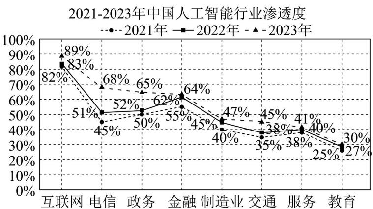

<!-- question-source:start -->
【变式3】习近平总书记指出，人工智能是引领新一轮科技革命和产业变革的重要驱动力，正深刻改变着人

们的生产、生活、学习方式，推动人类社会迎来人机协同、跨界融合、共创分享的智能时代·随着中国人工智

能行业市场规模的不断扩大，各行各业人工智能应用渗透度也在不断提升，下图是2021-2023年中国人工智

能在互联网、电信、政务、金融、制造业、交通、服务、教育等 $^{8}$ 个行业的渗透度的变化情况：

(1)从上图 2021 年 8 个行业中随机抽取 3 个，求其中恰有一个行业人工智能渗透度不低于 50% 的概率；

(2)从上图 2022 年和 2023 年 8 个行业中各随机抽取 1 个，设其中人工智能渗透度高于 60% 的行业个数为 X

求 $X$ 的分布列及数学期望；

(3)从上图2023年8个行业中随机抽取1个，用“ $Y = 0$ ”表示人工智能行业渗透度在区间 $\left[30\%, a\right]$ 内，用“ $Y = 1$ ”表示人工智能行业渗透度在区间 $\left(a,89\%\right]$ 内，若方差 $D(Y)$ 取得最大值，请写出实数 $^a$ 的取值范围·（结论不要

求证明）
<!-- question-source:end -->

![[高中/课堂同步/题库/人教A版高中数学同步讲义(2026)/05_选择性必修第三册/第七章 随机变量及其分布/讲义/专题7_3_离散型随机变量的数字特征_高效培优讲义_数学人教A版高二选/_compact/answers/Q00059703A1.md]]
