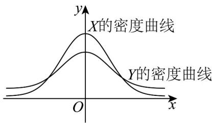

> [!faq]- 《专题7_5_正态分布_高效培优讲义_数学人教A版高二选择性必修第三册》官方解析
>
> > [!success]- **【答案】** ACD
>
> > [!note]- **【分析】**
> > 由正态曲线的性质，逐一判断，即可得到结果·
>
> > [!note]- **【解析】**
> > 对于 $\mathsf{A}$ ：作出随机变量 $X,Y$ 的正态分布密度曲线草图，根据对称性 $P(X\leq -2) = 1 - P(X <   2)$ ，所以 $\mathrm{P}(X\leq -2) + \mathrm{P}(X <   2) = 1$ ，故 $\mathsf{A}$ 正确；
> >
> > 对于 $^{B}$ ：由 $P(0 < Y < 3) + P(Y \leq -3) = P(0 < Y < 3) + P(Y - 3) = P(Y > 0) = \frac{1}{2}$ ，故 $^{B}$ 错误；
> >
> > 对于 $C$ ：由 $P(Y > 0) = P(X < 0) = \frac{1}{2}$ ，故 $C$ 正确；
> >
> > 对于 $^{D}$ ：对于正态分布 $X \sim N\left(\mu, \sigma^{2}\right)$ ，给定 $k \in N^{*}$ ， $P\left(\mu - k\sigma \leq X \leq \mu + k\sigma\right)$ 是一个只与 k 有关的定值，所以 $P(-2 \leq X \leq 2) = P(-3 \leq Y \leq 3) > P(-2 \leq Y \leq 2)$ ，故 $^{D}$ 正确·
> >
> > 故选：ACD.
> >
> > 
