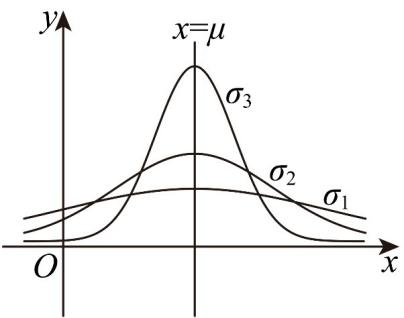

<!-- question-source:start -->
【变式1】如图是正态分布 $N\left(\mu,\sigma_{1}^{2}\right)$ ， $N\left(\mu,\sigma_{2}^{2}\right)$ ， $N\left(\mu,\sigma_{3}^{2}\right)$ （ $\sigma_{1}$ ， $\sigma_{2}$ ， $\sigma_{3}>0$ ）对应的曲线，则 $\sigma_{1}$ ， $\sigma_{2}$ ， $\sigma_{3}$ 的大小关系是（）

A. $\sigma_{1} > \sigma_{2} > \sigma_{3}$ B. $\sigma_{3} > \sigma_{2} > \sigma_{1}$ C. $\sigma_{1} > \sigma_{3} > \sigma_{2}$ D. $\sigma_{2} > \sigma_{1} > \sigma_{3}$
<!-- question-source:end -->

![[高中/课堂同步/题库/人教A版高中数学同步讲义(2026)/05_选择性必修第三册/第七章 随机变量及其分布/讲义/第七章_随机变量及其分布列_高效培优讲义_数学人教A版高二选择性必修第/_compact/answers/Q00059791A1.md]]
