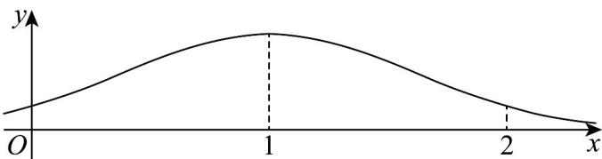

> [!faq]- 《第七章_随机变量及其分布列_高效培优讲义_数学人教A版高二选择性必修第》官方解析
>
> > [!success]- **【答案】** A
>
> > [!note]- **【分析】**
> > 由正态分布的性质可得·
>
> > [!note]- **【解析】**
> > 
> >
> > 因为 X 服从正态分布 $N(1, \sigma^{2})$ ( $\sigma > 0$ )
> >
> > 所以正态分布曲线关于 x = 1 对称；
> >
> > 又因为 X 在 $(0,2)$ 内取值的概率为 0.8，
> >
> > 所以 X 在 $(0,1)$ 内取值的概率为 0.4，
> >
> > 所以 X 在 $\left[0,+\infty\right)$ 内取值的概率为 $0.4+0.5=0.9$
> >
> > 故选 **A**
